# Module Architecture and QuMA-Style Timing Control

**Status:** Phase 1 design proposal, 2026-09-16. This document specifies module ownership and interface behavior. Numerical timing profiles, instruction encodings, and unsupported-operation policy require recorded decisions before implementation.

## 1. Architectural rule

SystemC is the discrete-event scheduler. It wakes processes at clock edges, timed notifications, and channel updates. It does not define the latency of an RV32I instruction, the capacity of a quantum command queue, or the instant at which a pulse starts. Those are explicit C++ model rules. The CPU, the timing control unit (TCU), the channel devices, and readout may use different clocks. Each stateful module has one owner, reads previously committed inputs at its active edge, computes next state, and publishes outputs according to a specified edge and update rule. A delta cycle is never counted as a hardware cycle. This follows the [Accellera SystemC scheduling implementation](https://github.com/accellera-official/systemc/blob/main/src/sysc/kernel/sc_simcontext.cpp); the particular hardware contracts below are qsbit-sim design choices.

The TCU **must preserve QuMA's core mechanism**: a producer reserves ordered timing points and puts events into bounded event queues in a nondeterministic preparation domain; a timing queue, per-port event queues, and a deterministic-domain timer cause all events tagged for a reached timing point to fire together. Instructions may take variable time to reach the queues without changing the already reserved output schedule, provided the queues are filled before their deadlines. QuMA describes these parts in [Section 5.2](https://arxiv.org/abs/1708.07677). eQASM calls the two stages reservation and triggering in [Section 3.1](https://arxiv.org/abs/1808.02449). Distributed-HISQ retains queue-based TCU control, while expressing effects as codewords sent to ports and adding pause and resume for synchronization in [Sections 3.1 and 3.2](https://arxiv.org/abs/2509.04798).

This is **not an eQASM implementation**. The executable is RV32I machine code with versioned quantum-control extensions. We retain the timing-control mechanism, not eQASM's binary encoding, target registers, fixed VLIW width, or classical pipeline. We also do not assume a particular waveform generator, qubit technology, or number of ports.

## 2. Architecture and paths

```mermaid
flowchart LR
  TOOL[Separate RISC-V assembler] --> ELF[RV32 ELF image]
  ELF --> LOAD[ELF loader]
  LOAD --> MEM[Memory and response model]
  MEM <--> CPU[RV32I cycle engine]
  ISA[Versioned ISA semantics] --> CPU
  CPU --> DEC[Quantum instruction adapter]
  DEC --> LOWER[Optional operation lowerer]
  LOWER --> RES[Timeline reservation manager]
  RES --> CDC[Command crossing and admission]
  CDC --> TQ[Timing queue]
  CDC --> EQ[Per-port event queues]
  TQ --> TIMER[TCU timer and label broadcaster]
  TIMER --> EQ
  EQ --> DIST[Event distributor and resource arbiter]
  DIST --> CW[Port codeword and waveform map]
  CW --> OUT[Output channel model]
  OUT --> QB[Quantum backend port]
  QB --> READ[Readout and discrimination model]
  READ --> FB[Measurement scoreboard and feedback crossing]
  FB --> CPU
  FB --> COND[Optional fast-condition flags]
  COND --> DIST
  TIMER -. optional pause and resume .-> SYNC[Future synchronization adapter]
  CPU -.-> TRACE[Generic versioned event trace]
  CDC -.-> TRACE
  TIMER -.-> TRACE
  OUT -.-> TRACE
  READ -.-> TRACE
  TRACE -. public trace .-> EXT[Separate disposable CACTUS validator]
  CLOCK[SystemC clocks and events] -. wakeup .-> CPU
  CLOCK -. wakeup .-> TIMER
  CLOCK -. wakeup .-> READ
```

The solid path carries modeled hardware requests, events, and results. The dashed clock links mean that SystemC schedules the owners' processes. Trace links are observation only: trace consumption cannot affect simulation timing. The external CACTUS validator owns its own probes, eQASM translation, fixtures, comparator, and results. It is not a source or build dependency of this repository.

### Suggested C++ boundaries

- `IsaDecoder` and `IsaSemantics`: pure C++ functions, independent of SystemC.
- `CpuCycleModel`: `step(CpuCycleInput) -> CpuCycleOutput`, with a replaceable implementation and an explicit timing-profile identifier.
- `TimelineProducer`: turns ordered control operations into `TimingPoint` and `ReservedEvent` records; it does not advance the deterministic TCU clock.
- `TcuCycleModel`: `step(TcuCycleInput) -> TcuCycleOutput`, containing the timing queue, event queues, timer, and dispatch state.
- `IQuantumBackend`: capability negotiation and physical-state actions; no authority to advance the SystemC clock.
- Small SystemC wrappers: call these models on the appropriate edges, own the ports and events, and apply the same-time publication rule.

The public records use fixed-width integers and a versioned serialization. At minimum, `TimingPoint` has a monotone label and interval in TCU cycles; `ReservedEvent` has that label, port, codeword or lowered operation, stable command ID, target identity, and optional condition ID; `TraceEvent` has global integer tick, clock domain and local cycle, event kind, identity, and status. An optional **derived** absolute fire tick is useful for tracing and deadlines, but it is not a replacement for the timing queue and label-matched event queues.

## 3. Module contracts

### 3.1 Platform configuration and clock adapter

**Upstream:** command-line configuration and validated device profile. **Downstream:** SystemC clocks, CPU, memory, crossing channels, TCU, channel models, and trace metadata.

It chooses one integer global tick resolution before SystemC elaboration; rejects periods, phases, or latencies that cannot be represented exactly; creates CPU and TCU clocks with explicit phases; and establishes reset release and stop rules. It owns configuration, not hardware state. The SystemC adapter converts the kernel's events to edge calls on plain C++ cycle models. Periodic `sc_clock` still creates every modeled edge: event-driven scheduling does not imply that idle clock cycles are skipped. Later optimization may skip a provably quiescent component only if it preserves timeout, arbitration, and externally visible cycle behavior.

### 3.2 ELF loader and program image

**Upstream:** RV32 ELF produced by a separately managed assembler and linker, or raw binary for focused tests. **Downstream:** memory model and initial CPU PC.

It validates ELF class, RISC-V machine type, endianness, loadable segments, overlaps, memory bounds, and entry point before simulation starts. It does not parse assembly or own a runtime instruction pipeline. Extension compatibility may be checked from an optional versioned manifest, but an ordinary ELF can omit it; decoder-time illegal-instruction checks remain mandatory. Program loading has no simulated latency unless a platform profile explicitly models a boot sequence.

### 3.3 ISA decoder and semantics library

**Upstream:** 32-bit fetched word, architectural register values, and enabled extension profile. **Downstream:** CPU cycle model and quantum-instruction adapter.

It decodes RV32I and versioned custom instructions, computes operand and immediate interpretation, declares architectural register and control effects, and returns typed illegal-instruction or alignment faults. It does not mutate the PC, register file, TCU queues, or simulated time. A custom control instruction declares whether it produces a time reservation, a port-codeword event, a result read, or a future synchronization action. The actual encoding is a separate decision and is not claimed to match Distributed-HISQ's bits. The toolchain and simulator must test the same encoding specification.

### 3.4 CPU cycle model

**Upstream:** memory response, command admission acknowledgment, visible measurement data, reset and CPU clock edge. **Downstream:** memory requests, quantum-instruction adapter, retirement trace and architectural state observers.

This module uniquely owns PC, general-purpose registers, pipeline latches, pending instructions, exception state, and retirement order. The initial model may be an in-order RV32I pipeline; stage count, forwarding, branch penalty, and memory latency belong to a named timing profile, not the ISA library. If command admission is blocked, the producing instruction retains its stable command ID and operands and stalls at a specified stage. It retires only when the admission rule permits it. A future external RISC-V engine can replace this module through the cycle contract; a functional-only engine must not claim boundary-time equivalence.

### 3.5 Memory and response model

**Upstream:** ELF loader at initialization and CPU read or write requests at runtime. **Downstream:** CPU memory responses and optional M0 control-register adapter.

It owns byte-addressable storage, request occupancy, alignment and access errors, configurable response latency, and one-time store effects. Requests and responses have stable identities so a stalled CPU cannot duplicate a store. Device-facing MMIO is only an M0 smoke-test input to the same control protocol; the Phase 1 software interface uses extension instructions.

### 3.6 Quantum-instruction adapter

**Upstream:** decoded extension instruction and CPU-owned operand snapshot. **Downstream:** operation lowerer and timeline producer; acknowledgment to CPU.

It translates ISA effects into technology-neutral control records. A codeword instruction names a port and codeword, with immediate or register operands as permitted by the chosen extension profile. A wait instruction contributes an interval on the TCU timeline rather than sleeping the host thread. A measurement-result read stalls until the scoreboard says its architectural value is visible. The adapter must never reinterpret codeword numbers as fixed quantum gates: [Distributed-HISQ Section 3.1.2](https://arxiv.org/abs/2509.04798) explicitly allows a codeword to select different hardware actions under a matching configuration.

### 3.7 Optional operation lowerer and configuration store

**Upstream:** abstract control operation or direct port-codeword command, versioned operation map, target map, and calibration profile. **Downstream:** timeline reservation manager and event distributor.

For direct HISQ-like port-codeword instructions, this is an identity path. If a higher-level operation is requested, it expands the operation into primitive events with relative offsets and explicit resource targets. QuMA's [Section 5.3](https://arxiv.org/abs/1708.07677) gives an example of multilevel quantum instruction, microinstruction, micro-operation, and codeword decoding; eQASM's [Section 4.3](https://arxiv.org/abs/1808.02449) adds operation combination and device-event distribution. Those layers are configurable modeling options, not a requirement to reproduce eQASM's instruction format. Expansion must complete before reservation of an atomic same-time group, so a partly expanded operation cannot fire.

### 3.8 Timeline reservation manager

**Upstream:** ordered waits and lowered control events from the adapter. **Downstream:** timing-queue entries and label-tagged per-port events through admission control.

This module owns the *producer-side* timeline cursor and monotonically ordered timing labels. A wait of `d` TCU cycles creates the next timing point at the prior point plus `d`; multiple operations may attach to one label. A zero interval does not consume a physical TCU cycle; same-time labels must be coalesced or drained on one edge under a documented rule. The first point is tied to an explicit start event or configured origin. The manager can calculate an absolute deadline for admission checks, but dispatch remains driven by the timing queue and label broadcast. eQASM [Section 3.1.2](https://arxiv.org/abs/1808.02449) documents interval-based timeline construction, including zero intervals and multiple operations at one point.

The producer may run ahead of the deterministic timer. It cannot revise a timing point after that point is committed for firing. A bundled operation is sealed before release to the TCU; an incomplete bundle or missing matching event is an error rather than a silent no-op.

### 3.9 Command crossing and admission controller

**Upstream:** producer-side `TimingPoint` and `ReservedEvent` groups. **Downstream:** TCU timing queue, per-port event queues, and CPU acknowledgment path.

It owns bounded crossing storage, synchronized visibility, readiness, and stable transaction identity. The group is accepted **atomically** only if the timing queue and every affected event queue have room; otherwise it remains held and the CPU-side producer sees backpressure. Atomicity prevents a timing label from firing after only some same-time port events arrived. The TCU acceptance edge and CPU acknowledgment visibility edge are configured and traced separately. A coincident CPU and TCU edge reads previously committed crossing state. Admission after the relevant label's firing deadline is rejected with a typed late error. The exact synchronizer depth and queue capacities remain timing-profile decisions; they are not asserted to be values specified by QuMA.

### 3.10 Timing queue

**Upstream:** admitted and sealed timing points. **Downstream:** deterministic timer and label broadcaster.

This is a bounded FIFO of `(interval_cycles, label, group-complete marker)` in timeline order. It is **not** a heap sorted by each event's absolute timestamp. It preserves zero-interval points and exposes full, empty, head label, and occupancy states. When the timer reaches a point, its head is consumed once and its label is broadcast to all event queues. QuMA [Section 5.2](https://arxiv.org/abs/1708.07677) describes a timing queue that holds intervals and labels separately from event queues. If the next required timing point is missing, the simulator reports a timeline-underflow fault under the selected profile; it does not invent an event-free future schedule.

### 3.11 Per-port event queues

**Upstream:** atomic admission controller. **Downstream:** event distributor upon a broadcast timing label.

Each configured output port has a bounded FIFO of label-tagged event records, and a readout or synchronization event can have its own queue. When label `L` is broadcast, each queue fires **all** head events for `L`; a head with a future label remains queued, and a head with a past label is a protocol fault. Multiple independent ports can fire on the same timing point. A queue entry carries a stable ID, port, codeword, target and optional condition; it does not itself advance simulation time. QuMA [Section 5.2](https://arxiv.org/abs/1708.07677) uses separate pulse, measurement-pulse, and measurement-discrimination queues. Distributed-HISQ [Section 3.2](https://arxiv.org/abs/2509.04798) describes queues corresponding to ports. The exact queue partition is therefore profile-driven, while matching a broadcast label is required.

### 3.12 TCU timer and timing-label broadcaster

**Upstream:** TCU clock, timing queue head, explicit start or future external trigger, and optional pause request. **Downstream:** every event queue, dispatch trace, and future synchronization adapter.

It uniquely owns deterministic-domain time `T_D`, the current interval countdown, next label, and run or pause state. After start, it counts TCU edges, reaches the next timing point, broadcasts its label once, and loads the following interval. All queues see the same label on the same modeled edge. If a zero interval follows, all such labels are processed at that same physical edge without treating extra SystemC delta cycles as hardware cycles. Timer start, pause, resume, reset, and rollover have explicit trace events and tests. The base QuMA mechanism requires a timing queue and deterministic trigger; Distributed-HISQ's [Section 3.2](https://arxiv.org/abs/2509.04798) adds external-trigger pause and resume to cope with nondeterministic synchronization. This extension can be a separate TCU control port, not a new eQASM dependency.

### 3.13 Event distributor and resource arbiter

**Upstream:** label-matched events from all event queues and optional fast-condition flags. **Downstream:** port codeword map, output channels, readout initiator and trace.

It converts same-time events into device actions, checks port and physical-resource conflicts, then dispatches valid actions on the agreed edge. Independent ports proceed concurrently. Same-port or shared-resource conflicts follow a named policy: reject the group, serialize only if the profile explicitly allows a new time, or record a missed deadline. It must never silently delay a nominally simultaneous action. For operations that expand to multiple device actions, all actions share the reserved timing point and are checked as a group. eQASM [Section 4.3](https://arxiv.org/abs/1808.02449) discusses operation combination, conflict detection, and a device-event distributor; our version uses a configurable port map rather than eQASM target registers.

### 3.14 Port codeword and waveform map

**Upstream:** accepted event `(port, codeword, target)` and calibration or device profile. **Downstream:** output channel and readout model.

It maps the digital trigger to a configured physical action: stored waveform, oscillator-setting action, readout trigger, discriminator trigger, or another declared action. Mapping is versioned and validated before simulation. A missing codeword or incompatible port raises an error. For a stored primitive waveform, trigger-to-output latency is fixed by the selected channel profile; QuMA [Section 5.1](https://arxiv.org/abs/1708.07677) relies on a fixed short delay from codeword to pulse generation. We record both the codeword-trigger tick and physical-output start tick so matching them cannot hide latency mistakes. The map does not claim that every codeword corresponds to a quantum gate.

### 3.15 Output channel and device-resource model

**Upstream:** decoded port action and device profile. **Downstream:** quantum backend port, readout initiation, and boundary trace.

It owns channel occupancy, start and end ticks, resource sharing, pulse overlap rules, output-lane capacity, and reset behavior. A physical action begins at the configured delay after its codeword trigger and has a configured duration. Multiple actions on distinct channels can overlap; conflicting actions cannot pass silently. An ideal gate adapter may collapse a pulse into an effective state operation at a documented point, while a pulse-level adapter receives the interval and drive parameters. The numerical backend cannot set the hardware start time.

### 3.16 Quantum backend port and replaceable adapters

**Upstream:** time-stamped physical actions and measurement requests from the channel model. **Downstream:** readout model with measured values and capability status.

The interface can reset state, advance to a model time, apply a gate, measure with collapse, and declare capabilities. A pulse-capable adapter additionally evolves a time interval under overlapping drives and a Hamiltonian; replaying independent gates is insufficient to claim pulse support. A scripted adapter supplies deterministic measurements for timing tests. Circuit-level and small-system pulse-level prototypes exercise the same contract. The backend owns quantum state and numerical computation; the SystemC architecture owns simulated time and readout latency. A Python bridge may block host execution while computing, but its wall-clock duration cannot change a scheduled simulated timestamp.

### 3.17 Readout and discrimination model

**Upstream:** measurement trigger and backend value or raw response. **Downstream:** measurement scoreboard, optional fast-condition flags, and trace.

It owns acquisition start, acquisition duration, discriminator latency, completion tick, result identity and error state. A measurement pulse and a discrimination event may be separate codeword-triggered actions, as in QuMA [Sections 5.1 and 5.2](https://arxiv.org/abs/1708.07677). The scripted backend gives a value; the readout model decides when that value becomes valid. If a pulse-level backend returns a waveform, a declared discriminator adapter decides the bit and its processing latency. Unsupported readout modes fail explicitly. The model does not make the measurement result available merely because the backend call returned on the host.

### 3.18 Measurement scoreboard and feedback crossing

**Upstream:** accepted measurement requests and completed discrimination results. **Downstream:** CPU result-read operand, optional fast-condition module, and trace.

This module owns pending measurement IDs, qubit or result-slot validity, ordering and the CPU-visible edge. A result read stalls until the specified result is valid; a later pending measurement must not accidentally expose an earlier value. eQASM [Section 3.6 and Section 4.3](https://arxiv.org/abs/1808.02449) invalidates a per-qubit measurement result while measurements are outstanding and stalls `FMR` until validity returns. qsbit-sim can use tagged result slots rather than eQASM's exact register encoding, but must keep the same causal rule. It distinguishes device completion, discrimination completion, crossing arrival, and CPU architectural visibility.

### 3.19 Optional fast-condition module

**Upstream:** completed measurement bits and configured predicate table. **Downstream:** event distributor at a labeled dispatch edge.

For simple local feedback, it maintains per-target condition flags derived from previously completed measurements and permits a pre-reserved event to execute or be canceled when its label fires. eQASM [Section 3.5](https://arxiv.org/abs/1808.02449) calls this fast conditional execution; its broader `FMR`-then-branch flow is the separate comprehensive-feedback path. In qsbit-sim, predicates and sampling edge must be explicit. A flag that arrives after dispatch cannot retroactively change an output. This module can be deferred until a selected Phase 1 workload requires it; the CPU result-read and branch path remains the baseline feedback mechanism.

### 3.20 Generic trace recorder and stop controller

**Upstream:** CPU, crossing channels, timing queues, TCU, output channels, readout, backend status and errors. **Downstream:** public trace file, test assertions and external consumers.

It records each observable transition with global integer tick, clock domain and cycle, stable operation or measurement ID, status and causal parent ID. It preserves the distinction between CPU command proposal, TCU admission, label firing, codeword trigger, physical output start and end, result completion, and CPU result visibility. A deterministic same-tick ordering field is diagnostic unless the hardware contract explicitly assigns it meaning. The stop controller reports halt, illegal instruction, missed deadline, underflow, unsupported capability, timeout or deadlock with context. Neither recorder nor external consumer changes simulation state.

### 3.21 Future synchronization adapter and multiple nodes

**Upstream:** a sync instruction or TCU sync queue, peer or router messages, and explicit link latency. **Downstream:** TCU pause and resume port, communication trace.

This is a later extension, not needed to prove a single-node QuMA-style TCU. Distributed-HISQ [Sections 3.2 and 4](https://arxiv.org/abs/2509.04798) adds a synchronization unit and message unit, and its BISP protocol may pause the TCU timer until a booking condition and remote signal condition are both met. A multi-node model must distinguish absolute wall time from each node's pausable deterministic timeline. The paper leaves message-unit implementation details out of scope, so this document does not invent a wire protocol or claim BISP support in Phase 1. The TCU reserves a control port for such an adapter.

## 4. Timing and admission invariants

1. **Reservation precedes triggering.** A timing point and every event in its sealed atomic group must be admitted before the TCU reaches its firing edge. Producer-side stalls may vary; committed output timing may not.
2. **Time has one owner per domain.** The SystemC kernel owns global simulation time; the TCU timer owns its deterministic cycle count; the CPU owns its cycle count. No module derives one by counting delta cycles.
3. **Labels, not priority-queue timestamps, coordinate ports.** The timing queue broadcasts one reached label. Each event queue fires entries carrying that label. The derived absolute tick is for validation, not the dispatch algorithm.
4. **Causality is explicit.** The CPU receives admission acknowledgment only after receiver-edge acceptance. A result is visible only after readout and configured crossing delay. Same-time CPU and TCU edges see prior committed inputs.
5. **Deadline faults are visible.** Queue underflow, late admission, missing group member, illegal label order, output-resource collision, or absent codeword mapping cannot be converted into a delayed success.
6. **Fixed output latency is measured separately.** TCU label firing, codeword trigger, output start and output end are distinct trace events. This preserves the QuMA trigger-to-pulse contract.
7. **Independent ports are concurrent.** All events for one label are evaluated as a set; serialization requires a documented resource constraint and cannot arise from C++ iteration order.
8. **Reset is total.** Reset clears producer cursor, crossing transactions, timing queue, event queues, timer, channel occupancy, pending measurements and condition flags, and emits an unambiguous new epoch.

### A short timing example

Suppose an explicit start makes `T_D = 0`, and the producer reserves `(interval=4, label=A)` with two events on ports 0 and 1, followed by `(interval=3, label=B)` with a readout event. Both A events are already in their port queues before start. After four TCU edges, A is broadcast and both ports trigger on that edge. Three TCU edges later, B is broadcast and readout starts. If the CPU stalls for two cycles *after* all three events were admitted, those trigger edges are unchanged. If port 1's A event has not been admitted when A is due, the simulator reports an incomplete reservation or deadline fault; it must not fire port 0 alone and later call the pair simultaneous. The exact convention for whether the start edge counts as the first interval edge is a timing-profile decision and must be fixed by a cycle test.

## 5. What is faithful to the papers and what is our design

| Feature | Paper basis | qsbit-sim decision |
| --- | --- | --- |
| Separate nondeterministic preparation and deterministic output domains | QuMA Section 5.2; eQASM Section 3.1 | Required TCU architecture. |
| Timing queue with interval and label, multiple label-tagged event queues, label broadcast | QuMA Section 5.2 | Required even when a trace also carries absolute ticks. |
| Fixed codeword-trigger-to-pulse latency and readout discrimination | QuMA Section 5.1 | Model with configurable channel and readout profiles. |
| Hierarchical instruction lowering and device distribution | QuMA Section 5.3; eQASM Section 4.3 | Optional lowering before TCU; direct port-codeword path is first-class. |
| Parallel operations, fast local conditions and result-dependent branches | eQASM Sections 3.4–3.6 | Resource-checked same-label groups; optional fast flags; tagged CPU-visible results. |
| RV32I extensions naming ports and codewords | Distributed-HISQ Section 3.1 | Versioned encoding designed separately; no binary-compatibility claim. |
| Pausable timer and multi-node booking synchronization | Distributed-HISQ Sections 3.2–4 | Extension port reserved; not a Phase 1 implementation claim. |
| Atomic group admission, explicit deadline faults, trace schema and crossing depths | Project design | Specify and test as a timing profile; not attributed to the papers. |

## 6. Implementation order and verification

1. Implement pure C++ RV32I decode and CPU cycle transitions, ELF loading, memory timing, and a SystemC clock wrapper. Verify ISA effects and pipeline cycle traces independently.
2. Implement the QuMA-style timing queue, per-port event queues, timer, label broadcast, start/reset and underflow behavior **without a quantum backend**. Use hand-checkable interval sequences, zero intervals and two simultaneous ports.
3. Add the producer-side timeline and atomic crossing protocol. Test coincident and offset clock edges, queue-full backpressure, exactly-once admission, and a late producer.
4. Add codeword mapping, fixed output latency, channel resources, scripted measurements, readout and CPU-visible feedback. Assert every boundary tick and the final CPU state.
5. Add the versioned RV32I control instructions and toolchain contract tests. Add a circuit-level and a small-system pulse-level backend prototype, with explicit capability tests.
6. Run equivalent workloads against CACTUS through the **separate disposable validation project**. Compare command acceptance, label dispatch, output and feedback boundary traces at zero common-grid-tick tolerance where both systems expose corresponding events. Do not put comparison code in the simulator core.

The timing profile must pin CPU and TCU periods and phases, reset release, timer-start convention, crossing depths, queue capacities, event-group atomicity, channel latency, readout latency, conflict policy and stop condition before any Phase 1 timing claim. A passing RV32I architectural test alone does not prove timing equivalence.

## Primary sources and inspection notes

- [Fu et al., *An Experimental Microarchitecture for a Superconducting Quantum Processor*](https://arxiv.org/abs/1708.07677), especially Sections 5.1–5.3 and Tables 2–6. Local full-text extraction inspected at `/mnt/d/Research/XQ/1-references/0-papers/txt/B1-fu2017-quma-microarchitecture.txt`.
- [Fu et al., *eQASM: An Executable Quantum Instruction Set Architecture*](https://arxiv.org/abs/1808.02449), especially Sections 3.1, 3.4–3.6 and 4.3. Local extraction inspected at `/mnt/d/Research/XQ/1-references/0-papers/txt/B2-fu2019-eqasm-isa.txt`.
- [Zhao et al., *Distributed-HISQ: A Distributed Quantum Control Architecture*](https://arxiv.org/abs/2509.04798), especially Sections 3.1–3.2 and 4. Local extraction inspected at `/mnt/d/Research/XQ/1-references/0-papers/txt/B7-fu2025-distributed-hisq.txt`; the XQ archive also holds the [v1 PDF](https://arxiv.org/pdf/2509.04798v1).
- [Accellera SystemC reference implementation](https://github.com/accellera-official/systemc), for scheduler and primitive-channel semantics.
