# Module Architecture and QuMA-Style Timing Control

**Status:** Phase 1 baseline proposal, 2026-09-16. Protocol rules below are concrete project choices, distinguished from paper mechanisms in Section 5. Instruction encodings and numerical timing-profile values remain open. Every implementation must select and record a complete profile; this document does not claim CACTUS equivalence has already been demonstrated.

## 1. Architectural rule

SystemC is the discrete-event scheduler. It schedules processes in response to clock events, timed event notifications, and events emitted by channels after their updates. It does not define the latency of an RV32I instruction, the capacity of a quantum command queue, or the instant at which a pulse starts. Those are explicit C++ model rules. The CPU, the timing control unit (TCU), the channel devices, and readout may use different clocks. Each mutable state object has one owner. That owner reads previously committed inputs, computes next state, and publishes outputs according to its clocked or timed-event contract. Clocked owners sample and commit at their active edges; DeviceRuntime instead runs at scheduled physical boundaries. A delta cycle is never counted as a hardware cycle. This follows the [Accellera SystemC scheduling implementation](https://github.com/accellera-official/systemc/blob/main/src/sysc/kernel/sc_simcontext.cpp); the particular hardware contracts below are qsbit-sim design choices.

The TCU **must preserve QuMA's core mechanism**: a producer reserves ordered timing points and puts events into bounded event queues in a nondeterministic preparation domain; a timing queue, per-port event queues, and a deterministic-domain timer cause all events tagged for a reached timing point to fire together. Instructions may take variable time to reach the queues without changing the already reserved output schedule, provided the queues are filled before their deadlines. QuMA describes these parts in [Section 5.2](https://arxiv.org/abs/1708.07677). eQASM calls the two stages reservation and triggering in [Section 3.1](https://arxiv.org/abs/1808.02449). Distributed-HISQ retains queue-based TCU control, while expressing effects as codewords sent to ports and adding pause and resume for synchronization in [Sections 3.1 and 3.2](https://arxiv.org/abs/2509.04798).

This is **not an eQASM implementation**. The executable is RV32I machine code with versioned quantum-control extensions. We retain the timing-control mechanism, not eQASM's binary encoding, target registers, fixed VLIW width, or classical pipeline. We also do not assume a particular waveform generator, qubit technology, or number of ports.

## 2. Architecture and paths

```mermaid
flowchart LR
  TOOL[Separate RISC-V assembler] --> LOAD[ELF loader]
  LOAD --> MEM[Memory model]
  LOAD --> CPU[RV32I cycle engine]
  MEM <--> CPU
  ISA[ISA semantics] --> CPU
  CPU --> DEC[Quantum instruction adapter]
  DEC --> RES[Timeline producer and staging]
  RES --> MAP[Port-action mapping and device distribution]
  MAP --> PLAN[Resolved port action group]
  PLAN --> CDC[Group crossing]
  CDC --> ADMIT[Atomic TCU admission]
  ADMIT --> TQ[Timing queue with member manifests]
  ADMIT --> EQ[Per-port event queues]
  ADMIT -. group acknowledgment .-> RES
  RES -. producer acknowledgment .-> CPU
  TQ --> TIMER[TCU timer and label broadcaster]
  TIMER --> EQ
  EQ --> LAUNCH[Condition gate and launch preflight]
  LAUNCH --> OUT[Device runtime and resource calendar]
  OUT -. committed resource snapshot .-> LAUNCH
  OUT --> QB[Single quantum-state service]
  OUT --> READ[Acquisition and discrimination]
  QB --> READ
  RES -. allocate measurement token .-> FB[Measurement scoreboard]
  READ --> CROSS[CPU feedback crossing]
  CROSS --> FB
  FB --> CPU
  READ --> COND[Independent fast-condition crossing]
  COND --> LAUNCH
  TIMER -. sync event .-> SYNC[Future synchronization adapter]
  SYNC -. pause and resume .-> TIMER
  CPU -.-> TRACE[Generic event trace]
  ADMIT -.-> TRACE
  LAUNCH -.-> TRACE
  READ -.-> TRACE
  TRACE -. public interface .-> EXT[Disposable external CACTUS validator]
  CLOCK[SystemC clocks and timed events] -. wakeup .-> CPU
  CLOCK -. wakeup .-> TIMER
  CLOCK -. wakeup .-> OUT
```

The solid path carries modeled hardware requests, events, and results. The dashed clock links mean that SystemC schedules the owners' processes. Trace links are observation only: trace consumption cannot affect simulation timing. The external CACTUS validator owns its own probes, eQASM translation, fixtures, comparator, and results. It is not a source or build dependency of this repository.

### Suggested C++ boundaries

- `IsaDecoder` and `IsaSemantics`: pure C++ functions, independent of SystemC.
- `CpuCycleModel`: `step(CpuCycleInput) -> CpuCycleOutput`, with a replaceable implementation and an explicit timing-profile identifier.
- `TimelineProducer`: holds the bounded group being planned at the producer cursor and at most one sealed group awaiting TCU admission; it produces `TimingPoint` and `ReservedEvent` records without advancing the TCU clock.
- `TcuCycleModel`: `step(TcuCycleInput) -> TcuCycleOutput`, containing the timing queue, event queues, timer, and launch state.
- `DeviceRuntime`: owns physical resource reservations and the sole caller of `IQuantumBackend`; batches all actions at a physical timestamp before evolving shared quantum state. The backend cannot advance the SystemC clock.
- Small SystemC wrappers: call these models on the appropriate edges, own the ports and events, and apply the same-time publication rule.

These are logical module boundaries, not one SystemC process per box. A SystemC channel is a communication object; a device output channel is a modeled physical resource. Neither term by itself implies a separate process. A CPU-domain owner contains the pipeline, producer, and measurement scoreboard; a TCU-domain owner contains admission, queue state, timer, and launch preflight. Pure helper calls within either owner do not add a cycle. DeviceRuntime owns timed physical events and quantum state access. Communication between owners uses committed channels as defined in Section 4.

The public records use fixed-width integers and a versioned serialization. At minimum, `TimingPoint` has an epoch, monotone label, interval in TCU cycles, and an expected-event manifest; `ReservedEvent` has that epoch and label, stable event and instruction IDs, port, codeword, a resolved immutable action descriptor, and optional condition and measurement tokens; `TraceEvent` has global integer tick, clock domain and local cycle, event kind, identity, and status. Group descriptors also carry a configuration hash and per-port event counts. `EndOfStream` carries the epoch, stream ID and last admitted label (absent for an empty stream); the receiver checks that ordering before closing input. It has no hardware timing label of its own. Replies distinguish `ProducerAccepted`, `GroupAdmitted`, `CpuResultVisible`, and typed rejection. An optional derived global fire tick is valid only while the future TCU run state is known; it does not replace the timing queue and label-matched event queues. A deferred synchronization extension must invalidate predictions beyond an unresolved pause.

### Timing terms used below

The [glossary](glossary.md) explains these and other SystemC, TCU, device, and feedback terms in more detail.

- **Simulation tick:** one unit on the global SystemC time grid. CPU and TCU edges occur at configured ticks. It is not host execution time.
- **Producer cursor:** the TCU *logical cycle being planned* by the CPU-side producer. It is not the current CPU cycle, current TCU timer value, or current simulation tick.
- **Open group (staging):** a capacity-limited list of operations planned for one producer-cursor position. Successive `APPEND` operations may add members to it. The group is not yet in a TCU queue.
- **Sealed group (sealed submission):** an open group whose label, interval and member list are fixed. The producer may have at most one such group awaiting a matching TCU admission reply in the baseline.
- **Admission versus firing:** `GroupAdmitted` means the entire sealed group entered the timing queue and the required per-port queues. Firing occurs later, when the TCU timer reaches its due logical cycle. `ProducerAccepted` is earlier still: it only confirms bounded CPU-side staging.

For example, with producer cursor 4, `APPEND(A)` and `APPEND(B)` place two operations in the open group for logical TCU cycle 4. `ADVANCE(3)` seals that group, waits for `GroupAdmitted`, then moves the cursor to 7. Neither `APPEND` nor `ADVANCE` directly advances SystemC time or the TCU timer; the TCU fires the group at cycle 4 only if it was admitted before that cycle's due edge.

## 3. Module map

The [module contract index](modules/README.md) links to one behavior description and diagram per logical module. These are logical responsibilities, not necessarily separate `sc_module` instances or extra clock stages. Each module page owns its local inputs, outputs, state, activation, errors and focused verification. Section 4 owns the cross-module timing and visibility protocol; if a module page and Section 4 disagree, resolve the discrepancy before implementation.

| Implementation area | Logical modules |
| --- | --- |
| Platform and program setup | [Configuration and clocks](modules/platform-and-clock-adapter.md), [ELF loader](modules/elf-loader-and-program-image.md) |
| CPU domain and producer | [ISA decode and semantics](modules/isa-decoder-and-semantics.md), [CPU cycle model](modules/cpu-cycle-model.md), [memory](modules/memory-and-response-model.md), [quantum instruction adapter](modules/quantum-instruction-adapter.md), [operation lowerer](modules/operation-lowerer-and-device-distributor.md), [port and waveform map](modules/port-codeword-and-waveform-map.md), [timeline producer](modules/timeline-reservation-manager.md), [measurement scoreboard](modules/measurement-scoreboard-and-cpu-feedback.md) |
| TCU domain | [Command crossing and admission](modules/command-crossing-and-admission.md), [timing queue](modules/timing-queue.md), [per-port queues](modules/per-port-event-queues.md), [timer and label broadcast](modules/tcu-timer-and-label-broadcaster.md), [condition and launch preflight](modules/condition-gate-and-launch-preflight.md), [fast-condition history](modules/fast-condition-history.md) |
| Device runtime and backend | [Output channels and calendar](modules/output-channels-and-resource-calendar.md), [quantum-state service](modules/quantum-state-service-and-backends.md), [acquisition and discrimination](modules/acquisition-and-discrimination.md) |
| Observation and lifecycle | [Trace recorder and stop controller](modules/trace-recorder-and-stop-controller.md) |
| Future extension | [Synchronization adapter](modules/future-synchronization-adapter.md) |

## 4. Baseline protocol and event ordering

This section specifies the handoffs between modules: when an operation counts as accepted, which receiver edge can observe a message, what the TCU may fire on one edge, and when a result or stop becomes visible. These rules make timing independent of SystemC process registration and incidental delta-cycle order. Module-local behavior belongs in [the individual contracts](modules/README.md).

### 4.1 Producer operations and progress

These are proposed semantic operations, not final instruction encodings. The producer starts with its cursor at logical TCU cycle zero and no real group yet. If no positive ADVANCE or FLUSH has occurred, the first `APPEND` opens a group at cycle zero. `FLUSH` on the still-empty origin closes it locally; positive `ADVANCE` can also move past it without sending an empty entry. Once the producer has opened a real point, even a point with no events is submitted when sealed: it can represent an intentional wait. At most one sealed group awaits admission at a time.

| Operation | Acceptance and completion | Effect |
| --- | --- | --- |
| APPEND(event) | Returns `ProducerAccepted` after the event has a place in bounded staging and any measurement slot is reserved. | Adds the event to the open group at the producer cursor. The CPU may retire this instruction and issue another APPEND for the same planned TCU cycle. |
| ADVANCE(0) | Completes locally. | Does not seal, add a label, or reopen a flushed point. |
| ADVANCE(d), d > 0 | If a real group is open, seals it and waits for its `GroupAdmitted` reply. If it was already flushed or the producer is still at the initial empty origin, no group is sent. | Moves the producer cursor to `cursor+d` and opens a new group there after any required reply; overflow faults. A real open group with no events is submitted with an empty manifest as a wait-only point. |
| FLUSH | Seals a real open group and waits for `GroupAdmitted`. The initial empty origin closes locally; repeating FLUSH has no further effect. | Keeps the cursor at that logical cycle. A later APPEND there is invalid until positive ADVANCE opens a new cycle. |
| READ_RESULT(token) | Performs FLUSH if needed, then waits for that token's CPU-visible result; consumes the slot. | Cannot wait forever for a measurement left in an unsubmitted open group. |
| END | Performs FLUSH, then publishes ordered end-of-stream metadata after FLUSH completion, including any required group reply. | Closes production. Simulator success requires the drain rule below, not just CPU retirement of END. |

A blocking instruction keeps explicit progress state, such as `NeedSeal -> AwaitGroupAck -> AdvanceCursor`. A retry after a stall resumes from that state; it must not submit the same group twice. Before APPEND succeeds, the producer checks open-group storage, per-port firing width, total queue capacity, and reserved measurement slots. An impossible group faults immediately; occupancy backpressure is allowed only when another owner can free the resource. This prevents both self-dependent staging stalls and a request permanently larger than its destination. The start event is configured outside the instruction stream, so CPU prefill backpressure cannot prevent the timer from starting.

### 4.2 Crossing and TCU edge order

A sender's message cannot be consumed on a receiver edge at the same simulation tick as publication. For a message published at global tick p, let r0 be the first receiver active edge **strictly after p**. A configured crossing latency of N receiver edges, N >= 1, makes it eligible at `r0 + (N-1)*receiver_period`. For example, with N=1 and receiver edges at ticks 20 and 40, a request published at tick 20 is first eligible at tick 40. N is a protocol latency, not a claim about an RTL synchronizer's flop count. Apply this rule separately to group requests, group replies and measurement feedback. After a held group becomes eligible, it remains pending if the TCU queues lack temporary free space; the request is not lost or resent. Epoch and ID matching prevent repeated acceptance.

At each TCU edge, the one TCU owner performs this transition:

1. Sample prior committed state and eligible messages. If reset applies, perform only reset.
2. Set the current `T_D` according to start and run state. Determine any due old queue head, validate its full manifest and condition snapshot, and preflight its physical resource intervals.
3. Evaluate candidate admission using **old** queue occupancy. A slot freed by firing on this edge cannot be used for a new admission until the next TCU edge. Require the new group's cumulative due cycle to be strictly greater than current `T_D`; before start, require its due tick to be no earlier than start and its admission strictly before that tick.
4. If validation detects a fatal error, stop with a typed fault before publishing any launch or successful admission from this transition. Otherwise commit the due group's removal, launch batch, accepted group's insertion, and corresponding replies once.
5. Commit newly eligible fast-condition history updates for use at the next TCU edge.

No newly admitted group fires on its own admission edge. Timer, queue matching and launch preflight are logical substages of this one transition; they are not separate clocked processes with accidental one-cycle propagation. Cross-owner publication uses deferred primitive-channel updates or immutable tick-stamped mailboxes enforcing the strict-edge rule. Direct mutable shared queues are forbidden. An `sc_event` is only a wakeup hint; the durable mailbox retains data even if a notification is missed. Stock `sc_fifo` delta notifications alone do not implement this crossing protocol.

### 4.3 Empty queues, start and end

An empty timing queue means that no point is currently ready to fire; it does not pause the TCU timer. Remember the last admitted due cycle and derive the next due cycle by adding its interval, even if the next group arrives much later. A future group arriving before its original deadline can continue the stream. A group arriving on or after its due edge faults: admission never moves its planned time to the arrival tick. A missing manifested member is an internal invariant violation; an unmentioned idle port is valid. Optional expected-point watchdogs need explicit contracts and do not follow merely from an empty queue.

A start with an empty queue is observable but not immediately fatal: the producer may still submit a point whose due cycle is in the future. A point at cycle zero must have been admitted before start. Retirement of END closes production; successful simulation completion occurs only after its closure marker is visible, all timing and event queues have drained, every scheduled physical event has completed, every pending measurement has reached its reserved CPU-visible slot, and all enabled feedback crossings have delivered their messages and released their delivery credits. An unconsumed visible CPU result slot is retained as final state and is not a pending delivery credit. Unconsumed visible results can be reported in the final state. Watchdog expiry reports an incomplete run; it cannot invent a successful end of stream.

### 4.4 Device batches, feedback and reset

A DeviceRuntime wrapper collects all architectural events assigned to tick t, including zero-delay actions from that tick's TCU transition, before one physical-state evaluation. This explicit phase barrier must not depend on how many arbitrary SystemC deltas happened to run. Before any evolution or collapse, validate the entire physical boundary batch for resource, target, sampling-order and backend-capability conflicts. No prefix may mutate state before a later member is found invalid. Pulse and acquisition intervals have positive duration in the baseline; explicitly instantaneous action kinds schedule no same-tick end event. Each valid batch follows this order:

1. Evolve quantum state to t once under the previously active drives over the half-open preceding interval.
2. End channels and acquisition windows due at t; perform their configured measurement samples and collapse. Concurrent samples on disjoint targets may be batched; ambiguous same-target state actions fault before any mutation.
3. Apply instantaneous ideal-gate actions and establish new pulse or acquisition intervals beginning at t. A measured target and a new instantaneous gate on it at exactly t are unsupported in the baseline; schedule distinct ticks or use a future explicit measurement-instrument profile.
4. Schedule discriminator results and any later end events. Publish ready completions to the two feedback paths with their actual tick; even zero discriminator delay cannot bypass a crossing's strict-edge rule.

Exclusive instantaneous control writes are also checked for same-tick conflicts; a zero-duration action cannot evade checks by having an empty interval. Resource conflicts are checked before state mutation; backend failure terminates the run as invalid and does not require rollback. Control metadata can arrive at the same tick as a physical boundary, but CPU and TCU clocked consumers read their prior committed inputs. They do not see a newly completed measurement on that edge.

The baseline reset operation is explicitly a **simulator session reset**, not a physical controller-reset signal. It is a global epoch boundary processed before other work at that tick. It invalidates pending messages and scheduled physical callbacks, clears CPU and producer state, queue banks, timer, resource calendar, measurement slots and fast-condition history, and initializes the backend to the declared initial state. Active actions receive reset-abort records. A future controller-only reset must separately specify pulse abort and preserve or evolve quantum state; it may not reuse session reset to prepare qubits implicitly. CPU PC returns to the loaded entry. Baseline reset preserves loaded memory; reloading is a separate cold-start action. Old-epoch callbacks are ignored and traced, even if already queued in the kernel. Reset does not rewind `sc_time_stamp()` or permit ID reuse within an epoch. Label, cycle and ID overflow faults rather than wrapping silently.

### 4.5 Worked counterexamples and expected outcomes

- **Two events at one point:** APPEND(p0) and APPEND(p1) each retire after staging; a following ADVANCE(3) seals them and waits for group admission. No later instruction is required to release the first APPEND. A third event beyond a configured per-port firing width faults instead of waiting for ADVANCE.
- **Coincident clocks:** with CPU period 5 ns, TCU period 20 ns and request latency N=1, a request published at 20 ns is first eligible at 40 ns. Its admission reply published at 40 ns is CPU-visible at 45 ns for return N=1. It cannot fire a label due at 40 ns; that admission is late.
- **Known start:** start S=100 ns and TCU period 20 ns make a logical point at cycle 4 due at 180 ns. A group admitted at 160 ns may fire at 180 ns. Admission at 180 ns fails. This convention fixes the earlier open off-by-one question.
- **Feedback with an empty queue:** after measurement at logical cycle 4, the CPU reads its result, then submits a branch-dependent point at cycle 12. It succeeds if admitted before 12, regardless of intervening empty edges. Completion at cycle 13 cannot retroactively rescue point 12.
- **Partial group corruption:** atomic admission cannot normally create a missing member. If fault injection removes a manifested event, the entire due batch faults before any port fires; another port without a manifest member remains correctly idle.
- **Overlapping pulses:** drives active over [10,30) and [20,40) cause one evolution over [10,20), one joint evolution over [20,30), then one over [30,40). No port independently advances the backend from 10 to 30 at its launch.

## 5. What is faithful to the papers and what is our design

| Feature | Paper basis | qsbit-sim decision |
| --- | --- | --- |
| Separate nondeterministic preparation and deterministic output domains | QuMA Section 5.2; eQASM Section 3.1 | Required TCU architecture. |
| Timing queue with interval and label, multiple label-tagged event queues, label broadcast | QuMA Section 5.2 | Required even when a trace also carries absolute ticks. |
| Fixed codeword-trigger-to-pulse latency and readout discrimination | QuMA Section 5.1 | Model with configurable channel and readout profiles. |
| Hierarchical lowering and device distribution | QuMA Section 5.3; eQASM Section 4.3 | Resolve and distribute before admission; post-trigger micro-operation sequences are a separate optional profile. |
| Parallel operations, fast local conditions and result-dependent branches | eQASM Sections 3.4–3.6 | Same-point combination and independent fast-condition history; explicit-token reads are a project semantic choice and differ from FMR. |
| RV32I extensions naming ports and codewords | Distributed-HISQ Section 3.1 | Versioned encoding designed separately; no binary-compatibility claim. |
| Pausable timer and multi-node booking synchronization | Distributed-HISQ Sections 3.2–4 | Extension port reserved; not a Phase 1 implementation claim. |
| Producer acceptance, group sealing, atomic admission, streaming emptiness, device batching, trace schema and crossing latency | Project design | Baseline behavioral rules are fixed above; numerical capacities and latencies must be pinned and checked against the external timing oracle. |

## 6. Implementation order and verification

1. Implement pure C++ RV32I decode and CPU cycle transitions, ELF loading, memory timing, and a SystemC clock wrapper. Verify ISA effects and pipeline cycle traces independently.
2. Implement the QuMA-style timing queue, per-port event queues, timer, label broadcast, start/reset, streaming emptiness, manifest validation and deadline faults **without a quantum backend**. Use hand-checkable interval sequences, zero-wait coalescing and two simultaneous ports.
3. Add the producer-side timeline and atomic crossing protocol. Test coincident and offset clock edges, queue-full backpressure, exactly-once admission, and a late producer.
4. Add codeword mapping, fixed output latency, channel resources, scripted measurements, readout and CPU-visible feedback. Assert every boundary tick and the final CPU state.
5. Add the versioned RV32I control instructions and toolchain contract tests. Add a circuit-level and a small-system pulse-level backend prototype, with explicit capability tests.
6. Run equivalent workloads against CACTUS through the **separate disposable validation project**. Compare separately mapped producer-acceptance and group-admission milestones, label firing, output and feedback boundary traces at zero common-grid-tick tolerance where both systems expose corresponding events. Do not put comparison code in the simulator core.

The timing profile must pin CPU and TCU periods and phases, reset and start ticks, crossing latencies, queue and staging capacities, per-port firing widths, producer and admission bandwidth, channel and acquisition timing, discriminator latency, and enabled backend capabilities before any Phase 1 timing claim. Baseline ordering, whole-group failure, reset, and closure rules are defined above; changing one requires a named profile and focused tests. A passing RV32I architectural test alone does not prove timing equivalence.

## Primary sources and inspection notes

- [Fu et al., *An Experimental Microarchitecture for a Superconducting Quantum Processor*](https://arxiv.org/abs/1708.07677), especially Sections 5.1–5.3 and Tables 2–6. Local full-text extraction inspected at `/mnt/d/Research/XQ/1-references/0-papers/txt/B1-fu2017-quma-microarchitecture.txt`.
- [Fu et al., *eQASM: An Executable Quantum Instruction Set Architecture*](https://arxiv.org/abs/1808.02449), especially Sections 3.1, 3.4–3.6 and 4.3. Local extraction inspected at `/mnt/d/Research/XQ/1-references/0-papers/txt/B2-fu2019-eqasm-isa.txt`.
- [Zhao et al., *Distributed-HISQ: A Distributed Quantum Control Architecture*](https://arxiv.org/abs/2509.04798), especially Sections 3.1–3.2 and 4. Local extraction inspected at `/mnt/d/Research/XQ/1-references/0-papers/txt/B7-fu2025-distributed-hisq.txt`; the XQ archive also holds the [v1 PDF](https://arxiv.org/pdf/2509.04798v1).
- [Accellera SystemC reference implementation](https://github.com/accellera-official/systemc), for scheduler and primitive-channel semantics.
