# Module Architecture and QuMA-Style Timing Control

**Status:** Reviewed Phase 1 baseline proposal, 2026-09-16. Protocol rules below are concrete project choices, distinguished from paper mechanisms in Section 5. Instruction encodings and numerical timing-profile values remain open. See the [review record](reviews/2026-09-16-module-architecture-review.md) for resolved findings. Every implementation must select and record a complete profile; this document does not claim CACTUS equivalence has already been demonstrated.

## 1. Architectural rule

SystemC is the discrete-event scheduler. It wakes processes at clock edges, timed notifications, and channel updates. It does not define the latency of an RV32I instruction, the capacity of a quantum command queue, or the instant at which a pulse starts. Those are explicit C++ model rules. The CPU, the timing control unit (TCU), the channel devices, and readout may use different clocks. Each stateful module has one owner, reads previously committed inputs at its active edge, computes next state, and publishes outputs according to a specified edge and update rule. A delta cycle is never counted as a hardware cycle. This follows the [Accellera SystemC scheduling implementation](https://github.com/accellera-official/systemc/blob/main/src/sysc/kernel/sc_simcontext.cpp); the particular hardware contracts below are qsbit-sim design choices.

The TCU **must preserve QuMA's core mechanism**: a producer reserves ordered timing points and puts events into bounded event queues in a nondeterministic preparation domain; a timing queue, per-port event queues, and a deterministic-domain timer cause all events tagged for a reached timing point to fire together. Instructions may take variable time to reach the queues without changing the already reserved output schedule, provided the queues are filled before their deadlines. QuMA describes these parts in [Section 5.2](https://arxiv.org/abs/1708.07677). eQASM calls the two stages reservation and triggering in [Section 3.1](https://arxiv.org/abs/1808.02449). Distributed-HISQ retains queue-based TCU control, while expressing effects as codewords sent to ports and adding pause and resume for synchronization in [Sections 3.1 and 3.2](https://arxiv.org/abs/2509.04798).

This is **not an eQASM implementation**. The executable is RV32I machine code with versioned quantum-control extensions. We retain the timing-control mechanism, not eQASM's binary encoding, target registers, fixed VLIW width, or classical pipeline. We also do not assume a particular waveform generator, qubit technology, or number of ports.

## 2. Architecture and paths

```mermaid
flowchart LR
  TOOL[Separate RISC-V assembler] --> LOAD[ELF loader]
  LOAD --> MEM[Memory model]
  LOAD --> CPU[RV32I cycle engine]
  MEM <--> CPU
  ISA[ISA semantics] --> CPU
  CPU --> DEC[Quantum instruction adapter]
  DEC --> RES[Timeline producer and staging]
  RES --> MAP[Port-action mapping and device distribution]
  MAP --> PLAN[Resolved port action group]
  PLAN --> CDC[Group crossing]
  CDC --> ADMIT[Atomic TCU admission]
  ADMIT --> TQ[Timing queue with member manifests]
  ADMIT --> EQ[Per-port event queues]
  ADMIT -. group acknowledgment .-> RES
  RES -. producer acknowledgment .-> CPU
  TQ --> TIMER[TCU timer and label broadcaster]
  TIMER --> EQ
  EQ --> LAUNCH[Condition gate and launch preflight]
  LAUNCH --> OUT[Device runtime and resource calendar]
  OUT -. committed resource snapshot .-> LAUNCH
  OUT --> QB[Single quantum-state service]
  OUT --> READ[Acquisition and discrimination]
  QB --> READ
  RES -. allocate measurement token .-> FB[Measurement scoreboard]
  READ --> CROSS[CPU feedback crossing]
  CROSS --> FB
  FB --> CPU
  READ --> COND[Independent fast-condition crossing]
  COND --> LAUNCH
  TIMER -. sync event .-> SYNC[Future synchronization adapter]
  SYNC -. pause and resume .-> TIMER
  CPU -.-> TRACE[Generic event trace]
  ADMIT -.-> TRACE
  LAUNCH -.-> TRACE
  READ -.-> TRACE
  TRACE -. public interface .-> EXT[Disposable external CACTUS validator]
  CLOCK[SystemC clocks and timed events] -. wakeup .-> CPU
  CLOCK -. wakeup .-> TIMER
  CLOCK -. wakeup .-> OUT
```

The solid path carries modeled hardware requests, events, and results. The dashed clock links mean that SystemC schedules the owners' processes. Trace links are observation only: trace consumption cannot affect simulation timing. The external CACTUS validator owns its own probes, eQASM translation, fixtures, comparator, and results. It is not a source or build dependency of this repository.

### Suggested C++ boundaries

- `IsaDecoder` and `IsaSemantics`: pure C++ functions, independent of SystemC.
- `CpuCycleModel`: `step(CpuCycleInput) -> CpuCycleOutput`, with a replaceable implementation and an explicit timing-profile identifier.
- `TimelineProducer`: owns bounded open-group staging, producer cursor, and at most one frozen submission; it produces `TimingPoint` and `ReservedEvent` records without advancing the TCU clock.
- `TcuCycleModel`: `step(TcuCycleInput) -> TcuCycleOutput`, containing the timing queue, event queues, timer, and dispatch state.
- `DeviceRuntime`: owns physical resource reservations and the sole caller of `IQuantumBackend`; batches all actions at a physical timestamp before evolving shared quantum state. The backend cannot advance the SystemC clock.
- Small SystemC wrappers: call these models on the appropriate edges, own the ports and events, and apply the same-time publication rule.

These are logical module boundaries, not one SystemC process per box. A CPU-domain owner contains the pipeline, producer, and measurement scoreboard; a TCU-domain owner contains admission, queue state, timer, and launch preflight. Pure helper calls within either owner do not add a cycle. DeviceRuntime owns timed physical events and quantum state access. Communication between owners uses committed channels as defined in Section 4.

The public records use fixed-width integers and a versioned serialization. At minimum, `TimingPoint` has an epoch, monotone label, interval in TCU cycles, and an expected-event manifest; `ReservedEvent` has that epoch and label, stable event and instruction IDs, port, codeword, a resolved immutable action descriptor, and optional condition and measurement tokens; `TraceEvent` has global integer tick, clock domain and local cycle, event kind, identity, and status. Group descriptors also carry a configuration hash and per-port event counts. `EndOfStream` carries the epoch, stream ID and last admitted label (absent for an empty stream); the receiver checks that ordering before closing input. It has no hardware timing label of its own. Replies distinguish `ProducerAccepted`, `GroupAdmitted`, `CpuResultVisible`, and typed rejection. An optional derived global fire tick is valid only while the future TCU run state is known; it does not replace the timing queue and label-matched event queues. A deferred synchronization extension must invalidate predictions beyond an unresolved pause.

## 3. Module contracts

### 3.1 Platform configuration and clock adapter

**Upstream:** command-line configuration and validated device profile. **Downstream:** SystemC clocks, CPU, memory, crossing channels, TCU, channel models, and trace metadata.

It chooses one integer global tick resolution before SystemC elaboration; rejects periods, phases, or latencies that cannot be represented exactly; creates CPU and TCU clocks with explicit phases; and establishes reset release and stop rules. It owns configuration, not hardware state. The SystemC adapter converts the kernel's events to edge calls on plain C++ cycle models. Periodic `sc_clock` still creates every modeled edge: event-driven scheduling does not imply that idle clock cycles are skipped. Later optimization may skip a provably quiescent component only if it preserves timeout, arbitration, and externally visible cycle behavior.

### 3.2 ELF loader and program image

**Upstream:** RV32 ELF produced by a separately managed assembler and linker, or raw binary for focused tests. **Downstream:** memory model and initial CPU PC.

It validates ELF class, RISC-V machine type, endianness, loadable segments, overlaps, memory bounds, and entry point before simulation starts. It does not parse assembly or own a runtime instruction pipeline. Extension compatibility may be checked from an optional versioned manifest, but an ordinary ELF can omit it; decoder-time illegal-instruction checks remain mandatory. Program loading has no simulated latency unless a platform profile explicitly models a boot sequence.

### 3.3 ISA decoder and semantics library

**Upstream:** 32-bit fetched word, architectural register values, and enabled extension profile. **Downstream:** CPU cycle model and quantum-instruction adapter.

It decodes RV32I and versioned custom instructions, computes operand and immediate interpretation, declares architectural register and control effects, and returns typed illegal-instruction or alignment faults. It does not mutate the PC, register file, TCU queues, or simulated time. A custom control instruction declares whether it produces a time reservation, a port-codeword event, a result read, or a future synchronization action. The actual encoding is a separate decision and is not claimed to match Distributed-HISQ's bits. The toolchain and simulator must test the same encoding specification.

### 3.4 CPU cycle model

**Upstream:** memory responses, producer-operation acknowledgments, CPU-visible measurement tokens, reset and CPU edge. **Downstream:** memory and producer requests, retirement trace and architectural observers.

The CPU uniquely owns PC, GPRs, pipeline latches, exceptions and retirement. Only the oldest instruction with all older branch and fault outcomes resolved may publish an irreversible store or control operation. Younger speculative instructions cannot reach producer staging. APPEND retires on `ProducerAccepted`, which means its event is stored durably in bounded producer state; it does not wait for TCU group admission. ADVANCE, FLUSH, result reads and END follow the barrier rules in Section 4.1. A held request retains its ID and operands until the corresponding acknowledgment; one acknowledgment causes at most one retirement. Faults discovered after producer acceptance are asynchronous simulator faults, not retroactive precise CPU traps. A future external CPU must implement this commit authorization and the named timing profile; ISA-state equivalence alone is insufficient.

### 3.5 Memory and response model

**Upstream:** ELF loader at initialization and CPU read or write requests at runtime. **Downstream:** CPU memory responses and optional M0 control-register adapter.

It owns byte-addressable storage, request occupancy, alignment and access errors, configurable response latency, and one-time store effects. Requests and responses have stable identities so a stalled CPU cannot duplicate a store. Device-facing MMIO is only an M0 smoke-test input to the same control protocol; the Phase 1 software interface uses extension instructions.

### 3.6 Quantum-instruction adapter

**Upstream:** an authorized extension instruction and operand snapshot. **Downstream:** timeline producer or measurement scoreboard; typed completion to CPU.

The adapter maps machine instructions to the semantic operations APPEND, ADVANCE, FLUSH, READ_RESULT and END defined in Section 4.1. These names define behavior, not final opcodes or assembly mnemonics. A wait advances the producer timeline; it does not suspend the host or advance the TCU clock. A codeword specifies a port and configured action, not a hard-coded gate. This preserves the abstraction in [Distributed-HISQ Section 3.1.2](https://arxiv.org/abs/2509.04798). Result reads execute a defined flush barrier before waiting for a measurement token. Unsupported operations fail before acceptance; an adapter cannot silently approximate them.

### 3.7 Optional lowerer, device-event distributor and configuration store

**Upstream:** the complete open group, its logical time, versioned target and operation maps. **Downstream:** an immutable resolved per-port group for admission.

The baseline APPEND path already supplies port-codeword events. APPEND first invokes the pure codeword lookup to reject unsupported actions before acceptance; sealing then validates the complete group. The lookup resolves each codeword to action kind, physical resources, trigger delay, duration and measurement association. Same-time combination, duplicate detection and device distribution happen **before event queues**, as in [eQASM Section 4.3](https://arxiv.org/abs/1808.02449). Configuration is frozen for an epoch and every group records its hash.

Optional high-level lowering may generate multiple timing points. Its expansion order, bounded staging, shared resource checks, and instruction completion must be declared by that extension; the baseline does not accept an unspecified multi-point expansion. QuMA [Section 5.3](https://arxiv.org/abs/1708.07677) also includes a post-trigger micro-operation sequencer. Pre-expanding such a sequence is a project choice with different queue occupancy and preparation cost, not a claim to reproduce that sequencer's cycles. In either case runtime work has configured finite latency and throughput; pure mapping never consumes simulated time merely because C++ took longer to execute.

### 3.8 Timeline reservation manager

**Upstream:** ordered semantic operations accepted at the CPU commit boundary. **Downstream:** sealed groups to the crossing; producer acknowledgments and measurement-token allocation.

The producer owns a logical cycle cursor, an open group, and at most one frozen submission. APPEND records events at the current cursor. ADVANCE(0) leaves the point unchanged; it creates no second label and provides no extra dispatch capacity. Positive ADVANCE seals the current unsubmitted point and, after its group acknowledgment, opens a point at `cursor + d`. FLUSH seals without advancing. The initial empty cycle-zero origin is an implicit anchor and need not be submitted; an event at cycle zero creates a real point. A flushed point cannot be reopened by APPEND; positive ADVANCE is required. READ_RESULT and END seal the last point, so a final group cannot remain stranded.

The full rules, including empty wait points, are in Section 4.1. Labels identify sealed points; intervals are calculated relative to the preceding sealed cursor. Staging limits are checked before APPEND acceptance. An operation that would make a group larger than staging or total per-port queue capacity is rejected, not left waiting for a later instruction to close that same group. Interval construction follows [eQASM Section 3.1](https://arxiv.org/abs/1808.02449); producer retirement and sealing rules are explicit qsbit-sim choices.

### 3.9 Command crossing and atomic admission

**Upstream:** one immutable sealed group. **Downstream:** TCU queue bank; a matching group reply to the producer.

The crossing owns its held request and reply mailbox, with at most one outstanding group in the baseline. It never owns or independently mutates the TCU queues. The TCU-domain owner validates the complete descriptor and atomically appends one timing entry plus every expected event only when all capacities, manifest checks and deadline checks pass. Unaffected ports need no entry. Failure writes none of the group. Impossible group sizes fault immediately; temporary occupancy causes backpressure. An old-epoch, duplicate or malformed request never repeats a queue write. Acknowledgment identifies the epoch and group and returns through the specified crossing latency. The CPU's earlier APPEND retirements remain distinct from this group admission. Section 4.2 fixes simultaneous-edge visibility and conservative capacity accounting.

### 3.10 Timing queue

**Upstream:** TCU atomic admission. **Downstream:** timer and label broadcaster, within the same TCU owner.

The bounded FIFO stores `(epoch, interval_cycles, label, member_manifest)` in producer order. The manifest lists expected event IDs and per-port counts; an empty manifest represents an intentional wait-only point. The TCU accumulates intervals from logical origin zero, including across periods when the queue is empty. Only the head can fire. Its due cycle is derived from this cumulative position, never from its arrival time. The timer and queues are coherent substates of one owner, not independently clocked stages.

An empty queue is normal before start, between streamed points, or after the final point. While running, it produces an observable empty state and `T_D` keeps advancing. It does not by itself prove underflow or completion. A later point already due at its admission edge faults as `LatePoint`; an admitted point missing a manifested event faults as `ManifestMismatch`. END and drain rules determine completion. This is a chosen streaming policy; [QuMA Section 5.2](https://arxiv.org/abs/1708.07677) establishes queue-based timing but does not specify this simulator's empty-queue policy.

### 3.11 Per-port event queues

**Upstream:** atomic queue-bank admission. **Downstream:** same-edge deterministic launch preflight when the head timing label fires.

Each bounded FIFO holds resolved events in label order. At firing, the timing entry's manifest determines precisely which port heads are required. A port absent from the manifest remains idle. A missing, stale, mismatched or extra same-label member is a fault, detected for the entire group before any output is emitted. A future head remains queued. Per-port firing width is finite and specified in the profile; excess same-time demand is rejected during producer validation rather than drained through unlimited zero-time iterations. The queue bank removes the entire firing group exactly once.

QuMA [Section 5.2](https://arxiv.org/abs/1708.07677) separates pulse and measurement event streams; Distributed-HISQ [Section 3.2](https://arxiv.org/abs/2509.04798) describes per-port queues. The selected physical partition and widths are profile parameters. Neither a label nor a C++ loop supplies unlimited output bandwidth.

### 3.12 TCU timer and timing-label broadcaster

**Upstream:** TCU edges, admitted timing entries, a configured start event, and a future explicit pause port. Baseline execution rejects pause, resume and sync requests as unsupported. **Downstream:** all event queues and dispatch trace.

The timer owns `T_D`, the last fired logical cursor and run state. Baseline start occurs at configured global tick `S`, aligned to a TCU edge and independent of CPU progress; `T_D=0` on that edge. With period `P`, edge `S+nP` has `T_D=n`. A label at logical cycle 4 therefore fires at `S+4P`. The current point at cycle zero can fire on start only if admitted before `S`. Reset leaves the timer stopped until a new explicit start. Global simulation time never resets.

Zero waits are coalesced by the producer, so distinct admitted labels have strictly increasing due cycles. All members of the one due label fire at that edge; logical queue matching and launch preflight do not add a hidden clock cycle. The timer continues through empty queues. It cannot silently pause to rescue late producers or unavailable output resources.

A future Distributed-HISQ-style synchronization adapter may freeze `T_D` while global simulation time and already active device operations continue. A sync event travels from TCU to the adapter; pause and resume travel back. Deadlines beyond an unresolved pause cannot be treated as known global ticks. The exact pause/resume edge rules and BISP protocol remain outside the baseline; see [Distributed-HISQ Sections 3.2 and 4](https://arxiv.org/abs/2509.04798).

### 3.13 Deterministic condition gate and launch preflight

**Upstream:** the due manifest and resolved events, previously committed fast flags, and a committed device-resource calendar snapshot. **Downstream:** one launch batch to DeviceRuntime and trace.

This block is pure logic inside the TCU edge transition. It checks the full manifest, evaluates every predicate against the same flag snapshot, and preflights every surviving action. It does not lower operations or choose a new schedule. Missing predicate history faults; false predicates produce explicit cancellation records. Unsupported predicated measurements are rejected before admission in the baseline, so cancellation cannot leave a measurement token pending forever.

All physical intervals in the batch are checked both against one another and against existing reservations. A collision, unsupported action or invariant violation rejects the entire due batch before physical side effects. The baseline stops with a typed fault; it never serializes a conflict into a later success. Successful preflight publishes one immutable launch batch. Optional future arbitration policies must be separate named profiles. Producer-side device distribution and post-trigger fast gating correspond to distinct stages in [eQASM Section 4.3](https://arxiv.org/abs/1808.02449).

### 3.14 Port codeword and waveform map

**Upstream:** producer-side port and codeword, frozen device profile. **Downstream:** resolved action descriptors used by staging, admission, launch and DeviceRuntime.

This pure lookup resolves an action before queue admission: kind, resource IDs, output delay, duration, backend capability, and measurement associations. Descriptors retain the original port and codeword plus configuration hash for tracing. Missing or incompatible entries fail before producer acceptance. The profile declares exclusive resources separately from intentionally additive drives; two actions touching one qubit are not automatically a hardware conflict.

For primitive pulse generation the configured trigger-to-output latency is fixed, preserving [QuMA Section 5.1](https://arxiv.org/abs/1708.07677). The recorded label-fire tick, codeword-trigger tick and physical start tick remain distinct. Baseline label matching issues codewords on the same edge; the mapped channel delay begins there. Later micro-operation sequencers need an explicit latency model.

### 3.15 Output channels and device-resource calendar

**Upstream:** accepted same-tick launch batches and existing physical events. **Downstream:** the single quantum-state service, acquisition state machine and boundary trace.

DeviceRuntime is the sole owner of physical interval reservations and active channels. Resource intervals are half-open `[start,end)`, so an exclusive lane ending at tick t can begin another pulse at t. Reservations include fixed future start delays, not just currently active channels. The TCU reads the prior committed calendar and checks its own batch internally; DeviceRuntime installs that batch once. The baseline has one TCU launch producer. Multiple TCUs require a same-time batch coordinator before they can share a device calendar.

A digital trigger, physical pulse, acquisition window and discrimination task are distinct actions, with explicit IDs and profiles. Channel clocks or quantization rules, if any, are specified in the descriptor; the baseline rejects unrepresentable times instead of rounding silently. Reset invalidates scheduled starts, ends and results by epoch. Device processing and backend actions at one tick follow the ordering in Section 4.4.

### 3.16 Single quantum-state service and backend adapters

**Upstream:** DeviceRuntime's time-ordered physical-event batches. **Downstream:** physical measurement outcomes to readout, capability status and errors.

Exactly one service owns backend calls and `last_evolved_tick` for a shared quantum state. Individual ports must not call `advance_to()` independently. At tick t it evolves the previous active drives over `[last_evolved_tick,t)` once, then applies the complete same-time boundary batch in the order in Section 4.4. It never evolves to a pulse's future end immediately at launch; another overlapping pulse or measurement can intervene. Advancement to the current backend tick is a no-op, permitting a first batch at initialization time. Decreasing time or replay of a processed batch identity is rejected.

An ideal gate adapter applies gates instantaneously at physical output start while the channel remains occupied for its configured duration. A pulse adapter receives the joint active drives and evolves them together. Simultaneous state actions on disjoint targets commute; same-target instantaneous gate or measurement conflicts are rejected unless a future profile defines them. Scripted measurement values are keyed by measurement token, independent of port iteration order. Capabilities are negotiated before execution, and unsupported requested behavior fails explicitly. A backend computation may take host time, but cannot advance SystemC time or expose feedback early.

### 3.17 Acquisition and discrimination model

**Upstream:** readout-pulse and discriminator triggers, preallocated measurement tokens and backend outcomes. **Downstream:** independent CPU-feedback and fast-condition crossing requests.

For each token it tracks acquisition start/end, the configured quantum sampling or collapse tick, discriminator latency, result-ready tick, and status. Baseline abstract readout samples at acquisition end. With discriminator arm tick a and processing delay L, the result-ready tick is `max(acquisition_end,a)+L`; a result cannot precede its arm trigger. A different physical model must declare its sampling rule before execution; a raw-waveform discriminator requires a matching backend capability. A compound measurement action arms its discriminator at acquisition start. When pulse and discriminator are separate actions, baseline group validation requires exactly one of each in the same sealed point, referencing one token; mapped physical delays can give them different start ticks. Missing or duplicate arms fault before admission. They form one measurement protocol, not two calls to measure. [QuMA Sections 5.1–5.2](https://arxiv.org/abs/1708.07677) distinguish these trigger paths.

A backend bit does not make the CPU register valid immediately. When discrimination completes, the model sends the same tagged completion down two independently timed paths: CPU result delivery and, if enabled, deterministic-domain fast flags. CPU completion storage and any enabled fast-condition delivery storage each reserve a credit at measurement acceptance so neither path can drop a result. CPU consumption releases only the CPU slot; a fast-path credit is released only after its independent delivery completes. A duplicate or unknown token is a protocol error; an old-epoch completion is discarded and traced.

### 3.18 Measurement scoreboard and CPU feedback crossing

**Upstream:** producer-accepted measurements and crossing-delivered discrimination results. **Downstream:** CPU READ_RESULT requests, trace and result-slot credit.

The CPU-domain producer and scoreboard allocate one `(epoch, measurement_id, result_slot, slot_generation)` token atomically when an acquisition APPEND is accepted. That token is returned in `ProducerAccepted`; a separate discriminator APPEND references it and allocates no second slot. A compound measurement APPEND allocates once. The slot becomes pending immediately, before TCU admission or physical triggering, and completion storage is reserved. Readout only propagates the token; it never allocates a second identity. A slot transitions `Free -> Pending -> Visible -> Free`; the last transition occurs when READ_RESULT consumes it. Token storage is bounded. Lack of free slots produces `MeasurementCapacityExceeded` in the baseline, rather than blocking an APPEND whose later read would be needed to free storage.

READ_RESULT identifies one accepted token, flushes any open timeline point, then waits for that token's CPU-visible completion. Unknown, consumed or wrong-epoch tokens fault. Completion becomes visible after the CPU-crossing rule, and the CPU can use it only at that visibility edge or later according to the CPU step contract. Out-of-order completion of distinct tokens is allowed. This tagged, consuming read is a qsbit-sim proposal, not eQASM's `FMR`: [eQASM Sections 3.6 and 4.3](https://arxiv.org/abs/1808.02449) wait until all issued measurements for a qubit have completed before reading its latest result. The external equivalence suite must map these semantics explicitly. Admission and reset failures must release or invalidate every reserved token.

### 3.19 Optional fast-condition history

**Upstream:** discriminator completions through an independent deterministic-domain crossing. **Downstream:** condition snapshot sampled by TCU launch preflight.

Fast flags update from completed measurements independently of CPU result-slot visibility, consumption, or the existence of later pending measurements. This preserves the separation described in [eQASM Section 4.3](https://arxiv.org/abs/1808.02449). An enabled profile defines the history depth, initial validity, predicate table and result ordering. The baseline extension requires measurement completions for each history target to preserve issue order; a target requiring reordering is unsupported until a bounded reorder policy is specified. Distinct targets may complete out of order.

Unconditional events use an always-true selector and require no measurement history. At a TCU edge, conditional actions sample the previously committed flag snapshot. A fast-history update made visible on that same edge is committed for the following TCU edge; it cannot affect the firing batch. Missing required history faults, whereas a valid false predicate cancels the event with a trace record. Flags do not cause a quantum-state mutation themselves. This optional module is implemented only when a selected workload and its timing profile require it.

### 3.20 Generic trace recorder and stop controller

**Upstream:** CPU, crossing channels, timing queues, TCU, output channels, readout, backend status and errors. **Downstream:** public trace file, test assertions and external consumers.

It records each observable transition with global integer tick, clock domain and cycle, stable operation or measurement ID, status and causal parent ID. It preserves the distinction between CPU command proposal, TCU admission, label firing, codeword trigger, physical output start and end, result completion, and CPU result visibility. A phase and causal-order field preserves the defined partial order at one tick. Independent same-tick actions are serialized by stable IDs for files, without making that serialization a hardware dependency. The stop controller reports halt, illegal instruction, missed deadline, manifest mismatch, unsupported capability, timeout or lack of progress with context. An empty event queue alone is not a fault. The simulation completes after producer closure, admitted-point drain, physical-action completion and completion of every enabled feedback delivery path; a CPU halt alone cannot discard queued outputs. The recorder and external consumers are observation-only. A separate stop-control owner decides draining and termination; sharing a utility package does not give the trace sink authority to stop or schedule hardware.

### 3.21 Future synchronization adapter and multiple nodes

**Upstream:** a sync instruction or TCU sync queue, peer or router messages, and explicit link latency. **Downstream:** TCU pause and resume port, communication trace.

This is a later extension, not needed to prove a single-node QuMA-style TCU. Distributed-HISQ [Sections 3.2 and 4](https://arxiv.org/abs/2509.04798) adds a synchronization unit and message unit, and its BISP protocol may pause the TCU timer until a booking condition and remote signal condition are both met. A multi-node model must distinguish global simulation time from each node's pausable deterministic timeline; neither is host wall-clock time. The paper leaves message-unit implementation details out of scope, so this document does not invent a wire protocol or claim BISP support in Phase 1. The TCU reserves a control port for such an adapter.

## 4. Baseline protocol and event ordering

### 4.1 Producer operations and progress

These semantic operations are the proposed instruction-adapter contract; final encodings remain open. The producer starts at logical cycle zero with an implicit empty origin. APPEND creates a real point there. FLUSH on the still-empty initial origin closes it locally without a queue entry; positive ADVANCE may leave it locally without submission. All subsequent open points, even empty ones, are real timing points. It never has more than one sealed submission in flight.

| Operation | Acceptance and completion | Effect |
| --- | --- | --- |
| APPEND(event) | Returns `ProducerAccepted` after bounded staging and any measurement slot have been reserved. | Adds an immutable event to the current open point. The CPU may retire this instruction and issue the next APPEND. |
| ADVANCE(0) | Completes locally. | Does not seal, add a label, or reopen a flushed point. |
| ADVANCE(d), d > 0 | Seals the current point if still open, waits for its `GroupAdmitted` reply, then completes. If already flushed or still at the initial empty origin, it completes locally. | Opens a new point at `cursor+d`; overflow faults. An open empty point is submitted with an empty manifest, preserving wait-only timing. |
| FLUSH | Seals a real open point and waits for group admission. The initial empty origin closes locally; already flushed is idempotent. | Leaves the cursor at the sealed point; later APPEND at that cursor is invalid until positive ADVANCE. |
| READ_RESULT(token) | Performs FLUSH if needed, then waits for that token's CPU-visible result; consumes the slot. | Cannot wait forever for a measurement left in an unsubmitted open group. |
| END | Performs FLUSH, then publishes ordered end-of-stream metadata after FLUSH completion, including any required group reply. | Closes production. Simulator success requires the drain rule below, not just CPU retirement of END. |

The active instruction drives a small explicit state machine, such as `NeedSeal -> AwaitGroupAck -> AdvanceCursor`, without reissuing side effects while stalled. Before APPEND succeeds, the producer checks open-group storage, per-port firing width, total queue capacity, and reserved measurement slots. An impossible group faults immediately; occupancy backpressure is allowed only when another owner can free the resource. This prevents both self-dependent staging stalls and a request permanently larger than its destination. The start event is configured outside the instruction stream, so CPU prefill backpressure cannot prevent the timer from starting.

### 4.2 Crossing and TCU edge order

For a message published at global tick p, let r0 be the first receiver active edge **strictly after p**. A configured crossing latency of N receiver edges, N >= 1, makes it eligible at `r0 + (N-1)*receiver_period`. N is a protocol latency, not a claim about an RTL synchronizer's flop count. Apply this rule separately to group requests, group replies and measurement feedback. A held group that becomes eligible remains eligible while capacity is unavailable. Epoch and ID matching prevent repeated acceptance.

At each TCU edge, the one TCU owner performs this transition:

1. Sample prior committed state and eligible messages. If reset applies, perform only reset.
2. Set the current `T_D` according to start and run state. Determine any due old queue head, validate its full manifest and condition snapshot, and preflight its physical resource intervals.
3. Evaluate candidate admission using **old** queue occupancy. A slot freed by firing this edge is available at the next edge. Require the new group's cumulative due cycle to be strictly greater than current `T_D`; before start, require its due tick to be no earlier than start and its admission strictly before that tick.
4. If validation detects a fatal error, stop with a typed fault before publishing any launch or successful admission from this transition. Otherwise commit the due group's removal, launch batch, accepted group's insertion, and corresponding replies once.
5. Commit newly eligible fast-history updates for use at the next TCU edge.

No newly admitted group fires on its own admission edge. Timer, queue matching and launch preflight are logical substages of this one transition; they are not separate clocked processes with accidental one-cycle propagation. Cross-owner publication uses deferred primitive-channel updates or immutable tick-stamped mailboxes enforcing the strict-edge rule. Direct mutable shared queues are forbidden. An `sc_event` is only a wakeup hint; the durable mailbox retains data even if a notification is missed. Stock `sc_fifo` delta notifications alone do not implement this crossing protocol.

### 4.3 Empty queues, start and end

There is no automatic timer pause on queue emptiness. Remember the last admitted cursor and derive the next due cycle by adding its interval, even if arrival is much later. A future group arriving before its original deadline can resume an empty stream. A group arriving on or after its due edge faults, with no rebasing onto its arrival time. A missing manifested member is an internal invariant violation; an unmentioned idle port is valid. Optional expected-point watchdogs need explicit contracts and do not follow merely from an empty queue.

A start with an empty queue is observable but not immediately fatal: the producer may still submit a point whose due cycle is in the future. A point at cycle zero must have been admitted before start. END permits a successful stop only after its closure marker is visible, all timing and event queues have drained, every scheduled physical event has completed, every pending measurement has reached its reserved CPU-visible slot, and all enabled feedback crossings have delivered their messages and released their delivery credits. An unconsumed visible CPU result slot is retained as final state and is not a pending delivery credit. Unconsumed visible results can be reported in the final state. Watchdog expiry reports an incomplete run; it cannot invent a successful end of stream.

### 4.4 Device batches, feedback and reset

A DeviceRuntime wrapper collects all architectural events assigned to tick t, including zero-delay actions from that tick's TCU transition, before one physical-state evaluation. This explicit phase barrier must not depend on how many arbitrary SystemC deltas happened to run. Before any evolution or collapse, validate the entire physical boundary batch for resource, target, sampling-order and backend-capability conflicts. No prefix may mutate state before a later member is found invalid. Pulse and acquisition intervals have positive duration in the baseline; explicitly instantaneous action kinds schedule no same-tick end event. Each valid batch follows this order:

1. Evolve quantum state to t once under the previously active drives over the half-open preceding interval.
2. End channels and acquisition windows due at t; perform their configured measurement samples and collapse. Concurrent samples on disjoint targets may be batched; ambiguous same-target state actions fault before any mutation.
3. Apply instantaneous ideal-gate actions and establish new pulse or acquisition intervals beginning at t. A measured target and a new instantaneous gate on it at exactly t are unsupported in the baseline; schedule distinct ticks or use a future explicit measurement-instrument profile.
4. Schedule discriminator results and any later end events. Publish ready completions to the two feedback paths with their actual tick; even zero discriminator delay cannot bypass a crossing's strict-edge rule.

Exclusive instantaneous control writes are also checked for same-tick conflicts; a zero-duration action cannot evade checks by having an empty interval. Resource conflicts are checked before state mutation; backend failure terminates the run as invalid and does not require rollback. Control metadata can arrive at the same tick as a physical boundary, but CPU and TCU clocked consumers read their prior committed inputs. They do not see a newly completed measurement on that edge.

The baseline reset operation is explicitly a **simulator session reset**, not a physical controller-reset signal. It is a global epoch boundary processed before other work at that tick. It invalidates pending messages and scheduled physical callbacks, clears CPU and producer state, queue banks, timer, resource calendar, measurement slots and fast flags, and initializes the backend to the declared initial state. Active actions receive reset-abort records. A future controller-only reset must separately specify pulse abort and preserve or evolve quantum state; it may not reuse session reset to prepare qubits implicitly. CPU PC returns to the loaded entry. Baseline reset preserves loaded memory; reloading is a separate cold-start action. Old-epoch callbacks are ignored and traced, even if already queued in the kernel. Reset does not rewind `sc_time_stamp()` or permit ID reuse within an epoch. Label, cycle and ID overflow faults rather than wrapping silently.

### 4.5 Worked counterexamples and expected outcomes

- **Two events at one point:** APPEND(p0) and APPEND(p1) each retire after staging; a following ADVANCE(3) seals them and waits for group admission. No later instruction is required to release the first APPEND. A third event beyond a configured same-point port width faults instead of waiting for ADVANCE.
- **Coincident clocks:** with CPU period 5 ns, TCU period 20 ns and request latency N=1, a request published at 20 ns is first eligible at 40 ns. Its admission reply published at 40 ns is CPU-visible at 45 ns for return N=1. It cannot fire a label due at 40 ns; that admission is late.
- **Known start:** start S=100 ns and TCU period 20 ns make a logical point at cycle 4 due at 180 ns. A group admitted at 160 ns may fire at 180 ns. Admission at 180 ns fails. This convention fixes the earlier open off-by-one question.
- **Feedback with an empty queue:** after measurement at logical cycle 4, the CPU reads its result, then submits a branch-dependent point at cycle 12. It succeeds if admitted before 12, regardless of intervening empty edges. Completion at cycle 13 cannot retroactively rescue point 12.
- **Partial group corruption:** atomic admission cannot normally create a missing member. If fault injection removes a manifested event, the entire due batch faults before any port fires; another port without a manifest member remains correctly idle.
- **Overlapping pulses:** drives active over [10,30) and [20,40) cause one evolution over [10,20), one joint evolution over [20,30), then one over [30,40). No port independently advances the backend from 10 to 30 at its launch.

## 5. What is faithful to the papers and what is our design

| Feature | Paper basis | qsbit-sim decision |
| --- | --- | --- |
| Separate nondeterministic preparation and deterministic output domains | QuMA Section 5.2; eQASM Section 3.1 | Required TCU architecture. |
| Timing queue with interval and label, multiple label-tagged event queues, label broadcast | QuMA Section 5.2 | Required even when a trace also carries absolute ticks. |
| Fixed codeword-trigger-to-pulse latency and readout discrimination | QuMA Section 5.1 | Model with configurable channel and readout profiles. |
| Hierarchical lowering and device distribution | QuMA Section 5.3; eQASM Section 4.3 | Resolve and distribute before admission; post-trigger micro-operation sequences are a separate optional profile. |
| Parallel operations, fast local conditions and result-dependent branches | eQASM Sections 3.4–3.6 | Same-point combination and independent fast flags; explicit-token reads are a project semantic choice and differ from FMR. |
| RV32I extensions naming ports and codewords | Distributed-HISQ Section 3.1 | Versioned encoding designed separately; no binary-compatibility claim. |
| Pausable timer and multi-node booking synchronization | Distributed-HISQ Sections 3.2–4 | Extension port reserved; not a Phase 1 implementation claim. |
| Producer acceptance, group sealing, atomic admission, streaming emptiness, device batching, trace schema and crossing latency | Project design | Baseline behavioral rules are fixed above; numerical capacities and latencies must be pinned and checked against the external timing oracle. |

## 6. Implementation order and verification

1. Implement pure C++ RV32I decode and CPU cycle transitions, ELF loading, memory timing, and a SystemC clock wrapper. Verify ISA effects and pipeline cycle traces independently.
2. Implement the QuMA-style timing queue, per-port event queues, timer, label broadcast, start/reset, streaming emptiness, manifest validation and deadline faults **without a quantum backend**. Use hand-checkable interval sequences, zero-wait coalescing and two simultaneous ports.
3. Add the producer-side timeline and atomic crossing protocol. Test coincident and offset clock edges, queue-full backpressure, exactly-once admission, and a late producer.
4. Add codeword mapping, fixed output latency, channel resources, scripted measurements, readout and CPU-visible feedback. Assert every boundary tick and the final CPU state.
5. Add the versioned RV32I control instructions and toolchain contract tests. Add a circuit-level and a small-system pulse-level backend prototype, with explicit capability tests.
6. Run equivalent workloads against CACTUS through the **separate disposable validation project**. Compare command acceptance, label dispatch, output and feedback boundary traces at zero common-grid-tick tolerance where both systems expose corresponding events. Do not put comparison code in the simulator core.

The timing profile must pin CPU and TCU periods and phases, reset and start ticks, crossing latencies, queue and staging capacities, per-port firing widths, producer and admission bandwidth, channel and acquisition timing, discriminator latency, and enabled backend capabilities before any Phase 1 timing claim. Baseline ordering, whole-group failure, reset, and closure rules are defined above; changing one requires a named profile and focused tests. A passing RV32I architectural test alone does not prove timing equivalence.

## Primary sources and inspection notes

- [Fu et al., *An Experimental Microarchitecture for a Superconducting Quantum Processor*](https://arxiv.org/abs/1708.07677), especially Sections 5.1–5.3 and Tables 2–6. Local full-text extraction inspected at `/mnt/d/Research/XQ/1-references/0-papers/txt/B1-fu2017-quma-microarchitecture.txt`.
- [Fu et al., *eQASM: An Executable Quantum Instruction Set Architecture*](https://arxiv.org/abs/1808.02449), especially Sections 3.1, 3.4–3.6 and 4.3. Local extraction inspected at `/mnt/d/Research/XQ/1-references/0-papers/txt/B2-fu2019-eqasm-isa.txt`.
- [Zhao et al., *Distributed-HISQ: A Distributed Quantum Control Architecture*](https://arxiv.org/abs/2509.04798), especially Sections 3.1–3.2 and 4. Local extraction inspected at `/mnt/d/Research/XQ/1-references/0-papers/txt/B7-fu2025-distributed-hisq.txt`; the XQ archive also holds the [v1 PDF](https://arxiv.org/pdf/2509.04798v1).
- [Accellera SystemC reference implementation](https://github.com/accellera-official/systemc), for scheduler and primitive-channel semantics.
