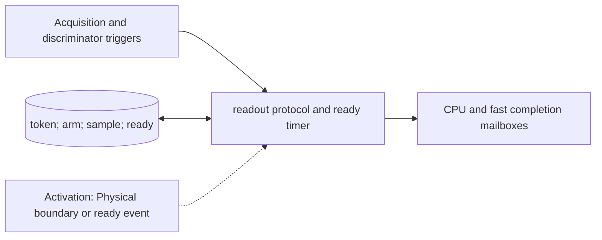

# Acquisition and Discrimination

**Architecture position:** [Module map](../module-architecture.md#3-module-map).

## Responsibility and neighbors

DeviceRuntime-owned readout protocol substate and scheduled result-ready events.

| Direction | Contract |
| --- | --- |
| Upstream inputs | Readout acquisition action, optional discriminator arm carrying the same measurement token, and backend sample. |
| Downstream outputs | Tagged completion to CPU-feedback crossing and independent fast-condition path. |
| State owner and retained state | Positive acquisition interval, arm tick, sample and collapse tick, result-ready tick, token status and reserved path credits. |

## Module diagram

## Behavior

**Activation:** Acquisition start and end are physical boundary events; result readiness is a timed callback.

**Transition:** Allocate no new token. For a separate pulse and discriminator, group validation requires exactly one of each with the same token. Baseline sampling and collapse occur at acquisition end. With arm tick a and processing delay L, ready tick is max(acquisition_end,a)+L. Fan out the same completion to each reserved delivery path.

**Time and visibility:** A backend call returning early on the host does not publish the result. Even L=0 still obeys the later receiver-edge crossing rule.

**Reset and errors:** Missing or duplicate arm, unknown token, and unsupported raw-waveform discrimination are faults. An old-epoch callback is discarded and traced.

Cross-module timing and visibility follow the [baseline protocol](../module-architecture.md#4-baseline-protocol-and-event-ordering).

## Implementation and verification

DeviceRuntime holds readout token, sample, arm and readiness state. Readiness is max(acquisition end, arm start) plus discriminator delay.

- Implementation: [device.cpp](../../src/device.cpp) and [device.hpp](../../include/qsbit/device.hpp).

**CTest:** `protocol.readout`.

Checks delayed arm, sample/readiness ticks, token matching and separate CPU/fast visibility.

- Numerical profile and supported scope: [Executable implementation](../implementation.md).
