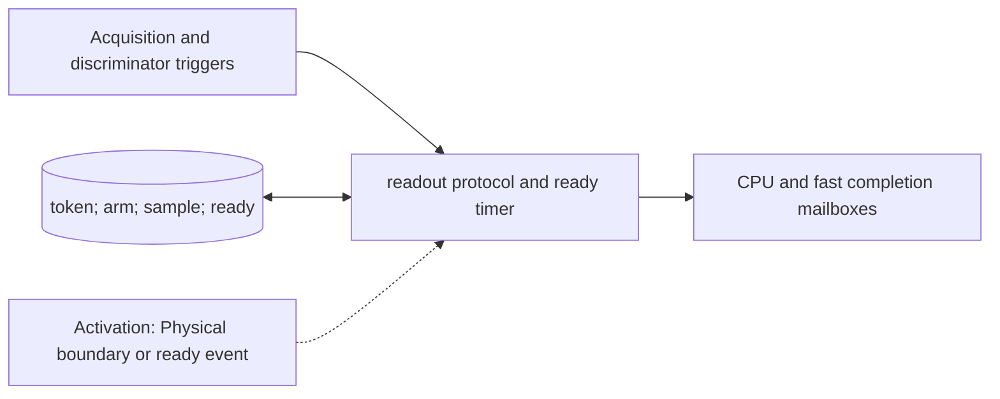

# Acquisition and Discrimination

**Architecture position:** [Module map](../module-architecture.md#3-module-map). **Status:** proposed behavior; no implementation exists yet.

## Responsibility and neighbors

DeviceRuntime-owned readout protocol substate and scheduled result-ready events.

| Direction | Contract |
| --- | --- |
| Upstream inputs | Readout acquisition action, optional discriminator arm carrying the same measurement token, and backend sample. |
| Downstream outputs | Tagged completion to CPU-feedback crossing and independent fast-condition path. |
| State owner and retained state | Positive acquisition interval, arm tick, sample and collapse tick, result-ready tick, token status and reserved path credits. |

## Module diagram

The dashed edge shows what invokes this behavior; it does not add a clock stage. Solid arrows show data flow. The cylinder shows state or read-only configuration used by the behavior, not another SystemC process.

## Behavior

**Activation:** Acquisition start and end are physical boundary events; result readiness is a timed callback.

**Transition:** Allocate no new token. For a separate pulse and discriminator, group validation requires exactly one of each with the same token. Baseline sampling and collapse occur at acquisition end. With arm tick a and processing delay L, ready tick is max(acquisition_end,a)+L. Fan out the same completion to each reserved delivery path.

**Time and visibility:** A backend call returning early on the host does not publish the result. Even L=0 still obeys the later receiver-edge crossing rule.

**Reset and errors:** Missing or duplicate arm, unknown token, and unsupported raw-waveform discrimination are faults. An old-epoch callback is discarded and traced.

**Focused verification:** Test late arm, L=0, paired triggers, repeated measurement and reset exactly at completion.

Cross-module timing and visibility follow the [baseline protocol](../module-architecture.md#4-baseline-protocol-and-event-ordering). A future profile that changes an applicable rule must state the replacement rule and its tests.
