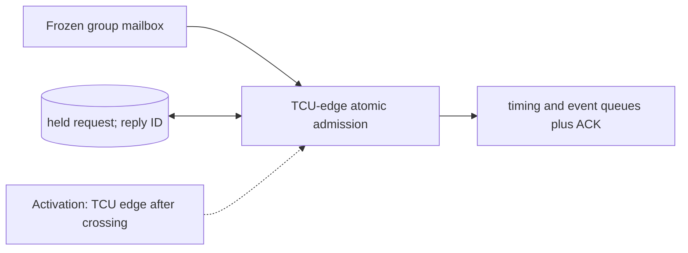

# Command Crossing and Atomic Admission

**Architecture position:** [Module map](../module-architecture.md#3-module-map). **Status:** proposed behavior; no implementation exists yet.

## Responsibility and neighbors

The mailbox holds one sealed group crossing from the CPU domain; the TCU-domain owner decides whether to insert it into its queues. The mailbox cannot mutate those queues by itself.

| Direction | Contract |
| --- | --- |
| Upstream inputs | One frozen sealed group from the producer and an optional prior admission reply. |
| Downstream outputs | Atomic timing and event queue writes, GroupAdmitted reply or typed error. |
| State owner and retained state | One held request, epoch and group IDs, crossing visibility tick, reply mailbox and de-duplication state. |

## Module diagram

The dashed edge shows what invokes this behavior; it does not add a clock stage. Solid arrows show data flow. The cylinder shows state or read-only configuration used by the behavior, not another SystemC process.

## Behavior

**Activation:** TCU admission check runs on its rising edge only after the request passes configured receiver-edge latency.

**Transition:** Check the sealed group’s member list, due-cycle deadline, queue capacity and IDs. If every check passes, insert one timing entry and all required per-port entries together, then return an ID-matched `GroupAdmitted` reply. If only current occupancy blocks insertion, keep the same request pending; never insert a partial group.

**Time and visibility:** At edge E, use old occupancy and require the group due cycle to be later than current T_D. An entry admitted at E cannot fire at E; a freed slot becomes usable on the next TCU edge.

**Reset and errors:** Reject stale epoch, duplicate group, impossible total capacity and late due cycle. Session reset clears mailboxes; old callbacks remain barred by epoch.

**Focused verification:** Test simultaneous CPU and TCU edges, same-edge queue release, oversized group, duplicate request, rejected late group and partial-write fault injection.

Cross-module timing and visibility follow the [baseline protocol](../module-architecture.md#4-baseline-protocol-and-event-ordering). A future profile that changes an applicable rule must state the replacement rule and its tests.
