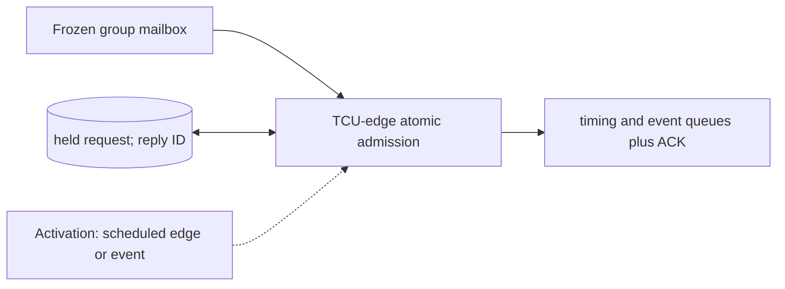

# Command Crossing and Atomic Admission

**Architecture position:** [Integrated contract, Section 3.9](../module-architecture.md#39-command-crossing-and-atomic-admission). **Status:** proposed behavior; no implementation exists yet.

## Responsibility and neighbors

Crossing mailbox plus admission logic in the TCU-domain owner. The mailbox never mutates TCU queues directly.

| Direction | Contract |
| --- | --- |
| Upstream inputs | One frozen sealed group from the producer and an optional prior admission reply. |
| Downstream outputs | Atomic timing and event queue writes, GroupAdmitted reply or typed error. |
| State owner and retained state | One held request, epoch and group IDs, crossing visibility tick, reply mailbox and de-duplication state. |

## Module diagram

The dashed activation edge is a scheduling or call relationship. The solid arrows carry records or results. The state shape identifies the only owner of the mutable state; it is not an additional SystemC process.

## Behavior

**Activation:** TCU admission check runs on its rising edge only after the request passes configured receiver-edge latency.

**Transition:** Validate manifest, deadline, queue capacities and member identities. Write one timing entry and all expected per-port entries as a single state transition, or write none. Hold a temporarily blocked request without changing it; generate an ID-matched reply after acceptance.

**Time and visibility:** At edge E, use old occupancy and require the group due cycle to be later than current T_D. An entry admitted at E cannot fire at E; a freed slot becomes usable on the next TCU edge.

**Reset and errors:** Reject stale epoch, duplicate group, impossible total capacity and late due cycle. Session reset clears mailboxes; old callbacks remain barred by epoch.

**Focused verification:** Test simultaneous CPU and TCU edges, same-edge queue release, oversized group, duplicate request, rejected late group and partial-write fault injection.

The module uses the baseline [producer and edge-order rules](../module-architecture.md#4-baseline-protocol-and-event-ordering). Any future timing profile that changes these rules must document its own behavior and tests.
