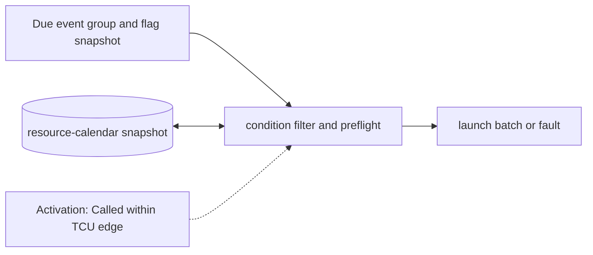

# Condition Gate and Launch Preflight

**Architecture position:** [Module map](../module-architecture.md#3-module-map).

## Responsibility and neighbors

Pure substage within the TCU edge transition. Producer-side device distribution has already resolved actions.

| Direction | Contract |
| --- | --- |
| Upstream inputs | Due manifested event batch, committed fast-condition snapshot and committed DeviceRuntime resource calendar. |
| Downstream outputs | One accepted immutable launch batch, explicit cancellations or whole-batch fault. |
| State owner and retained state | No independent persistent state; it reads immutable snapshots from TCU and device owners. |

## Module diagram

## Behavior

**Activation:** Call once for each due TCU label after manifest matching, before any physical side effect.

**Transition:** Evaluate every condition against the same prior snapshot; cancel false conditional actions explicitly; check surviving actions against each other and previously reserved half-open intervals. Validate backend support and same-tick target conflicts before publishing the batch.

**Time and visibility:** The check is part of the firing edge and cannot reschedule an action to a later tick. Fast flags that become visible on this edge apply only to later TCU edges.

**Reset and errors:** Missing required history or conflict yields a typed whole-batch fault. Conditional measurement is unsupported in the baseline. Supporting it would require a future profile to define cancellation and release of every reserved delivery credit.

Cross-module timing and visibility follow the [baseline protocol](../module-architecture.md#4-baseline-protocol-and-event-ordering).

## Implementation and verification

TcuCycleModel evaluates old fast history; DeviceRuntime preflights the complete launch before queue consumption or device reservation.

- Implementation: [tcu.cpp](../../src/tcu.cpp) and [device.hpp](../../include/qsbit/device.hpp).

**CTest:** `control.fast`, `protocol.calendar`, `protocol.sample_collision`.

Checks unavailable and false predicates, resource conflicts and rejection before partial device mutation.

- Numerical profile and supported scope: [Executable implementation](../implementation.md).
