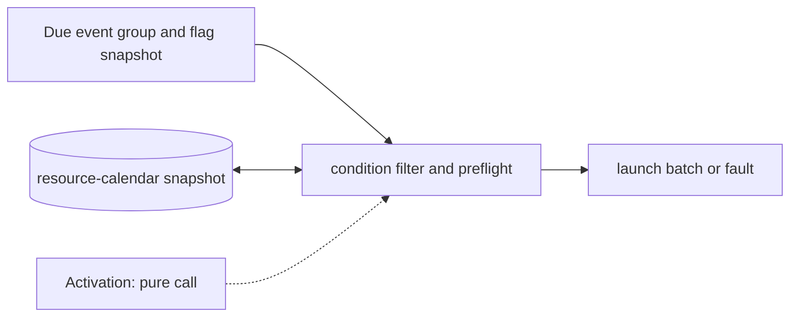

# Condition Gate and Launch Preflight

**Architecture position:** [Module map](../module-architecture.md#3-module-map). **Status:** proposed behavior; no implementation exists yet.

## Responsibility and neighbors

Pure substage within the TCU edge transition. Producer-side device distribution has already resolved actions.

| Direction | Contract |
| --- | --- |
| Upstream inputs | Due manifested event batch, committed fast-flag snapshot and committed DeviceRuntime resource calendar. |
| Downstream outputs | One accepted immutable launch batch, explicit cancellations or whole-batch fault. |
| State owner and retained state | No independent persistent state; it reads immutable snapshots from TCU and device owners. |

## Module diagram

The dashed activation edge is a scheduling or call relationship. The solid arrows carry records or results. The state shape identifies the only owner of the mutable state; it is not an additional SystemC process.

## Behavior

**Activation:** Call once for each due TCU label after manifest matching, before any physical side effect.

**Transition:** Evaluate every condition against the same prior snapshot; cancel false conditional actions explicitly; check surviving actions against each other and previously reserved half-open intervals. Validate backend support and same-tick target conflicts before publishing the batch.

**Time and visibility:** The check is part of the firing edge and cannot reschedule an action to a later tick. Fast flags that become visible on this edge apply only to later TCU edges.

**Reset and errors:** Missing required history or conflict yields a typed whole-batch fault. Baseline predicated measurement is unsupported unless a future cancellation rule frees its pending token.

**Focused verification:** Test false and unavailable predicates, simultaneous independent ports, future interval collision, instantaneous exclusive writes and no partial launch.

The module uses the baseline [producer and edge-order rules](../module-architecture.md#4-baseline-protocol-and-event-ordering). Any future timing profile that changes these rules must document its own behavior and tests.
