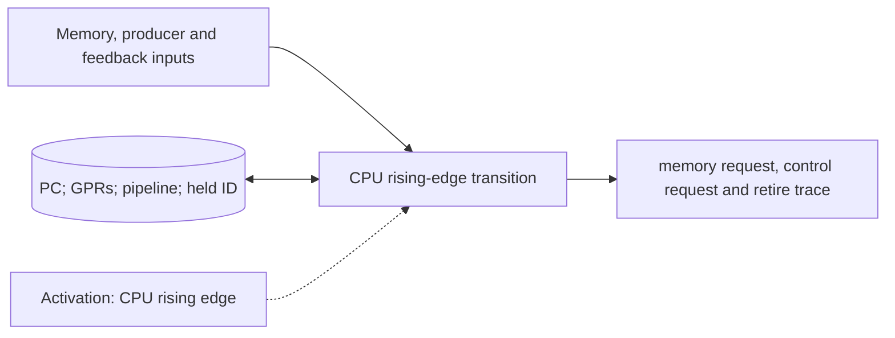

# CPU Cycle Model

**Architecture position:** [Module map](../module-architecture.md#3-module-map).

## Responsibility and neighbors

One CPU-domain owner, normally wrapped by a clock-sensitive `SC_METHOD`; its pipeline is a replaceable pure C++ cycle model.

| Direction | Contract |
| --- | --- |
| Upstream inputs | Prior committed memory response, producer-operation reply, CPU-visible measurement result with its token, reset epoch and CPU edge. |
| Downstream outputs | Stable memory and control requests, retirement record, PC and GPR state, stall reason and trace records. |
| State owner and retained state | PC, GPRs, pipeline latches, unresolved branch and fault state, held request ID and retirement sequence. |

## Module diagram

## Behavior

**Activation:** Wake on each CPU rising edge. A separate adapter call inside this transition adds no clock cycle.

**Transition:** Read prior committed inputs; resolve older branch and fault outcomes; advance the chosen pipeline; publish an irreversible store or control operation only from the oldest authorized non-speculative instruction. Hold its ID and operands unchanged during backpressure. Retire APPEND on ProducerAccepted; other operations use their barriers.

**Time and visibility:** A cross-owner reply such as `GroupAdmitted` follows the strict receiver-edge rule. `ProducerAccepted` is a local return inside the CPU-domain transition and adds no crossing latency. The selected CPU timing profile determines retirement; delta cycles never complete an extra pipeline stage.

**Reset and errors:** Reset clears pipeline and register state and restores loaded entry PC. A later protocol failure terminates the run as a simulator fault; it cannot retroactively turn a retired operation into a precise CPU trap.

Cross-module timing and visibility follow the [baseline protocol](../module-architecture.md#4-baseline-protocol-and-event-ordering).

## Implementation and verification

CpuCycleModel implements the three-stage pipeline; Simulator accepts an ICpuCycleModel factory for replacement. adapter_tests.cpp exercises this injection and reset.

- Implementation: [cpu.cpp](../../src/cpu.cpp) and [cpu.hpp](../../include/qsbit/cpu.hpp).

**CTest:** `systemc.use_cases`, `adapter.normal`, `adapter.reset`.

Checks hazards, branch flush, older faults, unique retirement IDs and replaceable CPU construction/reset.

- Numerical profile and supported scope: [Executable implementation](../implementation.md).
