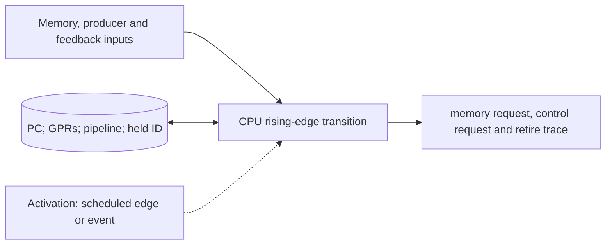

# CPU Cycle Model

**Architecture position:** [Integrated contract, Section 3.4](../module-architecture.md#34-cpu-cycle-model). **Status:** proposed behavior; no implementation exists yet.

## Responsibility and neighbors

One CPU-domain owner, normally wrapped by a clock-sensitive `SC_METHOD`; its pipeline is a replaceable pure C++ cycle model.

| Direction | Contract |
| --- | --- |
| Upstream inputs | Prior committed memory response, producer-operation reply, visible measurement token, reset epoch and CPU edge. |
| Downstream outputs | Stable memory and control requests, retirement record, PC and GPR state, stall reason and trace records. |
| State owner and retained state | PC, GPRs, pipeline latches, unresolved branch and fault state, held request ID and retirement sequence. |

## Module diagram

The dashed activation edge is a scheduling or call relationship. The solid arrows carry records or results. The state shape identifies the only owner of the mutable state; it is not an additional SystemC process.

## Behavior

**Activation:** Wake on each CPU rising edge. A separate adapter call inside this transition adds no clock cycle.

**Transition:** Read prior committed inputs; resolve older branch and fault outcomes; advance the chosen pipeline; publish an irreversible store or control operation only from the oldest authorized non-speculative instruction. Hold its ID and operands unchanged during backpressure. Retire APPEND on ProducerAccepted; other operations use their barriers.

**Time and visibility:** An acknowledgment published on a CPU edge is visible only on a later receiver edge under the crossing rule. No incidental delta cycle completes a pipeline stage.

**Reset and errors:** Reset clears pipeline and register state and restores loaded entry PC. A later protocol failure terminates the run as a simulator fault; it cannot retroactively turn a retired operation into a precise CPU trap.

**Focused verification:** Test branch flush, older memory fault, forwarding, stalls, duplicate acknowledgment, two APPENDs followed by ADVANCE, and registration-order invariance.

The module uses the baseline [producer and edge-order rules](../module-architecture.md#4-baseline-protocol-and-event-ordering). Any future timing profile that changes these rules must document its own behavior and tests.
