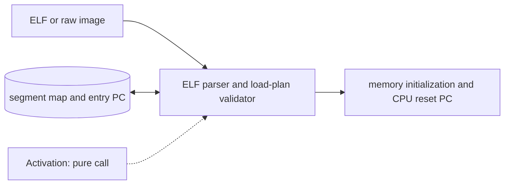

# ELF Loader and Program Image

**Architecture position:** [Integrated contract, Section 3.2](../module-architecture.md#32-elf-loader-and-program-image). **Status:** proposed behavior; no implementation exists yet.

## Responsibility and neighbors

Pure C++ startup component. It has no sensitivity list, `wait()`, or runtime SystemC process.

| Direction | Contract |
| --- | --- |
| Upstream inputs | RV32 ELF or test-only raw image, memory map and optional extension manifest. |
| Downstream outputs | Initialized memory bytes, executable ranges, initial PC and load diagnostics. |
| State owner and retained state | Load plan and checked segment descriptors exist only during initialization; the memory model owns bytes afterward. |

## Module diagram

The dashed activation edge is a scheduling or call relationship. The solid arrows carry records or results. The state shape identifies the only owner of the mutable state; it is not an additional SystemC process.

## Behavior

**Activation:** Call once before simulation or during an explicitly configured cold-start action.

**Transition:** Validate ELF class, machine, endianness, segment bounds, overlaps and entry PC; map loadable bytes and zero-fill required memory; publish the entry PC. For raw input require an explicit base address. The optional manifest can reject a known incompatible extension but cannot replace decoder checks.

**Time and visibility:** Program loading consumes no simulated cycles in the baseline. A modeled boot loader would be a separate timing profile.

**Reset and errors:** Reject a malformed image without partially starting simulation. Baseline session reset preserves loaded memory and reuses entry PC; a cold start reloads it.

**Focused verification:** Check malformed ELF fields, overlapping segments, zero-filled memory, legal entry, and raw-image base address.

The module uses the baseline [producer and edge-order rules](../module-architecture.md#4-baseline-protocol-and-event-ordering). Any future timing profile that changes these rules must document its own behavior and tests.
