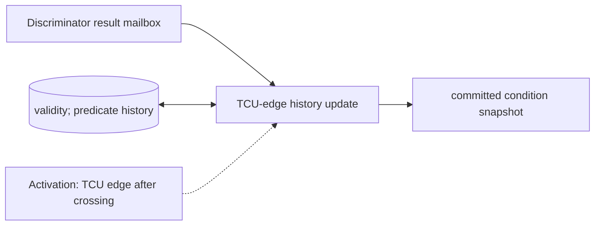

# Fast-Condition History

**Architecture position:** [Module map](../module-architecture.md#3-module-map). **Status:** proposed behavior; no implementation exists yet.

## Responsibility and neighbors

Optional TCU-domain history plus its own result crossing; it does not share CPU result visibility.

| Direction | Contract |
| --- | --- |
| Upstream inputs | Tagged discriminator completion and TCU clock edges. |
| Downstream outputs | Committed condition snapshot for launch preflight and fast-delivery credit release. |
| State owner and retained state | Per-target result history, predicate table, validity bit, crossing mailbox and epoch. |

## Module diagram

The dashed edge shows what invokes this behavior; it does not add a clock stage. Solid arrows show data flow. The cylinder shows state or read-only configuration used by the behavior, not another SystemC process.

## Behavior

**Activation:** Completion becomes eligible after configured TCU receiver-edge latency; TCU edge commits it after that edge’s due actions sample the prior snapshot.

**Transition:** Update history for every completed measurement independently of CPU result consumption and later pending measurements. An always-true selector supports unconditional events. A conditional event reads the prior committed history snapshot; a false predicate creates an explicit cancellation.

**Time and visibility:** A completion arriving on the same edge as a due label affects only a later edge. Per-target issue order is required in the baseline optional profile; unrelated targets may complete out of order.

**Reset and errors:** Missing required history faults. Conditional measurement is unsupported in the baseline to avoid leaving a token pending after cancellation. Reset clears history and old deliveries.

**Focused verification:** Test same-edge result versus condition, later pending result, CPU path slower or faster, missing history and canceled control output.

Cross-module timing and visibility follow the [baseline protocol](../module-architecture.md#4-baseline-protocol-and-event-ordering). A future profile that changes an applicable rule must state the replacement rule and its tests.
