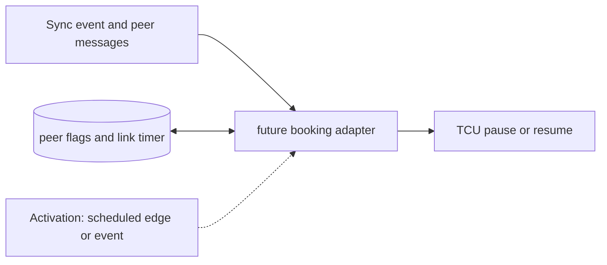

# Future Synchronization Adapter

**Architecture position:** [Integrated contract, Section 3.21](../module-architecture.md#321-future-synchronization-adapter-and-multiple-nodes). **Status:** proposed behavior; no implementation exists yet.

## Responsibility and neighbors

Extension boundary only. The Phase 1 baseline rejects synchronization and pause requests.

| Direction | Contract |
| --- | --- |
| Upstream inputs | Future sync instruction or sync event, peer messages and explicit link delay. |
| Downstream outputs | Future TCU pause or resume control and communication trace. |
| State owner and retained state | When enabled in a named future profile: booking state, peer flags, link delay and optional absolute simulated-time counter. |

## Module diagram

The dashed activation edge is a scheduling or call relationship. The solid arrows carry records or results. The state shape identifies the only owner of the mutable state; it is not an additional SystemC process.

## Behavior

**Activation:** In a future profile, a scheduled peer-message arrival wakes the adapter; TCU pause and resume still take effect only under declared edge rules.

**Transition:** Distributed-HISQ adds synchronization around the queue-based TCU. A later adapter may book a point, exchange peer signals and pause T_D until required conditions hold. Global simulation time and device evolution continue while local T_D is paused.

**Time and visibility:** Derived global fire ticks after an unresolved pause are unknown. A future implementation must declare resume-edge and same-time message ordering before claiming BISP behavior.

**Reset and errors:** Baseline reports unsupported for sync use. Future reset invalidates old peer messages by epoch and must preserve separate per-node timer ownership.

**Focused verification:** For a future profile, test peer delay, simultaneous booking, pause during device work, late message and independent node clocks.

The module uses the baseline [producer and edge-order rules](../module-architecture.md#4-baseline-protocol-and-event-ordering). Any future timing profile that changes these rules must document its own behavior and tests.
