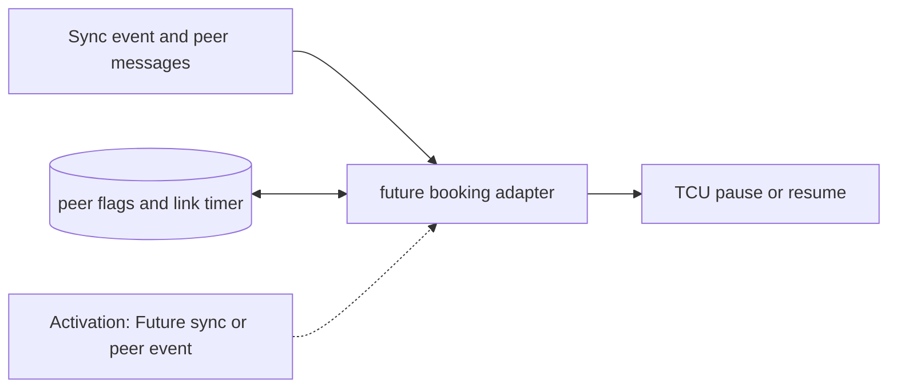

# Future Synchronization Adapter

**Architecture position:** [Module map](../module-architecture.md#3-module-map). **Status:** implemented in v0.1.0; future-only capabilities are identified below.

## Responsibility and neighbors

Extension boundary only. The Phase 1 baseline rejects synchronization and pause requests.

| Direction | Contract |
| --- | --- |
| Upstream inputs | Future sync instruction or sync event, peer messages and explicit link delay. |
| Downstream outputs | Future TCU pause or resume control and communication trace. |
| State owner and retained state | When enabled in a named future profile: booking state, peer flags, link delay and optional absolute simulated-time counter. |

## Module diagram

The dashed edge shows what invokes this behavior; it does not add a clock stage. Solid arrows show data flow. The cylinder shows state or read-only configuration used by the behavior, not another SystemC process.

## Behavior

**Activation:** In a future profile, a scheduled peer-message arrival wakes the adapter; TCU pause and resume still take effect only under declared edge rules.

**Transition:** Distributed-HISQ adds synchronization around the queue-based TCU. A later adapter may book a point, exchange peer signals and pause T_D until required conditions hold. Global simulation time and device evolution continue while local T_D is paused.

**Time and visibility:** Derived global fire ticks after an unresolved pause are unknown. A future implementation must declare resume-edge and same-time message ordering before claiming BISP behavior.

**Reset and errors:** Baseline reports unsupported for sync use. Future reset invalidates old peer messages by epoch and must preserve separate per-node timer ownership.

**Focused verification:** For a future profile, test peer delay, simultaneous booking, pause during device work, late message and independent node clocks.

Cross-module timing and visibility follow the [baseline protocol](../module-architecture.md#4-baseline-protocol-and-event-ordering). A future profile that changes an applicable rule must state the replacement rule and its tests.

## Implementation and verification

QSYNC raises UnsupportedSynchronization. This is a tested extension boundary, not a distributed synchronization implementation.

- Implementation: [producer.cpp](../../src/producer.cpp) and [producer.hpp](../../include/qsbit/producer.hpp).
- Focused verification: [use_cases.py](../../tests/use_cases.py); cross-module cases also run through [use_cases.py](../../tests/use_cases.py).
- Numerical profile and supported scope: [Executable implementation](../implementation.md).
