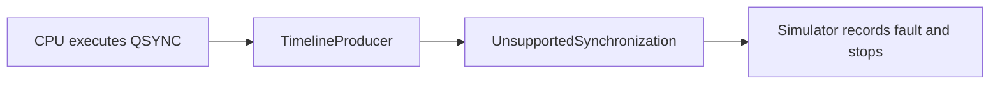

# Synchronization Extension Boundary

**Architecture position:** [Module map](../module-architecture.md#3-module-map).

## Supported behavior

Distributed synchronization is unsupported. The decoder recognizes the reserved QSYNC
encoding; the producer raises `UnsupportedSynchronization` when that instruction executes.
There is no synchronization process, peer-link state, or TCU pause/resume path.

| Direction | Contract |
| --- | --- |
| Upstream | CPU executes a legally encoded QSYNC instruction. |
| Downstream | Typed fatal fault, recorded by Simulator; no successful instruction completion. |
| State | No synchronization-specific retained state. |
| Activation | Producer call from the CPU edge transition. |
| Time | Rejection occurs on execution; it does not book a timing point or pause the TCU. |
| Reset | Normal session reset applies; there are no peer messages to cancel. |

## Module diagram

## Implementation and verification

- Implementation: [producer.cpp](../../src/producer.cpp), [producer.hpp](../../include/qsbit/producer.hpp).
- Encoding: [quantum instruction interface](../interfaces.md#quantum-instruction-encoding).

**CTest:** `systemc.use_cases`.

The `unsupported` program executes QSYNC and requires `UnsupportedSynchronization`.

## Future extension

A distributed profile would need peer-message timing, synchronization booking, TCU
pause/resume rules and reset handling. While a local TCU is paused, global simulation
time and device evolution must continue. Those behaviors have no implementation or
passing synchronization tests in the current baseline.
