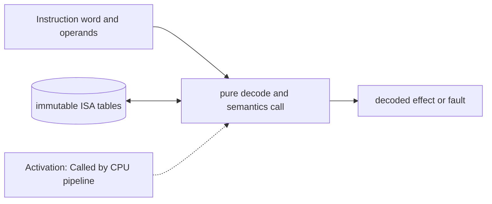

# ISA Decoder and Semantics

**Architecture position:** [Module map](../module-architecture.md#3-module-map). **Status:** proposed behavior; no implementation exists yet.

## Responsibility and neighbors

Pure C++ library called by the CPU owner. It does not own the PC, GPRs or a SystemC process.

| Direction | Contract |
| --- | --- |
| Upstream inputs | Fetched 32-bit word, PC, operand values, ISA extension profile and privilege assumptions. |
| Downstream outputs | Typed decoded operation, architectural effect description or typed fault; control operations go to the quantum instruction adapter. |
| State owner and retained state | No mutable architectural state. Tables of encoding masks and semantics are immutable for the simulation session. |

## Module diagram

The dashed edge shows what invokes this behavior; it does not add a clock stage. Solid arrows show data flow. The cylinder shows state or read-only configuration used by the behavior, not another SystemC process.

## Behavior

**Activation:** Call when the CPU model reaches its decode or execute stage, according to the selected pipeline profile.

**Transition:** Decode RV32I, immediates and enabled custom encodings; calculate sign extension, branch target, register effect and exceptions; describe APPEND, ADVANCE, FLUSH, READ_RESULT or END effects without performing them.

**Time and visibility:** Function execution consumes no SystemC time. Pipeline stage timing belongs to the CPU model. The assembler contract verifies emitted machine words against these masks.

**Reset and errors:** Unknown or disabled encodings return illegal instruction. Reset does not change immutable decode tables.

**Focused verification:** Cover every RV32I class, overflow and alignment edge cases, and each custom encoding including rejected masks.

Cross-module timing and visibility follow the [baseline protocol](../module-architecture.md#4-baseline-protocol-and-event-ordering). A future profile that changes an applicable rule must state the replacement rule and its tests.
