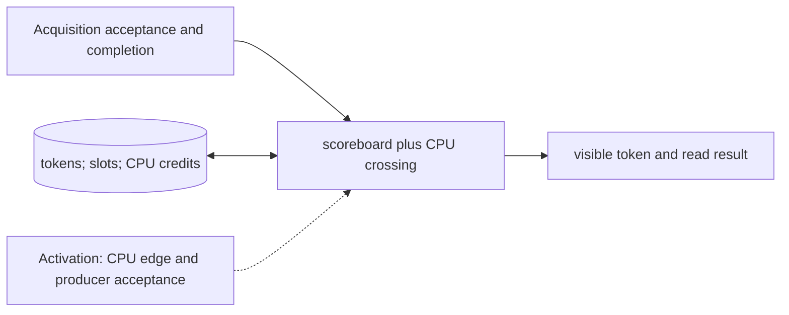

# Measurement Scoreboard and CPU Feedback

**Architecture position:** [Module map](../module-architecture.md#3-module-map). **Status:** proposed behavior; no implementation exists yet.

## Responsibility and neighbors

Token and slot state belongs to the CPU-domain producer and scoreboard; a separate committed mailbox handles CPU crossing.

| Direction | Contract |
| --- | --- |
| Upstream inputs | Authorized acquisition APPEND, tagged discrimination completion, READ_RESULT request and CPU edge. |
| Downstream outputs | ProducerAccepted with token; CPU-visible result or a typed token fault. |
| State owner and retained state | Bounded `(epoch, measurement_id, result_slot, slot_generation)` records in Free, Pending or Visible state, plus CPU-delivery credits. |

## Module diagram

The dashed edge shows what invokes this behavior; it does not add a clock stage. Solid arrows show data flow. The cylinder shows state or read-only configuration used by the behavior, not another SystemC process.

## Behavior

**Activation:** Allocate at producer acceptance; crossing completion becomes eligible on a later CPU edge; READ_RESULT acts through CPU commit path.

**Transition:** Reserve CPU completion capacity before accepting acquisition, mark the slot Pending immediately, and return its token. The discriminator refers to this token without another allocation. Match both epoch and slot_generation when delivering the result after crossing latency. READ_RESULT first seals any open group through FLUSH, waits for Visible, consumes that token and frees its CPU slot.

**Time and visibility:** Acquisition end, result-ready, CPU-visible, and result-consumption are separate milestones. Some may share a global tick when the profile permits it; result-ready to CPU-visible always obeys the strict crossing rule. Distinct tokens may complete out of order. Fast-path credits are independent of CPU slot consumption.

**Reset and errors:** Unknown, consumed, wrong-generation or wrong-epoch reads fault. Old-epoch completion cannot refill a reused slot. Session reset invalidates all generations.

**Focused verification:** Test stale earlier result, two outstanding generations, reversed completions, blocked read, capacity exhaustion and late fast delivery after CPU consumption.

Cross-module timing and visibility follow the [baseline protocol](../module-architecture.md#4-baseline-protocol-and-event-ordering). A future profile that changes an applicable rule must state the replacement rule and its tests.
