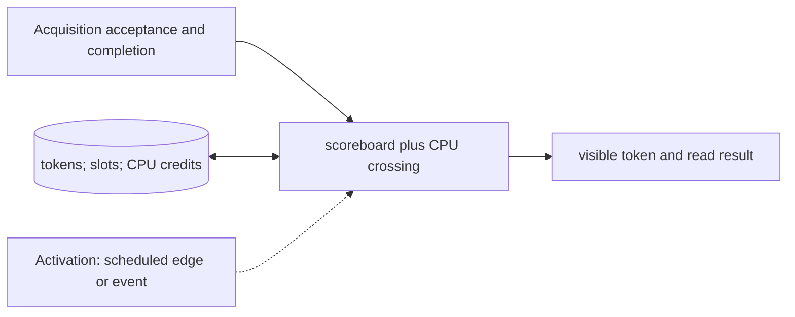

# Measurement Scoreboard and CPU Feedback

**Architecture position:** [Integrated contract, Section 3.18](../module-architecture.md#318-measurement-scoreboard-and-cpu-feedback-crossing). **Status:** proposed behavior; no implementation exists yet.

## Responsibility and neighbors

Token and slot state belongs to the CPU-domain producer and scoreboard; a separate committed mailbox handles CPU crossing.

| Direction | Contract |
| --- | --- |
| Upstream inputs | Authorized acquisition APPEND, tagged discrimination completion, READ_RESULT request and CPU edge. |
| Downstream outputs | ProducerAccepted with token; CPU-visible result or a typed token fault. |
| State owner and retained state | Bounded `(epoch, measurement_id, slot, generation)` records in Free, Pending or Visible state, plus CPU-delivery credits. |

## Module diagram

The dashed activation edge is a scheduling or call relationship. The solid arrows carry records or results. The state shape identifies the only owner of the mutable state; it is not an additional SystemC process.

## Behavior

**Activation:** Allocate at producer acceptance; crossing completion becomes eligible on a later CPU edge; READ_RESULT acts through CPU commit path.

**Transition:** Reserve CPU completion capacity before accepting acquisition, mark the slot Pending immediately, and return its token. The discriminator refers to this token without another allocation. Deliver its exact generation after crossing latency. READ_RESULT first flushes its producer point, waits for Visible, consumes that token and frees its CPU slot.

**Time and visibility:** Device completion, discrimination completion, CPU crossing arrival and architectural use are separate ticks. Distinct tokens may complete out of order. Fast-path credits are independent of CPU slot consumption.

**Reset and errors:** Unknown, consumed, wrong-generation or wrong-epoch reads fault. Old-epoch completion cannot refill a reused slot. Session reset invalidates all generations.

**Focused verification:** Test stale earlier result, two outstanding generations, reversed completions, blocked read, capacity exhaustion and late fast delivery after CPU consumption.

The module uses the baseline [producer and edge-order rules](../module-architecture.md#4-baseline-protocol-and-event-ordering). Any future timing profile that changes these rules must document its own behavior and tests.
