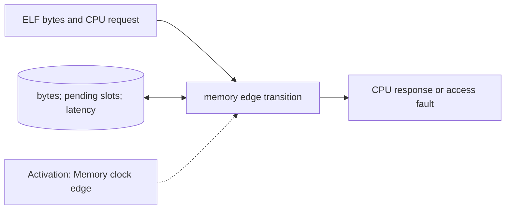

# Memory and Response Model

**Architecture position:** [Module map](../module-architecture.md#3-module-map). **Status:** proposed behavior; no implementation exists yet.

## Responsibility and neighbors

Clocked memory owner for runtime requests. ELF loading initializes its storage before the run.

| Direction | Contract |
| --- | --- |
| Upstream inputs | Load-plan bytes, one stable CPU request with ID, and CPU clock edge. |
| Downstream outputs | Bounded response mailbox with ID, value or access fault; M0 MMIO may feed the same producer protocol. |
| State owner and retained state | Byte storage, pending request slots, configured latency counters and response state. |

## Module diagram

The dashed edge shows what invokes this behavior; it does not add a clock stage. Solid arrows show data flow. The cylinder shows state or read-only configuration used by the behavior, not another SystemC process.

## Behavior

**Activation:** Wake on a configured memory clock edge, initially the CPU clock. Read a committed request; publish a later response according to the profile.

**Transition:** Check address and alignment, accept a request once by identity, schedule read or write completion, and apply a store effect once at its configured completion point. Keep a response stable until consumed; do not have both CPU and memory mutate the same request object.

**Time and visibility:** For a request published at tick p, eligibility begins at the first memory edge strictly after p. Response latency is counted in memory edges and reported as a tick.

**Reset and errors:** Out-of-range and misaligned accesses produce typed faults. Baseline session reset clears in-flight transactions but preserves loaded bytes; cold start reloads them.

**Focused verification:** Test response latency, held request, one-time store, load-after-store profile behavior, reset during a request and M0 MMIO conversion.

Cross-module timing and visibility follow the [baseline protocol](../module-architecture.md#4-baseline-protocol-and-event-ordering). A future profile that changes an applicable rule must state the replacement rule and its tests.
