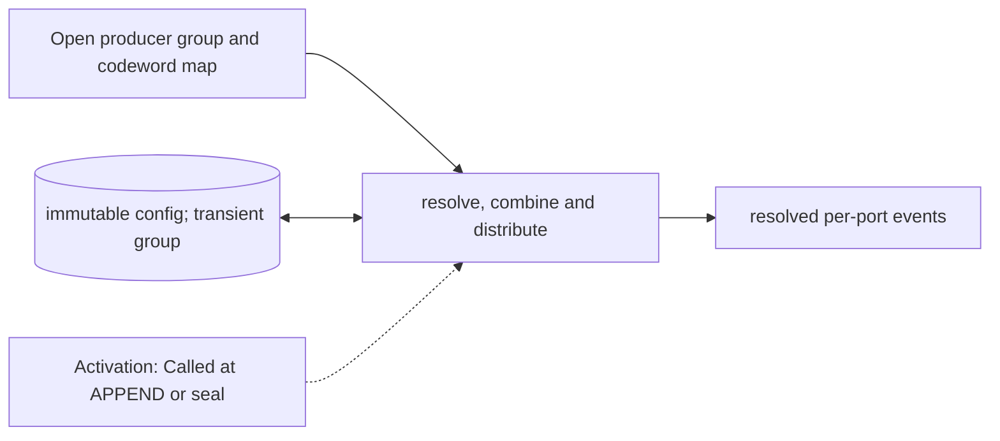

# Operation Lowerer and Device Distributor

**Architecture position:** [Module map](../module-architecture.md#3-module-map). **Status:** proposed behavior; no implementation exists yet.

## Responsibility and neighbors

Pure producer-side group resolver. Mandatory port action resolution is present even if optional higher-level lowering is disabled.

| Direction | Contract |
| --- | --- |
| Upstream inputs | Open same-time group, versioned codeword map, target map and profile hash. |
| Downstream outputs | Immutable per-port event group with resolved resources, delays, durations and measurement associations. |
| State owner and retained state | Configuration tables are read-only per epoch; transient grouping and duplicate checks occur within the producer owner. |

## Module diagram

The dashed edge shows what invokes this behavior; it does not add a clock stage. Solid arrows show data flow. The cylinder shows state or read-only configuration used by the behavior, not another SystemC process.

## Behavior

**Activation:** APPEND checks each action before producer acceptance; sealing performs whole-group combination before crossing submission.

**Transition:** Resolve codewords to action descriptors, combine simultaneous actions, detect duplicates and route actions to target device ports before TCU admission. Baseline direct port-codeword commands do not require eQASM decoding. Higher-level multi-point lowering needs a separately declared bounded timing profile.

**Time and visibility:** Pure lookup itself adds no modeled latency. Any future microcode pipeline with finite issue bandwidth must declare its stage timing and queue demand.

**Reset and errors:** Missing mapping, incompatible port or impossible group width fails before admission. Configuration does not change during an epoch.

**Focused verification:** Check two same-label ports, duplicate physical target, invalid codeword, profile hash mismatch and an expansion that would reorder timeline points.

Cross-module timing and visibility follow the [baseline protocol](../module-architecture.md#4-baseline-protocol-and-event-ordering). A future profile that changes an applicable rule must state the replacement rule and its tests.
