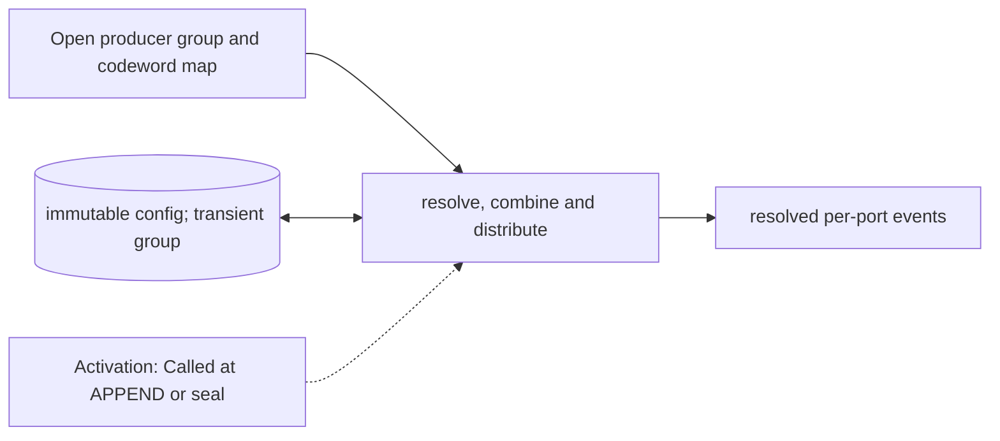

# Operation Lowerer and Device Distributor

**Architecture position:** [Module map](../module-architecture.md#3-module-map).

## Responsibility and neighbors

Pure producer-side group resolver. Mandatory port action resolution is present even if optional higher-level lowering is disabled.

| Direction | Contract |
| --- | --- |
| Upstream inputs | Profile, source port/codeword, epoch, instruction/event IDs and optional measurement and condition tokens. |
| Downstream outputs | Immutable per-port event group with resolved resources, delays, durations and measurement associations. |
| State owner and retained state | Configuration tables are read-only for the simulation session; transient grouping and duplicate checks occur within the producer owner. |

## Module diagram

## Behavior

**Activation:** APPEND resolves and validates actions before producer acceptance; sealing assigns the group label and manifest before crossing submission.

**Transition:** Resolve each codeword to ActionSpec values and assign stable event IDs. The producer accumulates these events in one open group, checks capacity and manifest consistency, then submits them together to the TCU. Baseline direct port-codeword commands do not require eQASM decoding. Higher-level multi-point lowering needs a separately declared bounded timing profile.

**Time and visibility:** Pure lookup itself adds no modeled latency. Any future microcode pipeline with finite issue bandwidth must declare its stage timing and queue demand.

**Reset and errors:** Missing mapping, incompatible port or impossible group width fails before admission. Session reset does not change the immutable configuration.

Cross-module timing and visibility follow the [baseline protocol](../module-architecture.md#4-baseline-protocol-and-event-ordering).

## Implementation and verification

lower resolves immutable mappings into ReservedEvent values. TimelineProducer validates the complete staged group.

- Implementation: [control.cpp](../../src/control.cpp) and [control.hpp](../../include/qsbit/control.hpp).

**CTest:** `control.mapping`, `protocol.capacity`.

Checks mapping errors, manifest validation and rejection of groups exceeding staging or result capacity.

- Numerical profile and supported scope: [Executable implementation](../implementation.md).
