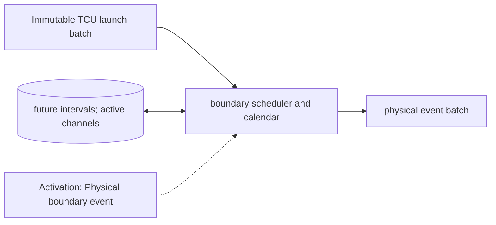

# Output Channels and Resource Calendar

**Architecture position:** [Module map](../module-architecture.md#3-module-map). **Status:** proposed behavior; no implementation exists yet.

## Responsibility and neighbors

DeviceRuntime is the sole owner of physical channel occupancy and future interval reservations.

| Direction | Contract |
| --- | --- |
| Upstream inputs | TCU launch batch, resolved action intervals and previously scheduled physical boundaries. |
| Downstream outputs | Codeword-trigger, physical-start and physical-end records, active drive set and event batches to quantum service and readout. |
| State owner and retained state | Resource interval calendar, pending boundaries, active channels, processed batch IDs and session epoch. |

## Module diagram

The dashed edge shows what invokes this behavior; it does not add a clock stage. Solid arrows show data flow. The cylinder shows state or read-only configuration used by the behavior, not another SystemC process.

## Behavior

**Activation:** Scheduled physical-boundary events wake DeviceRuntime; zero-delay launches join the current tick’s explicit phase batch.

**Transition:** Preflight each complete launch batch against existing future reservations and same-batch actions. Install every accepted half-open interval [start,end) once. End old actions before starting new ones at the same tick; allow back-to-back occupancy. Additive drives may overlap if the backend supports them.

**Time and visibility:** DeviceRuntime aggregates all actions assigned tick t before physical-state evaluation. An sc_event only wakes the owner; callback identity and payload remain in durable epoch-tagged storage.

**Reset and errors:** Unsupported conflict rejects the whole batch. Session reset aborts active actions and invalidates scheduled old-epoch callbacks. Positive pulse and acquisition duration is required.

**Focused verification:** Test future overlap, adjacent intervals, zero-delay launch, old-epoch scheduled end and reversed arrival order.

Cross-module timing and visibility follow the [baseline protocol](../module-architecture.md#4-baseline-protocol-and-event-ordering). A future profile that changes an applicable rule must state the replacement rule and its tests.
