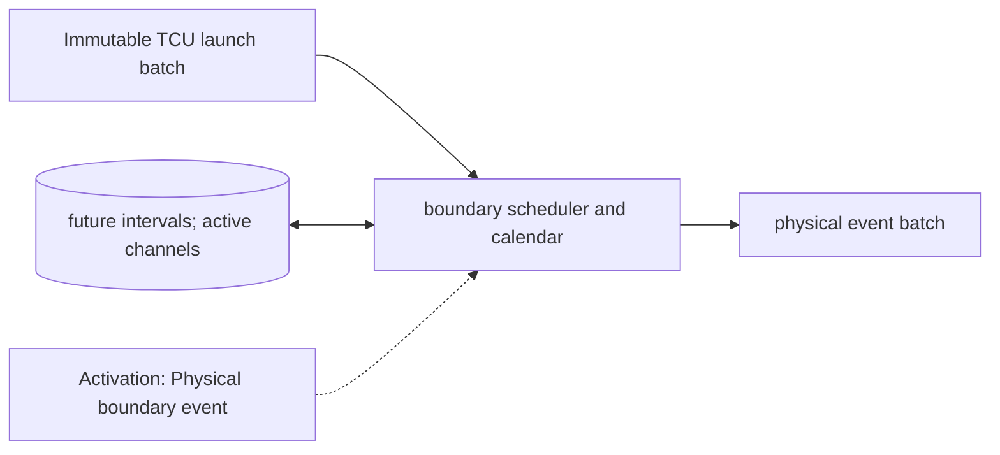

# Output Channels and Resource Calendar

**Architecture position:** [Module map](../module-architecture.md#3-module-map).

## Responsibility and neighbors

DeviceRuntime is the sole owner of physical channel occupancy and future interval reservations.

| Direction | Contract |
| --- | --- |
| Upstream inputs | TCU launch batch, resolved action intervals and previously scheduled physical boundaries. |
| Downstream outputs | Codeword-trigger, physical-start and physical-end records, active drive set and event batches to quantum service and readout. |
| State owner and retained state | Resource interval calendar, pending boundaries, active channels, last processed physical tick and session epoch. |

## Module diagram

## Behavior

**Activation:** Scheduled physical-boundary events wake DeviceRuntime; zero-delay launches join the current tick’s explicit phase batch.

**Transition:** Preflight each complete launch batch against existing future reservations and same-batch actions. Install every accepted half-open interval [start,end) once. End old actions before starting new ones at the same tick; allow back-to-back occupancy. Additive drives may overlap if the backend supports them.

**Time and visibility:** DeviceRuntime aggregates all actions assigned tick t before physical-state evaluation. An sc_event only wakes the owner; callback identity and payload remain in durable epoch-tagged storage.

**Reset and errors:** Unsupported conflict rejects the whole batch. Session reset aborts active actions and invalidates scheduled old-epoch callbacks. Positive pulse and acquisition duration is required.

Cross-module timing and visibility follow the [baseline protocol](../module-architecture.md#4-baseline-protocol-and-event-ordering).

## Implementation and verification

ResourceCalendar checks future half-open intervals. DeviceRuntime schedules starts and ends under one chronological owner.

- Implementation: [device.cpp](../../src/device.cpp) and [device.hpp](../../include/qsbit/device.hpp).

**CTest:** `protocol.calendar`, `protocol.sample_collision`, `protocol.reset`.

Checks interval conflicts, same-target sampling collisions and cancellation of in-flight device work.

- Numerical profile and supported scope: [Executable implementation](../implementation.md).
