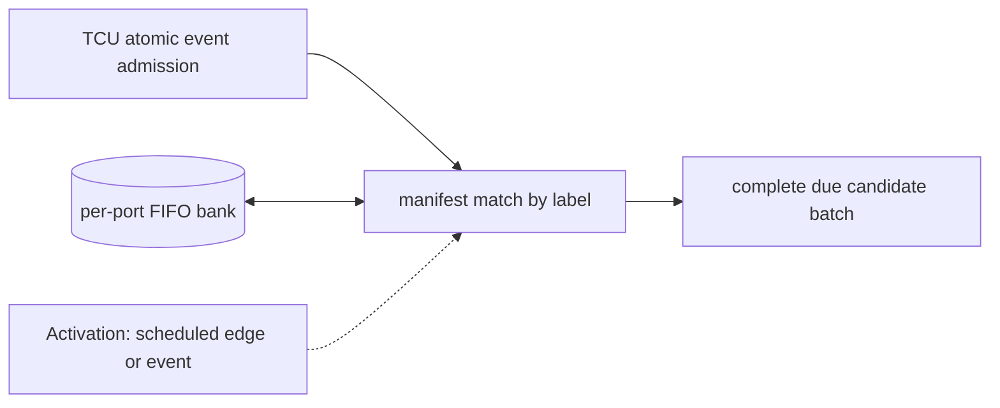

# Per-Port Event Queues

**Architecture position:** [Integrated contract, Section 3.11](../module-architecture.md#311-per-port-event-queues). **Status:** proposed behavior; no implementation exists yet.

## Responsibility and neighbors

Bounded queue bank owned by the same TCU cycle model as the timing queue and broadcaster.

| Direction | Contract |
| --- | --- |
| Upstream inputs | Atomically admitted resolved events grouped by timing label and physical port. |
| Downstream outputs | All manifested head events for a due label to launch preflight; occupancy to admission. |
| State owner and retained state | Per-port ordered FIFOs, head IDs and configured per-edge issue width. |

## Module diagram

The dashed activation edge is a scheduling or call relationship. The solid arrows carry records or results. The state shape identifies the only owner of the mutable state; it is not an additional SystemC process.

## Behavior

**Activation:** Admission appends on a TCU edge; label broadcast reads old heads in that owner transition.

**Transition:** For due label L, compare exactly the manifest’s IDs and counts with each port head. Fire all matching members as one candidate batch. Leave ports absent from the manifest idle; leave future-label entries queued. Do not drain more than configured port width using zero-time loops.

**Time and visibility:** Logical matching and launch preflight share a TCU edge; separate C++ helper calls do not add clock cycles.

**Reset and errors:** Past or extra same-label entries fault with the whole group before launch. Reset clears every FIFO and invalidates old epoch entries.

**Focused verification:** Test two simultaneous ports, idle unmentioned port, extra and missing entry, per-port width and queue-full backpressure.

The module uses the baseline [producer and edge-order rules](../module-architecture.md#4-baseline-protocol-and-event-ordering). Any future timing profile that changes these rules must document its own behavior and tests.
