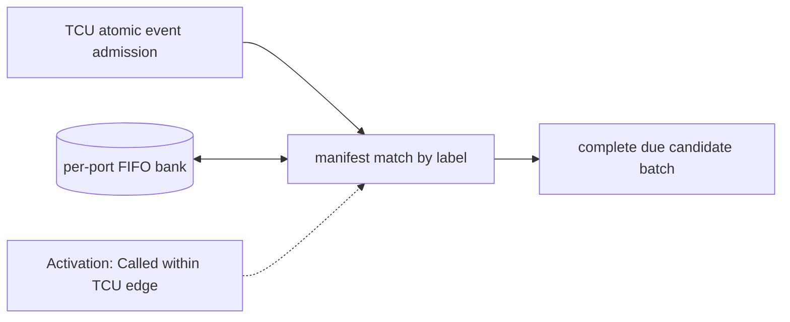

# Per-Port Event Queues

**Architecture position:** [Module map](../module-architecture.md#3-module-map). **Status:** proposed behavior; no implementation exists yet.

## Responsibility and neighbors

Bounded queue bank owned by the same TCU cycle model as the timing queue and broadcaster.

| Direction | Contract |
| --- | --- |
| Upstream inputs | Atomically admitted resolved events grouped by timing label and physical port. |
| Downstream outputs | All manifested head events for a due label to launch preflight; occupancy to admission. |
| State owner and retained state | Per-port ordered FIFOs, head IDs and configured per-port firing width. |

## Module diagram

The dashed edge shows what invokes this behavior; it does not add a clock stage. Solid arrows show data flow. The cylinder shows state or read-only configuration used by the behavior, not another SystemC process.

## Behavior

**Activation:** Admission appends on a TCU edge; label broadcast reads old heads in that owner transition.

**Transition:** When the timer reaches label L, compare the timing point’s expected IDs and per-port counts with the previously committed queue heads. Only a complete match becomes one candidate launch batch; remove those members once. Ports absent from the list stay idle and future-label entries remain queued. The configured per-port firing width cannot be bypassed with zero-time loops.

**Time and visibility:** Logical matching and launch preflight share a TCU edge; separate C++ helper calls do not add clock cycles.

**Reset and errors:** Past or extra same-label entries fault with the whole group before launch. Reset clears every FIFO and invalidates old epoch entries.

**Focused verification:** Test two simultaneous ports, idle unmentioned port, extra and missing entry, per-port firing width and queue-full backpressure.

Cross-module timing and visibility follow the [baseline protocol](../module-architecture.md#4-baseline-protocol-and-event-ordering). A future profile that changes an applicable rule must state the replacement rule and its tests.
