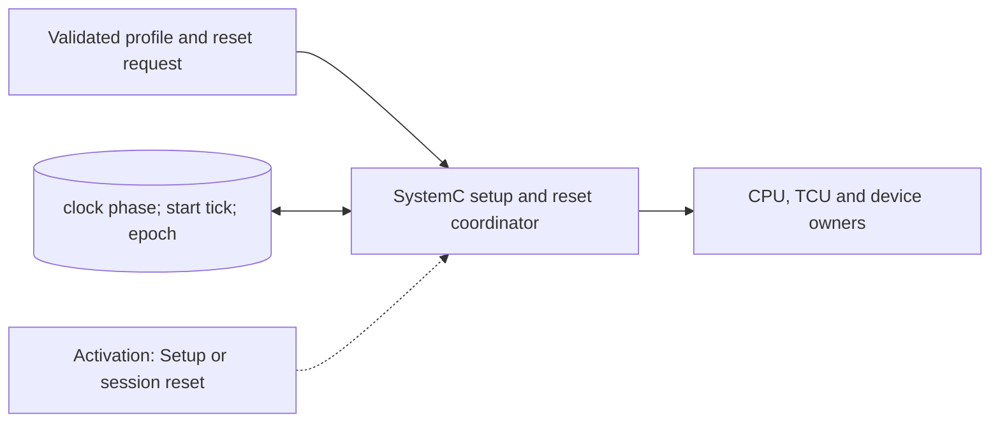

# Platform Configuration and Clock Adapter

**Architecture position:** [Module map](../module-architecture.md#3-module-map). **Status:** proposed behavior; no implementation exists yet.

## Responsibility and neighbors

Platform setup owns the immutable timing profile; a session coordinator owns reset requests. This is a SystemC integration boundary, not a per-cycle hardware datapath.

| Direction | Contract |
| --- | --- |
| Upstream inputs | CLI configuration, the device profile, selected ISA profile, and a requested session start or reset tick. |
| Downstream outputs | CPU and TCU clocks, cross-domain mailbox capacities and latencies, DeviceRuntime timing, epoch and trace metadata. |
| State owner and retained state | Validated integer tick resolution, clock periods and phases, start tick, current session epoch, and immutable configuration hash. |

## Module diagram

The dashed edge shows what invokes this behavior; it does not add a clock stage. Solid arrows show data flow. The cylinder shows state or read-only configuration used by the behavior, not another SystemC process.

## Behavior

**Activation:** Validate and construct before elaboration. A scheduled session-reset callback runs before other work at its tick; clock edges wake their respective domain owners.

**Transition:** Check that every period, phase and device delay maps exactly to global ticks; create separate CPU and TCU clocks; publish a single read-only profile snapshot to all owners. Configure start independently of CPU progress so admission backpressure cannot prevent timer start.

**Time and visibility:** Global simulation time never rewinds. At a coincident reset and clock edge, reset dominates and suppresses that edge’s ordinary state transition. Ordinary clocks still create every modeled edge.

**Reset and errors:** Reject unrepresentable or inconsistent parameters before sc_start. Session reset preserves the immutable timing profile, increments the epoch, invalidates old callbacks and initializes the backend; a future controller-only reset needs a different contract.

**Focused verification:** Change CPU and TCU phases and confirm predicted edge sequences; reset exactly on a due edge and verify no old-epoch launch survives.

Cross-module timing and visibility follow the [baseline protocol](../module-architecture.md#4-baseline-protocol-and-event-ordering). A future profile that changes an applicable rule must state the replacement rule and its tests.
