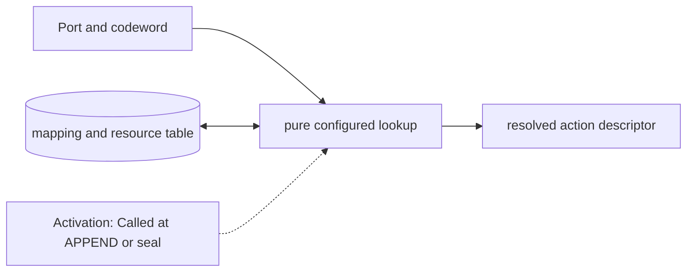

# Port Codeword and Waveform Map

**Architecture position:** [Module map](../module-architecture.md#3-module-map). **Status:** implemented in v0.1.0; future-only capabilities are identified below.

## Responsibility and neighbors

Pure immutable lookup used during APPEND and group sealing, before TCU admission.

| Direction | Contract |
| --- | --- |
| Upstream inputs | Port, codeword, target, immutable configuration hash and declared backend capabilities. |
| Downstream outputs | Action descriptor containing kind, resource IDs, fixed trigger delay, duration and readout association. |
| State owner and retained state | Versioned mapping table, resource declarations and calibration identifiers; no mutable pulse state. |

## Module diagram

The dashed edge shows what invokes this behavior; it does not add a clock stage. Solid arrows show data flow. The cylinder shows state or read-only configuration used by the behavior, not another SystemC process.

## Behavior

**Activation:** Lookup when APPEND is proposed; whole-group validation repeats consistency checks at seal.

**Transition:** Decode a digital codeword for its configured port. Permit mapped waveform, oscillator setting, readout or discriminator action kinds. Declare exclusive physical resources separately from intentionally additive pulse drives. Keep source port and codeword in the descriptor.

**Time and visibility:** Primitive pulse output starts after a fixed configured trigger-to-output delay. Codeword trigger, physical start and physical end are separate trace milestones. Zero trigger-to-output delay allows trigger and start to share a tick; positive pulse duration separates start and end.

**Reset and errors:** Unknown codeword, wrong port, unrepresentable delay or unsupported backend capability faults before producer acceptance. Configuration is immutable for the simulation session, including across session resets.

**Focused verification:** Test configuration version, wrong port, action kind, additive versus exclusive resource declarations and fixed delay.

Cross-module timing and visibility follow the [baseline protocol](../module-architecture.md#4-baseline-protocol-and-event-ordering). A future profile that changes an applicable rule must state the replacement rule and its tests.

## Implementation and verification

Profile holds immutable gate, constant-drive pulse, acquisition and arm descriptors. Arbitrary sampled waveform storage is outside v1.

- Implementation: [control.cpp](../../src/control.cpp) and [control.hpp](../../include/qsbit/control.hpp).
- Focused verification: [control_tests.cpp](../../tests/control_tests.cpp); cross-module cases also run through [use_cases.py](../../tests/use_cases.py).
- Numerical profile and supported scope: [Executable implementation](../implementation.md).
