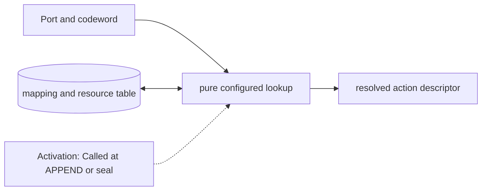

# Port Codeword and Waveform Map

**Architecture position:** [Module map](../module-architecture.md#3-module-map).

## Responsibility and neighbors

Pure immutable lookup used during APPEND and group sealing, before TCU admission.

| Direction | Contract |
| --- | --- |
| Upstream inputs | Source port and codeword, looked up in the immutable Profile mappings. |
| Downstream outputs | Action descriptor containing kind, resource IDs, fixed trigger delay, duration and readout association. |
| State owner and retained state | Mapping table of ActionSpec values and resource declarations; no mutable pulse state. |

## Module diagram

## Behavior

**Activation:** Lookup when APPEND is proposed; whole-group validation repeats consistency checks at seal.

**Transition:** Decode a digital codeword for its configured port. Supported kinds are IdealGate, Pulse, Acquire and DiscriminatorArm. Declare exclusive physical resources separately from intentionally additive pulse drives. The lowerer preserves source port and codeword in ReservedEvent.

**Time and visibility:** Primitive pulse output starts after a fixed configured trigger-to-output delay. Codeword trigger, physical start and physical end are separate trace milestones. Zero trigger-to-output delay allows trigger and start to share a tick; positive pulse duration separates start and end.

**Reset and errors:** Unknown codeword, wrong port, unrepresentable delay or unsupported backend capability faults before producer acceptance. Configuration is immutable for the simulation session, including across session resets.

Cross-module timing and visibility follow the [baseline protocol](../module-architecture.md#4-baseline-protocol-and-event-ordering).

## Implementation and verification

Profile holds immutable gate, constant-drive pulse, acquisition and arm descriptors. Arbitrary sampled waveform storage is outside v1.

- Implementation: [control.cpp](../../src/control.cpp) and [control.hpp](../../include/qsbit/control.hpp).

**CTest:** `control.mapping`, `protocol.readout`.

Checks unknown port/codeword, duplicate mappings, fingerprint changes and incompatible acquisition/arm targets.

- Numerical profile and supported scope: [Executable implementation](../implementation.md).
