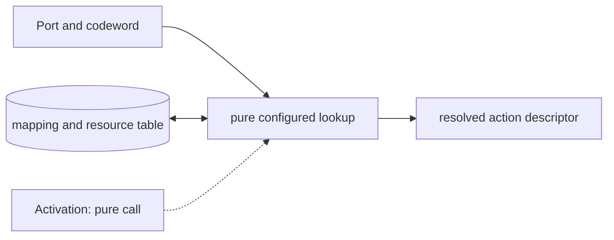

# Port Codeword and Waveform Map

**Architecture position:** [Module map](../module-architecture.md#3-module-map). **Status:** proposed behavior; no implementation exists yet.

## Responsibility and neighbors

Pure immutable lookup used during APPEND and group sealing, before TCU admission.

| Direction | Contract |
| --- | --- |
| Upstream inputs | Port, codeword, target, epoch configuration hash and declared backend capabilities. |
| Downstream outputs | Action descriptor containing kind, resource IDs, fixed trigger delay, duration and readout association. |
| State owner and retained state | Versioned mapping table, resource declarations and calibration identifiers; no mutable pulse state. |

## Module diagram

The dashed activation edge is a scheduling or call relationship. The solid arrows carry records or results. The state shape identifies the only owner of the mutable state; it is not an additional SystemC process.

## Behavior

**Activation:** Lookup when APPEND is proposed; whole-group validation repeats consistency checks at seal.

**Transition:** Decode a digital codeword for its configured port. Permit mapped waveform, oscillator setting, readout or discriminator action kinds. Declare exclusive physical resources separately from intentionally additive pulse drives. Keep source port and codeword in the descriptor.

**Time and visibility:** Primitive pulse output starts after a fixed configured trigger-to-output delay. Trigger, physical start and physical end have distinct trace ticks.

**Reset and errors:** Unknown codeword, wrong port, unrepresentable delay or unsupported backend capability faults before producer acceptance. Config remains frozen for the epoch.

**Focused verification:** Test configuration version, wrong port, action kind, additive versus exclusive resource declarations and fixed delay.

The module uses the baseline [producer and edge-order rules](../module-architecture.md#4-baseline-protocol-and-event-ordering). Any future timing profile that changes these rules must document its own behavior and tests.
