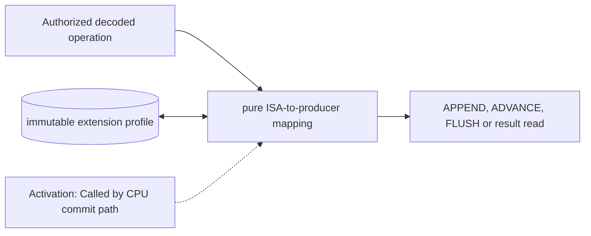

# Quantum Instruction Adapter

**Architecture position:** [Module map](../module-architecture.md#3-module-map). **Status:** implemented in v0.1.0; future-only capabilities are identified below.

## Responsibility and neighbors

Pure mapping called from the authorized CPU commit path. It does not introduce its own SystemC thread.

| Direction | Contract |
| --- | --- |
| Upstream inputs | Decoded extension effect, immutable operand snapshot, target configuration and active epoch. |
| Downstream outputs | One semantic producer operation or typed unsupported error; result reads consult the CPU-domain scoreboard. |
| State owner and retained state | No independently clocked state; pending instruction identity remains owned by the CPU. |

## Module diagram

The dashed edge shows what invokes this behavior; it does not add a clock stage. Solid arrows show data flow. The cylinder shows state or read-only configuration used by the behavior, not another SystemC process.

## Behavior

**Activation:** Call only for the oldest non-speculative instruction when the CPU cycle model authorizes external publication.

**Transition:** Map codeword instructions to APPEND(port, codeword), waits to ADVANCE(interval), explicit sealing to FLUSH, result reads to READ_RESULT(token), and producer closure to END. These semantic operations map to the v1 custom-0 opcodes in ADR 0001. Use the configured port action map without assuming a codeword names a gate.

**Time and visibility:** Producer acceptance and TCU admission are distinct; the adapter returns whichever completion the semantic operation requires. It never advances T_D by sleeping a host process.

**Reset and errors:** Reject unsupported operation, port or operand before irreversible acceptance. No mutable state to clear on reset; stale-epoch requests are rejected.

**Focused verification:** Check immediate and register operands, illegal port and codeword, a blocked operation with stable operands, and a result read that first flushes.

Cross-module timing and visibility follow the [baseline protocol](../module-architecture.md#4-baseline-protocol-and-event-ordering). A future profile that changes an applicable rule must state the replacement rule and its tests.

## Implementation and verification

adapt_quantum maps decoded custom-0 instructions and captured register operands into ProducerOperation values.

- Implementation: [producer.cpp](../../src/producer.cpp) and [producer.hpp](../../include/qsbit/producer.hpp).
- Focused verification: [use_cases.py](../../tests/use_cases.py); cross-module cases also run through [use_cases.py](../../tests/use_cases.py).
- Numerical profile and supported scope: [Executable implementation](../implementation.md).
