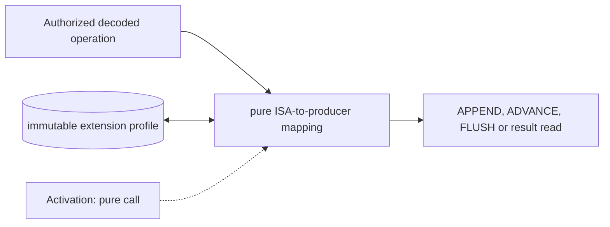

# Quantum Instruction Adapter

**Architecture position:** [Integrated contract, Section 3.6](../module-architecture.md#36-quantum-instruction-adapter). **Status:** proposed behavior; no implementation exists yet.

## Responsibility and neighbors

Pure mapping called from the authorized CPU commit path. It does not introduce its own SystemC thread.

| Direction | Contract |
| --- | --- |
| Upstream inputs | Decoded extension effect, immutable operand snapshot, target configuration and active epoch. |
| Downstream outputs | One semantic producer operation or typed unsupported error; result reads consult the CPU-domain scoreboard. |
| State owner and retained state | No independently clocked state; pending instruction identity remains owned by the CPU. |

## Module diagram

The dashed activation edge is a scheduling or call relationship. The solid arrows carry records or results. The state shape identifies the only owner of the mutable state; it is not an additional SystemC process.

## Behavior

**Activation:** Call only for the oldest non-speculative instruction when the CPU cycle model authorizes external publication.

**Transition:** Map codeword instructions to APPEND(port, codeword), waits to ADVANCE(interval), explicit barriers to FLUSH and result reads to READ_RESULT(token). Treat these names as semantic operations, not finalized opcodes. Use the configured port action map without assuming a codeword names a gate.

**Time and visibility:** Producer acceptance and TCU admission are distinct; the adapter returns whichever completion the semantic operation requires. It never advances T_D by sleeping a host process.

**Reset and errors:** Reject unsupported operation, port or operand before irreversible acceptance. No mutable state to clear on reset; stale-epoch requests are rejected.

**Focused verification:** Check immediate and register operands, illegal port and codeword, a blocked operation with stable operands, and a result read that first flushes.

The module uses the baseline [producer and edge-order rules](../module-architecture.md#4-baseline-protocol-and-event-ordering). Any future timing profile that changes these rules must document its own behavior and tests.
