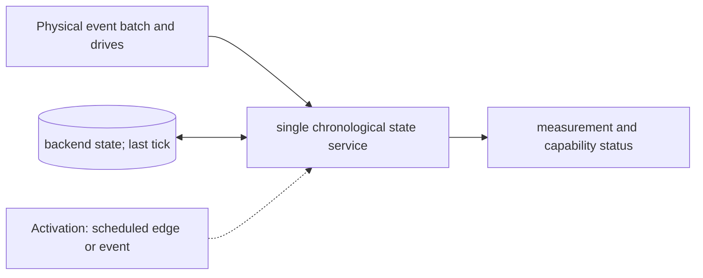

# Quantum-State Service and Backends

**Architecture position:** [Integrated contract, Section 3.16](../module-architecture.md#316-single-quantum-state-service-and-backend-adapters). **Status:** proposed behavior; no implementation exists yet.

## Responsibility and neighbors

One chronological service is the sole caller of a replaceable quantum-state backend for a shared state.

| Direction | Contract |
| --- | --- |
| Upstream inputs | DeviceRuntime physical boundary batch, active-drive set and measurement sampling request. |
| Downstream outputs | Gate or pulse evolution, measurement outcome with token, and capability or numerical error. |
| State owner and retained state | Backend state, last evolved tick, active drive snapshot and processed batch IDs. |

## Module diagram

The dashed activation edge is a scheduling or call relationship. The solid arrows carry records or results. The state shape identifies the only owner of the mutable state; it is not an additional SystemC process.

## Behavior

**Activation:** Called by DeviceRuntime at physical boundaries; no independent CPU-cycle process.

**Transition:** Prevalidate the complete boundary batch. Evolve previous active drives over [last_tick,t) once, then apply the declared same-tick ordering and install the next active set. An ideal gate applies at configured output start while its channel can remain occupied. A pulse backend integrates overlapping drives jointly.

**Time and visibility:** Equal-tick advancement is a no-op, so the first event may occur at backend initialization tick. Decreasing time and replay of a batch ID are rejected. Host runtime never sets a simulation timestamp.

**Reset and errors:** Unsupported capability fails before partial execution; a numerical backend failure terminates the run as invalid. Session reset creates declared initial quantum state; controller-only reset is a different future operation.

**Focused verification:** Test overlapping pulses in both input orders, equal-time first action, monotone time, measurement collapse and unsupported capabilities.

The module uses the baseline [producer and edge-order rules](../module-architecture.md#4-baseline-protocol-and-event-ordering). Any future timing profile that changes these rules must document its own behavior and tests.
