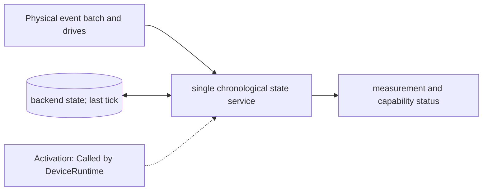

# Quantum-State Service and Backends

**Architecture position:** [Module map](../module-architecture.md#3-module-map).

## Responsibility and neighbors

One chronological service is the sole caller of a replaceable quantum-state backend for a shared state.

| Direction | Contract |
| --- | --- |
| Upstream inputs | DeviceRuntime physical boundary batch, active-drive set and measurement sampling request. |
| Downstream outputs | Gate or pulse evolution, measurement outcome with token, and capability or numerical error. |
| State owner and retained state | Backend quantum state; DeviceRuntime owns the last evolved/processed tick and active physical actions. |

## Module diagram

## Behavior

**Activation:** Called by DeviceRuntime at physical boundaries; no independent CPU-cycle process.

**Transition:** Prevalidate the complete boundary batch. Evolve previous active drives over [last_tick,t) once, then apply the declared same-tick ordering and install the next active set. An ideal gate applies at configured output start while its channel can remain occupied. A pulse backend integrates overlapping drives jointly.

**Time and visibility:** Equal-tick advancement is a no-op, so the first event may occur at backend initialization tick. DeviceRuntime rejects decreasing time and repeated processing of a physical tick. Host runtime never sets a simulation timestamp.

**Reset and errors:** Unsupported capability fails before partial execution; a numerical backend failure terminates the run as invalid. Session reset creates declared initial quantum state; controller-only reset is a different future operation.

Cross-module timing and visibility follow the [baseline protocol](../module-architecture.md#4-baseline-protocol-and-event-ordering).

## Implementation and verification

DeviceRuntime is the sole chronological caller of IQuantumBackend. Aer and the small-system SciPy pulse adapter share the Python bridge.

- Implementation: [python_backend.cpp](../../src/python_backend.cpp) and [backend.hpp](../../include/qsbit/backend.hpp).

**CTest:** `systemc.bell.normal`, `systemc.pulse.normal`.

Checks scripted backend calls through complete device execution. Optional `numerical.*` tests exercise Aer and pulse state evolution when enabled; `python.plugin` exercises external adapters.

- Numerical profile and supported scope: [Executable implementation](../implementation.md).
