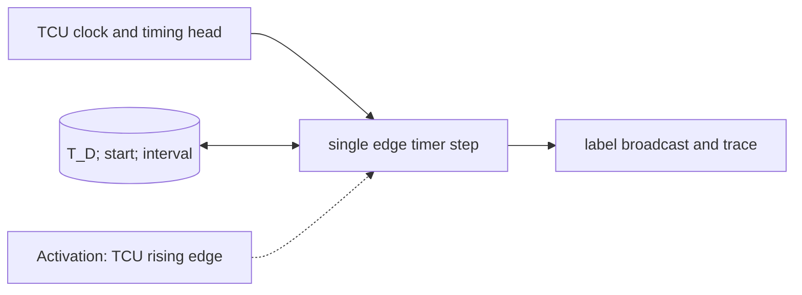

# TCU Timer and Label Broadcaster

**Architecture position:** [Module map](../module-architecture.md#3-module-map). **Status:** proposed behavior; no implementation exists yet.

## Responsibility and neighbors

One TCU rising-edge process owns deterministic time and invokes queue matching and launch preflight as logical substages.

| Direction | Contract |
| --- | --- |
| Upstream inputs | TCU clock, configured start tick, old timing-queue head, optional future pause port. |
| Downstream outputs | Reached label to every event queue, T_D and label-firing trace; future sync event output. |
| State owner and retained state | T_D, run or stopped state, last fired due cycle and pending interval. |

## Module diagram

The dashed edge shows what invokes this behavior; it does not add a clock stage. Solid arrows show data flow. The cylinder shows state or read-only configuration used by the behavior, not another SystemC process.

## Behavior

**Activation:** Wake on TCU rising edge; an external configured start enables it independently of CPU progress.

**Transition:** On configured start edge S, set `T_D=0`. With TCU period P, edge `S+nP` has `T_D=n`. If a previously admitted timing-queue head is due at n, broadcast its label and check the whole expected event group before firing. Continue incrementing `T_D` through empty-queue gaps; a future synchronization profile may pause this local counter while global simulation time continues.

**Time and visibility:** No label is fired merely because an sc_event occurs; only the defined TCU edge controls this timer. A new group admitted on the same edge cannot fire.

**Reset and errors:** Baseline rejects pause and sync requests. Reset stops the timer and clears epoch state without rewinding SystemC time; overflow faults.

**Focused verification:** Test S+nP arithmetic, cycle-zero prefill, empty queue, zero waits, future point after feedback and reset on a due edge.

Cross-module timing and visibility follow the [baseline protocol](../module-architecture.md#4-baseline-protocol-and-event-ordering). A future profile that changes an applicable rule must state the replacement rule and its tests.
