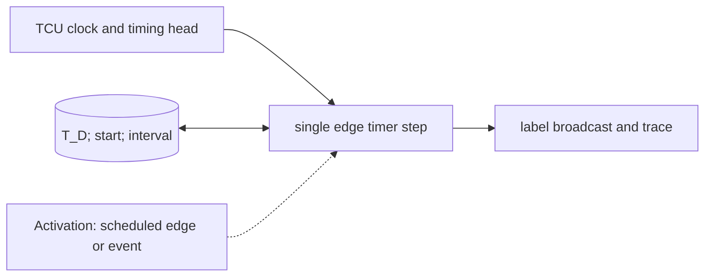

# TCU Timer and Label Broadcaster

**Architecture position:** [Integrated contract, Section 3.12](../module-architecture.md#312-tcu-timer-and-timing-label-broadcaster). **Status:** proposed behavior; no implementation exists yet.

## Responsibility and neighbors

One TCU rising-edge process owns deterministic time and invokes queue matching and launch preflight as logical substages.

| Direction | Contract |
| --- | --- |
| Upstream inputs | TCU clock, configured start tick, old timing-queue head, optional future pause port. |
| Downstream outputs | Reached label to every event queue, T_D and dispatch trace; future sync event output. |
| State owner and retained state | T_D, run or stopped state, last fired cursor and pending interval. |

## Module diagram

The dashed activation edge is a scheduling or call relationship. The solid arrows carry records or results. The state shape identifies the only owner of the mutable state; it is not an additional SystemC process.

## Behavior

**Activation:** Wake on TCU rising edge; an external configured start enables it independently of CPU progress.

**Transition:** At start edge S set T_D=0. At edge S+nP use T_D=n and fire an old head due at n. Broadcast one label to every queue and check the entire manifested group. Continue counting during empty-stream gaps. A future sync profile may pause T_D while global simulation time continues.

**Time and visibility:** No label is fired merely because an sc_event occurs; only the defined TCU edge controls this timer. A new group admitted on the same edge cannot fire.

**Reset and errors:** Baseline rejects pause and sync requests. Reset stops the timer and clears epoch state without rewinding SystemC time; overflow faults.

**Focused verification:** Test S+nP arithmetic, cycle-zero prefill, empty queue, zero waits, future point after feedback and reset on a due edge.

The module uses the baseline [producer and edge-order rules](../module-architecture.md#4-baseline-protocol-and-event-ordering). Any future timing profile that changes these rules must document its own behavior and tests.
