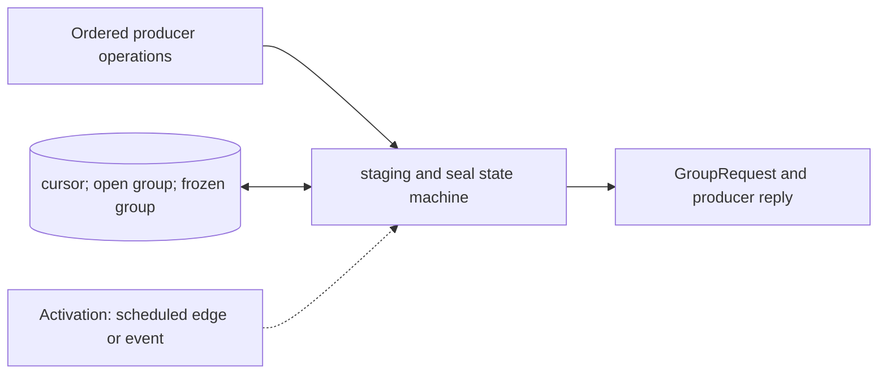

# Timeline Reservation Manager

**Architecture position:** [Integrated contract, Section 3.8](../module-architecture.md#38-timeline-reservation-manager). **Status:** proposed behavior; no implementation exists yet.

## Responsibility and neighbors

Logical substate of the CPU-domain owner, not a second independently clocked process.

| Direction | Contract |
| --- | --- |
| Upstream inputs | APPEND, ADVANCE, FLUSH, READ_RESULT and END from the adapter; TCU group acknowledgments. |
| Downstream outputs | Immutable sealed group, producer acceptance reply, cursor advancement and EndOfStream marker. |
| State owner and retained state | Logical TCU-cycle cursor, initial implicit origin, bounded open group and at most one frozen submission. |

## Module diagram

The dashed activation edge is a scheduling or call relationship. The solid arrows carry records or results. The state shape identifies the only owner of the mutable state; it is not an additional SystemC process.

## Behavior

**Activation:** Advance on CPU edges through semantic operations; group replies arrive via a committed mailbox.

**Transition:** APPEND adds to the current point and retires after bounded staging acceptance. ADVANCE(0) retains the point. Positive ADVANCE seals a real open point, waits for GroupAdmitted and then advances the cursor; an initially empty origin is skipped locally. FLUSH seals without advancing and makes further APPEND at that cursor illegal. READ_RESULT flushes before waiting; END flushes before closing production.

**Time and visibility:** Intervals are measured from the preceding sealed logical cursor, not from current host or CPU time. A group remains immutable during crossing backpressure.

**Reset and errors:** Impossible staging or per-port total capacity faults immediately. Reset discards the open and frozen group and returns to the implicit origin with a new epoch.

**Focused verification:** Test same-point APPEND progress, zero wait, initial empty start, wait-only point, append after flush, final-group sealing and oversized-group rejection.

The module uses the baseline [producer and edge-order rules](../module-architecture.md#4-baseline-protocol-and-event-ordering). Any future timing profile that changes these rules must document its own behavior and tests.
