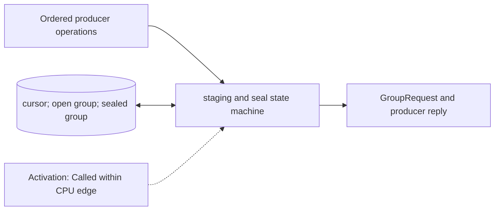

# Timeline Reservation Manager

**Architecture position:** [Module map](../module-architecture.md#3-module-map).

## Responsibility and neighbors

CPU-domain substate that prepares groups of operations for one planned TCU cycle. It does not have its own clocked SystemC process.

| Direction | Contract |
| --- | --- |
| Upstream inputs | APPEND, ADVANCE, FLUSH, READ_RESULT and END from the adapter; TCU group acknowledgments. |
| Downstream outputs | Immutable sealed group, producer acceptance reply, cursor advancement and EndOfStream marker. |
| State owner and retained state | Producer cursor (the logical TCU cycle being planned), initial empty origin, capacity-limited open group, and at most one sealed group awaiting admission. |

## Module diagram

## Behavior

**Activation:** Advance on CPU edges through semantic operations; group replies arrive via a committed mailbox.

**Transition:** APPEND places an event in the open group at the producer cursor and retires on `ProducerAccepted`; a second APPEND may join the same group. ADVANCE(0) changes nothing. Positive ADVANCE freezes a real open group, waits for its matching `GroupAdmitted` reply, then moves the cursor by the requested number of logical TCU cycles. An untouched initial origin needs no submission. FLUSH seals without moving the cursor, so APPEND there remains invalid until a positive ADVANCE. READ_RESULT flushes before waiting; END flushes before closing production.

**Time and visibility:** The group interval is the current producer cursor minus the preceding sealed point’s due cycle, using logical origin zero for the first point; it is not measured from CPU execution or host time. A sealed group remains immutable while its crossing request is held. Admission confirms queue insertion, not physical firing.

**Reset and errors:** Impossible staging or per-port total capacity faults immediately. Reset discards the open and sealed group and returns to the implicit origin with a new epoch.

Cross-module timing and visibility follow the [baseline protocol](../module-architecture.md#4-baseline-protocol-and-event-ordering).

## Implementation and verification

TimelineProducer owns cursor, bounded open events, one sealed group and held operation identity.

- Implementation: [producer.cpp](../../src/producer.cpp) and [producer.hpp](../../include/qsbit/producer.hpp).

**CTest:** `protocol.producer`, `protocol.capacity`, `systemc.use_cases`.

Checks held operation identity, one submission, acknowledgment before cursor movement, staging bounds, and coalescing APPENDs across ADVANCE(0).

- Numerical profile and supported scope: [Executable implementation](../implementation.md).
