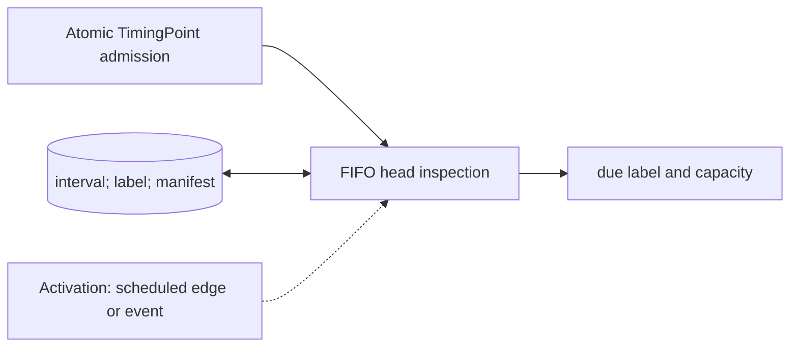

# Timing Queue

**Architecture position:** [Module map](../module-architecture.md#3-module-map). **Status:** proposed behavior; no implementation exists yet.

## Responsibility and neighbors

Bounded FIFO substate of one TCU cycle model. It has no separate `SC_METHOD` or delta-cycle notification contract.

| Direction | Contract |
| --- | --- |
| Upstream inputs | Atomically admitted TimingPoint records with interval, label and exact member manifest. |
| Downstream outputs | Head point and cumulative due cycle to the TCU timer; occupancy to admission. |
| State owner and retained state | FIFO entries, last admitted logical cursor and head manifest. |

## Module diagram

The dashed activation edge is a scheduling or call relationship. The solid arrows carry records or results. The state shape identifies the only owner of the mutable state; it is not an additional SystemC process.

## Behavior

**Activation:** Admission appends on a TCU edge; the timer inspects and removes a due old head in that same owner transition.

**Transition:** Preserve ordered intervals and labels. Derive every due cycle from the cumulative producer cursor, including periods when the FIFO is empty. An empty manifest is a valid wait-only point; absence of a queue entry is not itself a fault.

**Time and visibility:** Only the old head may fire on the current edge. New entries cannot be inspected as due until a later edge. Empty queue does not pause T_D or rebase a later entry.

**Reset and errors:** Late admission faults; a manifested missing member causes ManifestMismatch at firing. Reset empties the FIFO and invalidates its epoch.

**Focused verification:** Test first point at logical cycle zero, wait-only labels, feedback-driven empty gap, late entry, FIFO full and manifest mismatch.

The module uses the baseline [producer and edge-order rules](../module-architecture.md#4-baseline-protocol-and-event-ordering). Any future timing profile that changes these rules must document its own behavior and tests.
