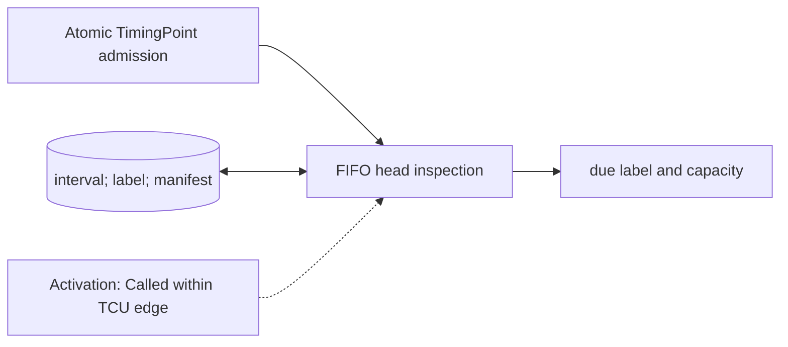

# Timing Queue

**Architecture position:** [Module map](../module-architecture.md#3-module-map). **Status:** proposed behavior; no implementation exists yet.

## Responsibility and neighbors

Bounded FIFO substate of one TCU cycle model. It has no separate `SC_METHOD` or delta-cycle notification contract.

| Direction | Contract |
| --- | --- |
| Upstream inputs | Atomically admitted TimingPoint records with interval, label and exact member manifest. |
| Downstream outputs | Head point and cumulative due cycle to the TCU timer; occupancy to admission. |
| State owner and retained state | FIFO entries, last admitted logical cursor and head manifest. |

## Module diagram

The dashed edge shows what invokes this behavior; it does not add a clock stage. Solid arrows show data flow. The cylinder shows state or read-only configuration used by the behavior, not another SystemC process.

## Behavior

**Activation:** Admission appends on a TCU edge; the timer inspects and removes a due old head in that same owner transition.

**Transition:** Keep admitted timing points in producer order. Each entry carries an interval, label and expected-member list. Add its interval to the prior logical due cycle; do not restart timing from the admission tick, even if the queue was empty meanwhile. An empty member list is an intentional wait-only point; an empty FIFO alone is not a fault.

**Time and visibility:** Only the old head may fire on the current edge. New entries cannot be inspected as due until a later edge. Empty queue does not pause T_D or rebase a later entry.

**Reset and errors:** Late admission faults; a manifested missing member causes ManifestMismatch at firing. Reset empties the FIFO and invalidates its epoch.

**Focused verification:** Test first point at logical cycle zero, wait-only labels, feedback-driven empty gap, late entry, FIFO full and manifest mismatch.

Cross-module timing and visibility follow the [baseline protocol](../module-architecture.md#4-baseline-protocol-and-event-ordering). A future profile that changes an applicable rule must state the replacement rule and its tests.
