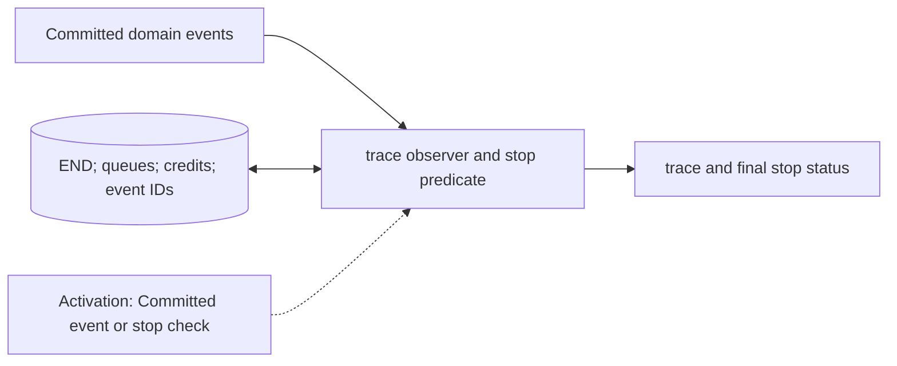

# Trace Recorder and Stop Controller

**Architecture position:** [Module map](../module-architecture.md#3-module-map).

## Responsibility and neighbors

Two separate logical responsibilities documented together: trace is observation-only; the stop controller owns completion and fatal termination.

| Direction | Contract |
| --- | --- |
| Upstream inputs | CPU retirement, group admission, label fire, physical output, measurement delivery, END marker and typed faults. |
| Downstream outputs | Versioned trace file and final stop reason with simulation tick. |
| State owner and retained state | Ordered TraceEvent records with event-kind-specific IDs; stop controller tracks END, queue drain, physical events and both feedback-path credits. |

## Module diagram

## Behavior

**Activation:** Trace callbacks observe committed transitions. Stop checks after all owners have published effects for the tick.

**Transition:** Record producer acceptance, group admission, firing, trigger, physical start/end, result-ready and CPU-visible ticks distinctly. Stable IDs serialize independent same-tick records without imposing hardware order. END closes producer input after its required admission reply; successful simulation completion additionally waits for timing and event queues, physical actions and all enabled feedback deliveries to drain.

**Time and visibility:** Trace writing cannot schedule hardware or consume time. CPU halt is not the same as global simulation completion. Watchdog expiry reports incomplete progress.

**Reset and errors:** On fatal fault, stop with typed context and no claimed successful drain. Session reset emits an epoch boundary; stale callback discards remain observable.

Cross-module timing and visibility follow the [baseline protocol](../module-architecture.md#4-baseline-protocol-and-event-ordering).

## Implementation and verification

Trace serializes versioned JSONL; Simulator owns drain, watchdog and fatal stop. Trace remains observation-only.

- Implementation: [simulator.cpp](../../src/simulator.cpp) and [trace.hpp](../../include/qsbit/trace.hpp).

**CTest:** `systemc.use_cases`.

Checks complete trace equality under registration reversal, END drain through slow fast-feedback delivery, reset epochs and typed watchdog/fault termination.

- Numerical profile and supported scope: [Executable implementation](../implementation.md).
