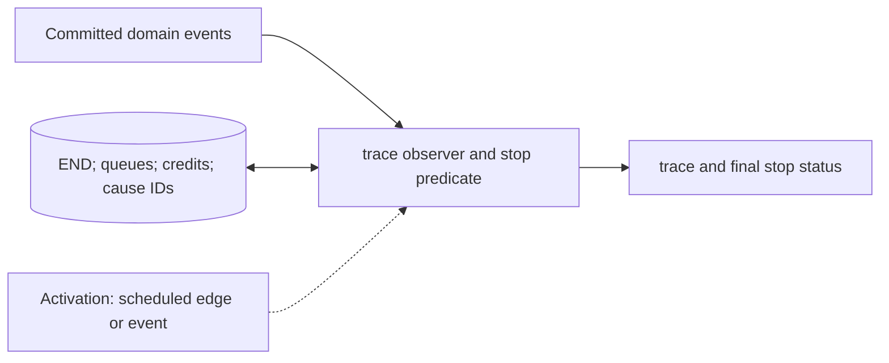

# Trace Recorder and Stop Controller

**Architecture position:** [Integrated contract, Section 3.20](../module-architecture.md#320-generic-trace-recorder-and-stop-controller). **Status:** proposed behavior; no implementation exists yet.

## Responsibility and neighbors

Two separate logical responsibilities documented together: trace is observation-only; the stop controller owns completion and fatal termination.

| Direction | Contract |
| --- | --- |
| Upstream inputs | CPU retirement, group admission, label fire, physical output, measurement delivery, END marker and typed faults. |
| Downstream outputs | Versioned trace file and final stop reason with simulation tick. |
| State owner and retained state | Trace sequence metadata and causal parent IDs; stop controller tracks END, queue drain, physical events and both feedback-path credits. |

## Module diagram

The dashed activation edge is a scheduling or call relationship. The solid arrows carry records or results. The state shape identifies the only owner of the mutable state; it is not an additional SystemC process.

## Behavior

**Activation:** Trace callbacks observe committed transitions. Stop checks after all owners have published effects for the tick.

**Transition:** Record proposal, producer acceptance, group admission, firing, trigger, physical start/end, result-ready and CPU-visible ticks distinctly. Stable IDs serialize independent same-tick records without imposing hardware order. END succeeds only after timing and event queues, physical boundaries and all enabled feedback deliveries drain.

**Time and visibility:** Trace writing cannot schedule hardware or consume time. CPU halt is not the same as global simulation completion. Watchdog expiry reports incomplete progress.

**Reset and errors:** On fatal fault, stop with typed context and no claimed successful drain. Session reset emits an epoch boundary; stale callback discards remain observable.

**Focused verification:** Test exact event schema, causal IDs, END during active pulse, slow fast-feedback delivery and fatal partial-batch prevention.

The module uses the baseline [producer and edge-order rules](../module-architecture.md#4-baseline-protocol-and-event-ordering). Any future timing profile that changes these rules must document its own behavior and tests.
