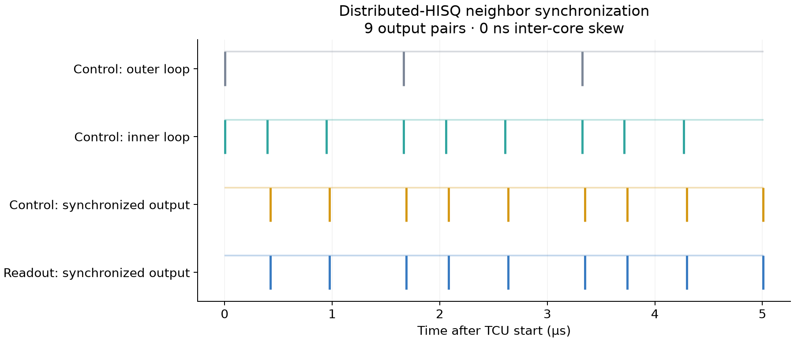
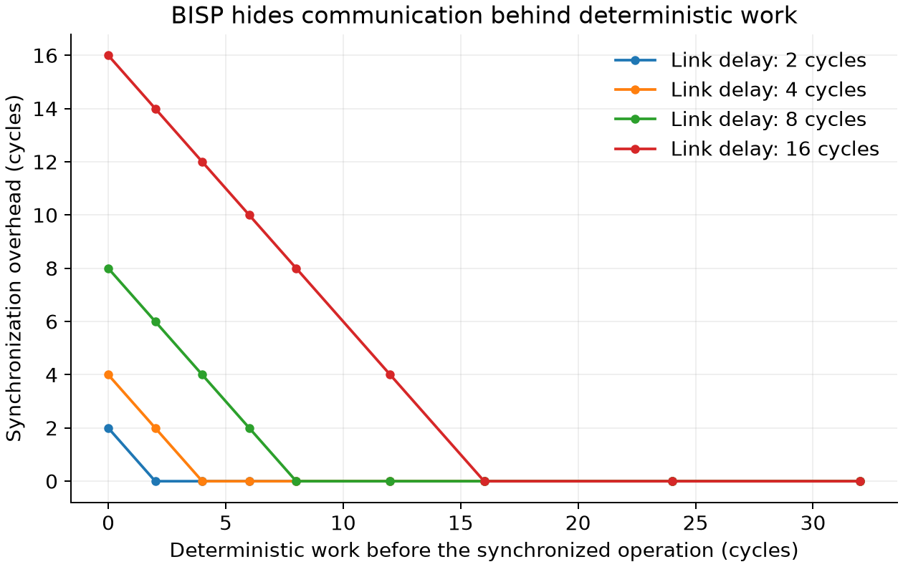

# Distributed-HISQ neighbor synchronization

Run two independent RV32I programs with qsbit timing and synchronization
instructions modeled on Distributed-HISQ. Synchronization uses BISP, the
booking-based synchronization protocol from Distributed-HISQ. The example
recreates the synchronized-output timing scenario in
[Distributed-HISQ, Figures 12 and 13](https://arxiv.org/html/2509.04798v1#S6.SS3)
and measures synchronization overhead as deterministic work covers the link delay.

## Run

Build and install `qsbit-sim` with the [repository instructions](../../README.md#build).
The experiment uses the mock backend and the RISC-V assembler and linker.
Run from the repository root:

```sh
python3 examples/distributed-hisq/run.py
```

The script finds `qsbit-sim` on PATH; `--simulator PATH` selects another build.
It assembles [control.S](control.S), [readout.S](readout.S) and
[booking.S](booking.S), runs each configuration and checks the observed
timestamps against the program intervals and link delays. It writes ELF files,
run configurations, traces and `results.json` under `build-clang/distributed-hisq/`.
Each generated configuration can also run directly:

```sh
qsbit-sim --config build-clang/distributed-hisq/boards/run.json
```

Install the plotting dependencies and write figures to
`build-clang/distributed-hisq/figs/`:

```sh
uv run --frozen --extra plots examples/distributed-hisq/plot.py
```

Pass `--output examples/distributed-hisq/figs` to update the checked-in
reference figures.

## Two-controller synchronization experiment

The control program increases a register through 40, 80 and 120 and uses it
as the `wait.r` interval before `sync`. The readout program repeats a fixed
sequence. Both programs execute three outer repetitions and then exit.
The two controllers run in one SystemC simulation, following the paper's
dual-board timing scenario.

[experiment.json](experiment.json) specifies a 5 ns CPU period, a 4 ns TCU
period and a 10 µs initial TCU start. The two directional link delays are
8 and 6 TCU cycles, matching the waits after `sync` in Figure 12.
These are example configured delays; the paper does not report measured
directional link delays. The control output delay is 228 ns, compensated by
the readout program's 57-cycle wait. Output markers have a 4 ns duration.

All nine pairs of synchronized outputs have **0 ns skew**. Reversing process
registration and TCU execution order preserves their timestamps.



The 40-cycle increment corresponds to 160 ns on the configured 4 ns grid.
Section 6.3 reports a 120 ns increment. The example retains Figure 12's
instruction operands and Section 6.1's 250 MHz TCU frequency.

## Booking overhead

The scan varies the link delay from 2 to 16 cycles and the available
deterministic work from 0 to 32 cycles. For link delay L and work duration D,
the expected overhead is `max(0, L - D)` cycles. Both cores output their
final marker on the same edge in all 36 configurations.



When D is at least L, `sync` is placed L cycles before the planned output.
When D is shorter, synchronization starts as soon as the preceding work
finishes and delays the output by L − D cycles.

## Scope

The plots contain simulated digital output timing. Analog waveform shape,
clock jitter, regional synchronization and the application comparisons in
Figures 15 and 16 are not modeled by this example.

See [distributed simulation](../../docs/distributed-simulation.md) for core,
connection and shared-device configuration.
