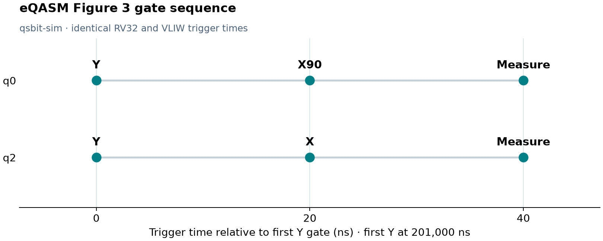
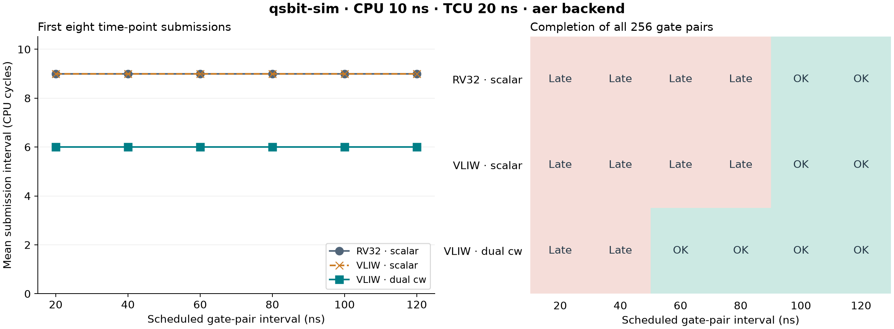

# eQASM gate sequence and VLIW issue rate

Run the two-qubit gate sequence from
[eQASM, Figure 3](https://arxiv.org/pdf/1808.02449v3), then compare scalar
instructions with 32-bit dual-codeword bundles. Both programs use HISQ
control operations.

## Run

From the repository root, prepare the [native dependencies](../../docs/prerequisites.md)
and build with the Python bridge:

```sh
uv sync --frozen --group build --extra experiments --inexact
source .venv/bin/activate
cmake --preset clang-ninja -DQSBIT_PYTHON_BACKENDS=ON
cmake --build --preset clang-ninja --parallel
python examples/eqasm/run.py --backend aer
python examples/eqasm/plot.py
```

The runner assembles the programs with GNU RISC-V binutils and checks their
operation order, trigger times and quantum results. The plot command writes
`figs/figure3.png`, `figs/issue_rate.png` and the underlying
[result data](figs/results.json).

[experiment.json](experiment.json) sets clocks, queue capacities, codeword
mappings and backend options. The configured Aer backend uses ideal gates
and projective measurements. Use `--backend mock` for a control-only run.

## Figure 3 gate sequence

[figure3.S](figure3.S) applies Y to q0 and q2, then X90 to q0 and X to q2,
then measures both qubits. X90 rotates by π/2 about the X axis.
Each step starts one TCU cycle after the preceding step.

With the configured 20 ns TCU period, `wait.i 10000` advances the time point
by 200 μs. The 1 μs TCU startup offset places the first Y gates at 201 μs.
Acquisition starts 40 ns later and lasts 1 μs.



The runner checks all six operation starts for both CPU models.
Aer also verifies that q2 measures zero after Y followed by X.

## Issue-rate sweep

[issue_rate.S](issue_rate.S) repeats `X90(q0)` and `X(q2)` at 256 time
points. The scheduled interval between gate pairs ranges from 20 to 120 ns.

| Run | CPU model | Instructions per time point |
| --- | --- | --- |
| RV32 scalar | `rv32` | Two `cw.i.i` instructions and one `wait.i`. |
| VLIW scalar | `vliw` | The same scalar program. |
| VLIW dual cw | `vliw` | One `cw.bundle` and one `wait.i`. |

The CPU period is 10 ns; the TCU period is 20 ns. Memory latency is one CPU
period, and command and reply latencies are one receiver edge each.
The timing queue and each event queue hold 32 entries. All runs use the same
profile and schedule 512 gate operations.



The left panel shows the mean interval between the first eight
`TimingPointSubmitted` records, before queue backpressure. Both scalar runs
take 9 CPU cycles per time point; dual-codeword execution takes 6 cycles.

The right panel reports whether all 256 gate pairs finish. In the tested
intervals, scalar execution completes at 100 ns and 120 ns; dual-codeword
execution completes at 60 ns and above. `Late` denotes a
`LateAdmission` fault: the TCU receives a time point too late to trigger it
on schedule.

Successful Aer runs return to the all-zero basis state after 256 pairs.
The runner checks its probability against one with an absolute tolerance of
`1e-10`.

## Output and configuration

Each case under `build-clang/eqasm/` contains `program.elf`, `run.json`,
`trace.jsonl`, `summary.json` and `run.log`. The top-level `results.json`
records the experiment settings, program and simulator hashes, submission
intervals, retirement counts, operation counts and stop ticks.

Rerun an individual case with:

```sh
build-clang/qsbit-sim --config build-clang/eqasm/vliw-bundle-60ns/run.json
```

Use `--points` and `--intervals` to change the sweep:

```sh
python examples/eqasm/run.py --backend aer --points 512 \
  --intervals 40 60 80 100 --output build-clang/eqasm-512
python examples/eqasm/plot.py --results build-clang/eqasm-512/results.json \
  --output build-clang/eqasm-512/figs
```

Intervals are in nanoseconds and must be positive multiples of the configured
TCU period. `--settings FILE` selects another experiment configuration.
See the [CPU selection and instruction reference](../../docs/interfaces.md#cpu-selection)
for running other programs.
