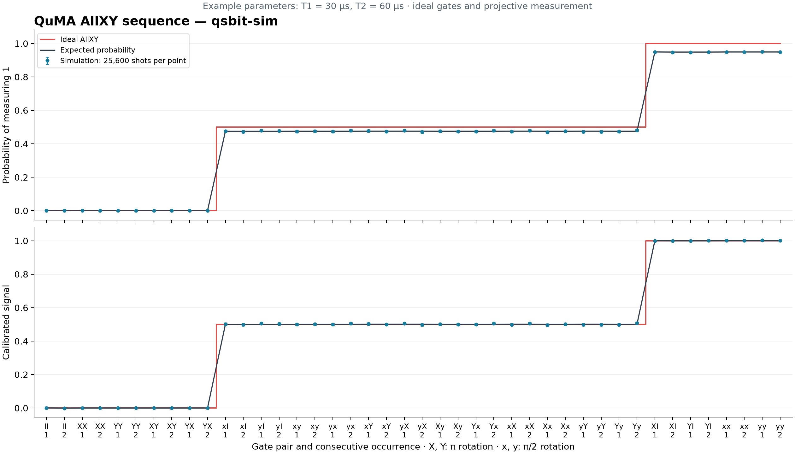

# QuMA AllXY

Run the 42-point AllXY sequence from [QuMA, Figure 9 and Algorithm 3](https://arxiv.org/pdf/1708.07677).
Each of the 21 gate pairs occurs twice consecutively. The default experiment
uses control replay and transition-probability sampling to generate 25,600
measurement outcomes per point from the configured model.



## Run

From the repository root, install the experiment dependencies and build with the
Python bridge. See [prerequisites](../../docs/prerequisites.md) for native build tools.

```sh
uv run --frozen --group build --extra experiments \
  cmake --preset clang-ninja -DQSBIT_PYTHON_BACKENDS=ON
cmake --build --preset clang-ninja --parallel
cmake --install build-clang --prefix "$HOME/.local"
export PATH="$HOME/.local/bin:$PATH"
uv run --frozen --extra experiments qsbit-sim --config examples/quma/run.json
uv run --frozen --extra experiments examples/quma/plot.py
```

[allxy.S](allxy.S) uses `cw.i.i`, `wait.i` and `fmr`. FMR waits for each result
without using its value to select later operations. The sampler preserves the
dependence on the preceding measurement outcome between trials.

[run.json](run.json) selects the backend, physical parameters, clock periods and
execution strategy. Results and control traces are written under
`build-clang/quma/`. The plot command checks the numerical result and writes
`build-clang/quma/figs/allxy.png` and its count data in
`build-clang/quma/figs/allxy.json`. Pass `--output examples/quma/figs` to
update the checked-in reference figure and data.

## Physical model

The example uses ideal gates, computational-basis projective measurements and
Aer thermal relaxation. T1 = 30 μs, T2 = 60 μs and zero equilibrium excitation are
example parameters, not fitted or reported QuMA device values. Relaxation continues
during acquisition; measurement samples the state at acquisition end.

The upper panel shows raw probabilities. The lower panel applies a linear
calibration using the mean of the two II points as zero and the four XI and YI
points as one. It follows the signal-normalization procedure in Section 8 of the
paper. The figure reproduces the sequence and staircase, not the hardware's
measured scatter or its reported deviation. Gate order follows Figure 9.

Error bars show 1.96 sampling standard errors. Calibrated error bars hold the
estimated calibration constants fixed.

## Timing

The paper specifies a 40,000-cycle initialization wait, two 4-cycle gate intervals
and a 300-cycle measurement pulse. At 5 ns per cycle these are 200 μs, 20 ns and
1.5 μs. The next initialization wait advances the time point from the preceding
measurement trigger, not from acquisition completion.

| Quantity | Value |
| --- | --- |
| Time-point advance per trial | 40,008 TCU cycles |
| Time-point advance per round | 1,680,336 TCU cycles; 8.40168 ms |
| Time-point advance over 25,600 rounds | 43,016,601,600 TCU cycles; 215.083008 s |

The total is calculated from the program, not a runtime reported by the paper.
The result JSON separately records startup-adjusted trigger time, last measurement
sample time, controller completion and host runtime. Replayed controller completion
is marked `extrapolated`.

## Execution strategy

The default configuration executes two three-round control runs, one with all
measurement outcomes zero and one with all outcomes one. Static instruction checks
exclude feedback and data-dependent timing. Event recordings verify the repeated
backend calls and clock alignment.

Aer then computes the probability of measuring one from each possible preceding
measurement result. The sampler carries that result into the next trial, preserving
the effect of incomplete passive initialization. Repeated transition calculations
are cached. The full experiment does not repeat CPU and queue simulation per shot.

Set `simulation.quantum_execution` to `direct` to evolve the backend for every
measurement. Set `simulation.execution` to `full` and `quantum_execution` to
`direct` to execute the control microarchitecture for every round. Use a small
`repetitions` value for this comparison; extend `profile.watchdog` for longer runs.
See [repeated simulations](../../docs/repeated-simulations.md) for the supported
program structure and configuration fields.

## Verify

```sh
cmake --preset clang-ninja -DBUILD_TESTING=ON \
  -DQSBIT_PYTHON_BACKENDS=ON -DQSBIT_TEST_EXPERIMENTS=ON
cmake --build --preset clang-ninja --parallel
ctest --test-dir build-clang -R experiment.allxy --output-on-failure
```

The test requests four experiment repetitions, validates replay behavior, and
runs the plotting checks. The plot
checks gate order, trigger timestamps and probabilities from the recorded output.
Transition probabilities must match independent Bloch-vector calculations within
2e-12. Shot frequencies must lie within six sampling standard errors plus one
count of the configured-model expectation.
