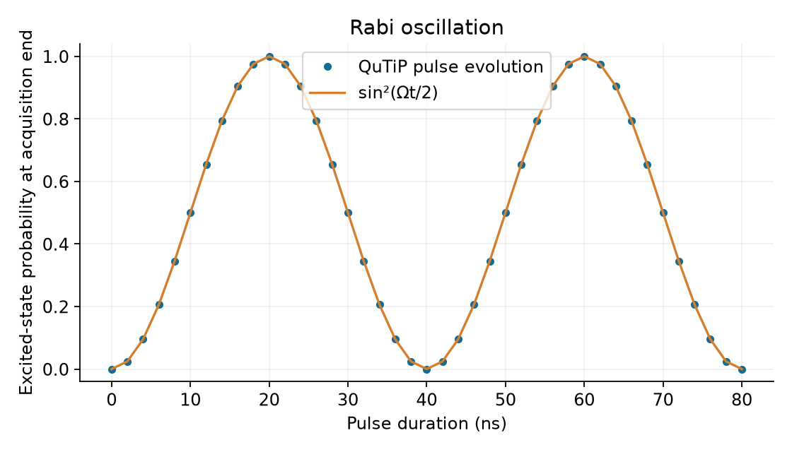
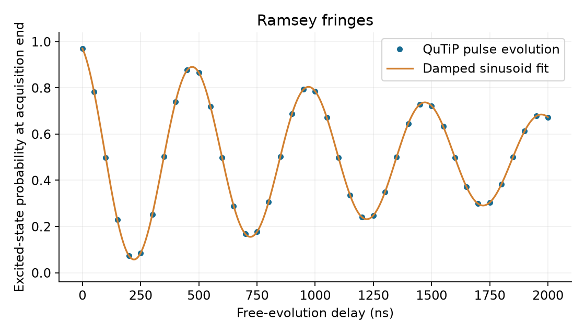
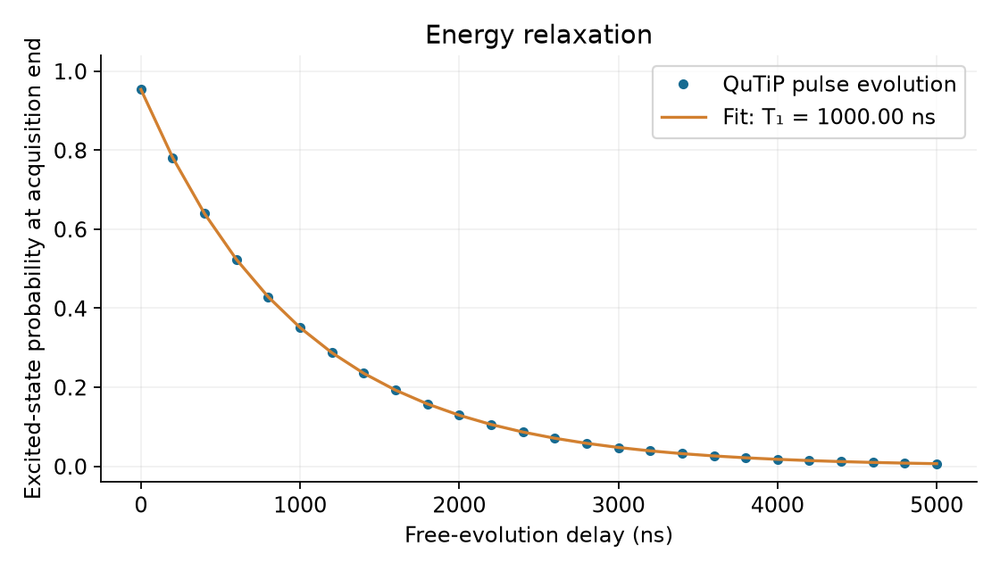
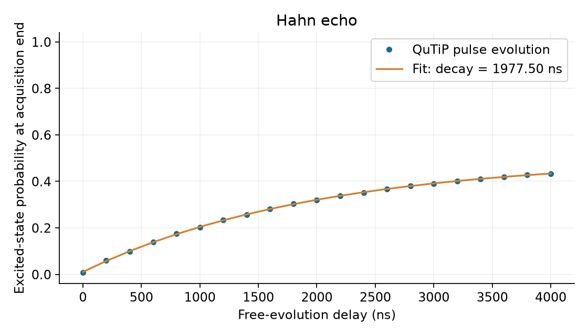
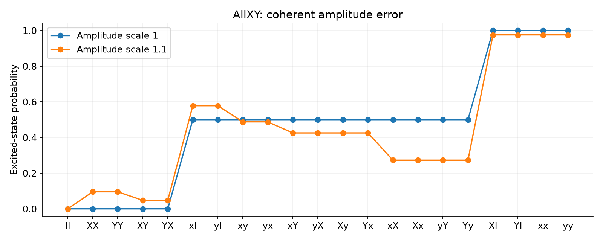
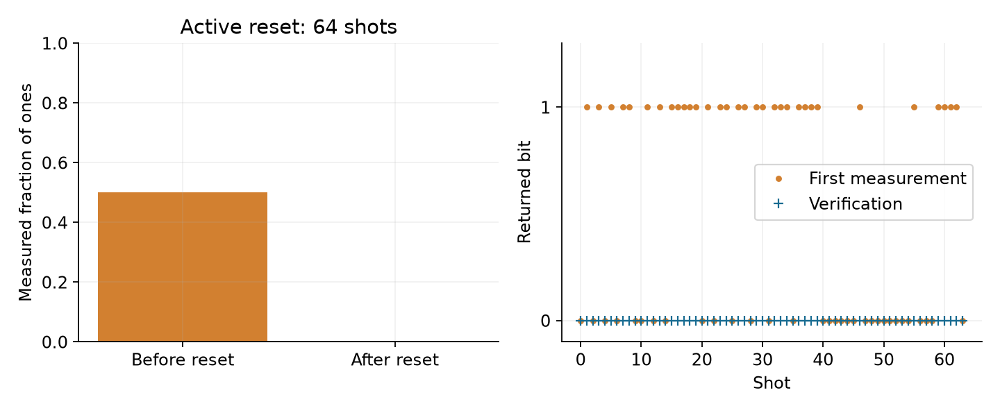
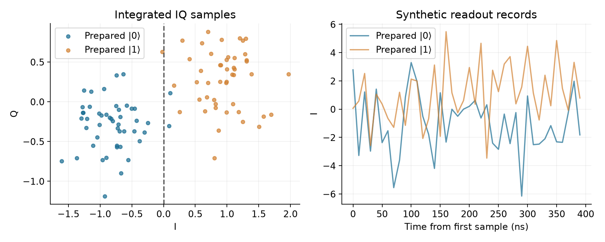
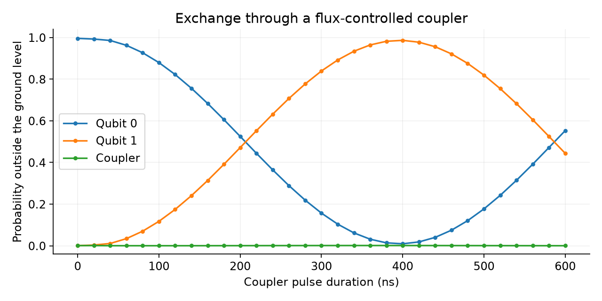

# Pulse experiments with QuTiP

Run qsbit control programs that trigger configured waveforms and measure their effects.
The CPU and TCU schedule the events; QuTiP integrates the driven quantum system.

## Run

From the repository root, after preparing the [build dependencies](../../docs/prerequisites.md):

```sh
uv sync --frozen --group build --extra qutip --extra plots
source .venv/bin/activate
cmake --preset clang-ninja -B build-qutip -DQSBIT_PYTHON_BACKENDS=ON
cmake --build build-qutip --parallel
python examples/qutip/run.py --simulator build-qutip/qsbit-sim
```

The runner assembles a program for each sweep point, executes it with
`qsbit-sim`, checks the numerical results and writes PNGs to `build/qutip/figs/`.
`build/qutip/` contains each generated `program.S`, ELF, `run.json`, trace,
measurement records and summary. `results.json` collects the measurements,
fitted parameters, package versions and source hashes.

Run one experiment or change the output directory:

```sh
python examples/qutip/run.py --simulator build-qutip/qsbit-sim \
  --only ramsey --output build/qutip-ramsey --figures build/qutip-ramsey/figs
build-qutip/qsbit-sim --config build/qutip-ramsey/ramsey-010/run.json
```

Use `--jobs` to limit concurrent simulator processes. `--model` and `--settings`
select alternative configuration files. Pass `--figures examples/qutip/figs`
to update the checked-in reference figures.

## Configuration

[model.json](model.json) defines the base Hamiltonian, dissipation, waveforms and
solver settings. [experiments.json](experiments.json) defines pulse amplitudes,
durations, sweep points, readout parameters, seeds and numerical tolerances.
The single-qubit experiments use two levels. The coupler experiment uses three
levels for each of two transmons and their coupler.

One TCU cycle is 2 ns. A profile mapping selects a waveform by `operation` and
sets its amplitude, duration, axis and target. `cw` triggers that mapping;
`wait` advances the scheduled time point. The generated program reads
measurement results with `fmr`. Active reset branches on the returned bit and
conditionally issues the correction pulse.

The examples use synthetic model parameters. Waveform equations,
units and measurement semantics are specified in [QuTiP pulse models](../../docs/qutip.md).

## Rabi oscillation

Sweep a resonant square pulse from 0 to 80 ns. The reference is
$P_1(t)=\sin^2(\Omega t/2)$, with $\Omega=\pi/20$ radians per nanosecond.
The runner requires a maximum probability error below the configured tolerance.



## Ramsey fringes

Apply two X rotations of $\pi/2$, separated by a variable delay. The configured
detuning is $2\pi/500$ radians per nanosecond and the pure-dephasing time is
2000 ns. Fit the acquisition-end probabilities to a damped sinusoid and compare
its frequency with the configured detuning. Finite pulse duration contributes
to the fitted phase and contrast.



## Energy relaxation

Prepare an excitation, wait, and measure. The configured $T_1$ is 1000 ns.
An exponential fit includes a free amplitude because relaxation also occurs
during state preparation and acquisition.



## Hahn echo

Apply $X_{\pi/2}$, half the scanned delay, $X_\pi$, the other half, and
$X_{\pi/2}$. The middle pulse refocuses static detuning. Markovian dephasing
remains, with a configured decay time of 2000 ns. The runner fits the decay
and checks it against that value.



## AllXY

Run the 21 gate pairs with nominal amplitude and a 10% amplitude error.
Uppercase X and Y denote $\pi$ rotations; lowercase x and y denote $\pi/2$
rotations. I waits for one pulse duration. Nominal results are compared with
the ideal sequence: five zeros, twelve halves and four ones.

Each point is the acquisition-end probability from the density matrix. The
[QuMA example](../quma/README.md) separately reproduces its repeated sequence
and finite-shot statistics.



## Active reset

Prepare an equal superposition and measure it. `fmr` blocks until the result
arrives. A measured one selects an X pulse; a measured zero skips it.
Both paths schedule the verification acquisition after the same feedback budget.
The ideal model must return zero in all 64 verification measurements.



## Readout assignment

Prepare zero and one for 48 shots each. Generate a classical IQ record with
exponential ring-up and Gaussian noise, integrate it, and classify its rotated
I component against the configured threshold. The figure shows integrated
samples and two individual records.

The record is conditioned on the level sampled at acquisition end. It does not
model resonator dynamics or continuous quantum measurement backaction.



## Tunable-coupler exchange

Prepare qubit 0 and drive the coupler frequency with a trapezoidal pulse.
Fixed exchange couplings connect each qubit to the coupler. Scan the pulse
duration and read the final density matrix to obtain all three populations.

Both qubits and the coupler evolve under the same three-oscillator Hamiltonian.
The plot shows the final population of each oscillator.


